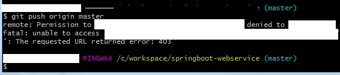
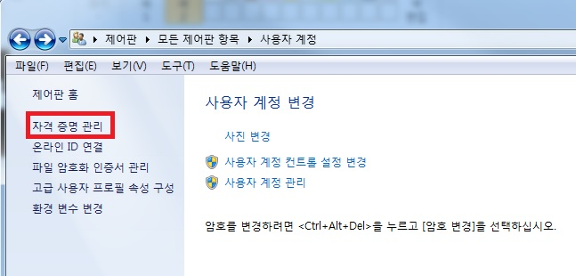
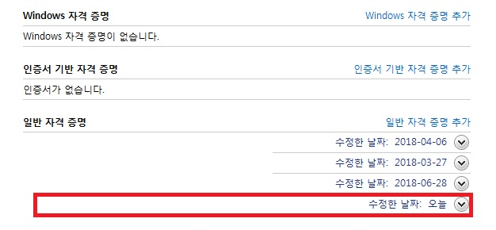

동일 컴퓨터에서 github 계정 변경 후 push를 할 경우 아래와 같은 에러가 발생할 수 있다.

1) 우선 현재 계정정보를 확인한다

`git config user.name`

`git config user.email`

을 치면 신규계정이 아닌 이전계정과 이전 이메일 주소가 나올 것이다.

_ _ _

2) 해당 계정을 신규 계정으로 변경해주고
(해당 계정정보는 ~/.gitconfig에서도 변경 가능하다)

`git config --global user.name 신규계정`

`git config --global user.email 신규이메일`

_ _ _

3)그리고 제어판->사용자계정->자격 증명 관리로 들어간다

_ _ _

4) 자격증명관리에서 github와 관련된 모든 자격증명을 제거해준다.

_ _ _

5) 다시 git push origin master를 날려 보면 github 로그인 창이 뜬다.

_ _ _

**6) id와 p/w를 입력하면 정상적으로 push가 완료된다.**

