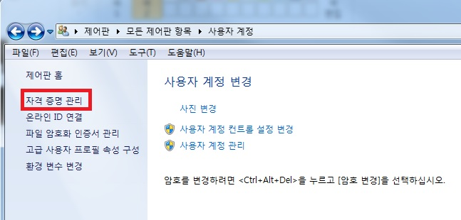
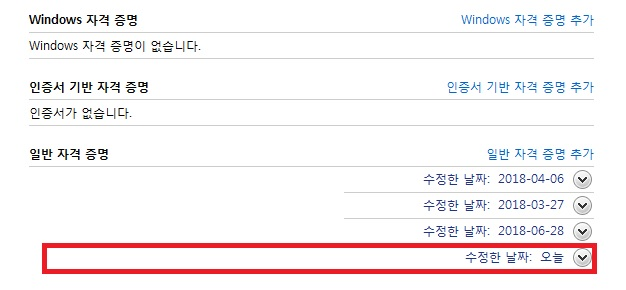

블로그를 만들기 위해서는 아래와 같은 순서로 진행하면 된다.

1) 

_ _ _

2) 해당 계정을 신규 계정으로 변경해주고
(해당 계정정보는 ~/.gitconfig에서도 변경 가능하다)

`git config --global user.name 신규계정`

`git config --global user.email 신규이메일`

_ _ _

3)그리고 제어판->사용자계정->자격 증명 관리로 들어간다

_ _ _

4) 자격증명관리에서 github와 관련된 모든 자격증명을 제거해준다.

_ _ _

5) 다시 git push origin master를 날려 보면 github 로그인 창이 뜬다.

_ _ _

**6) id와 p/w를 입력하면 정상적으로 push가 완료된다.**

_ _ _

*출처 : *
