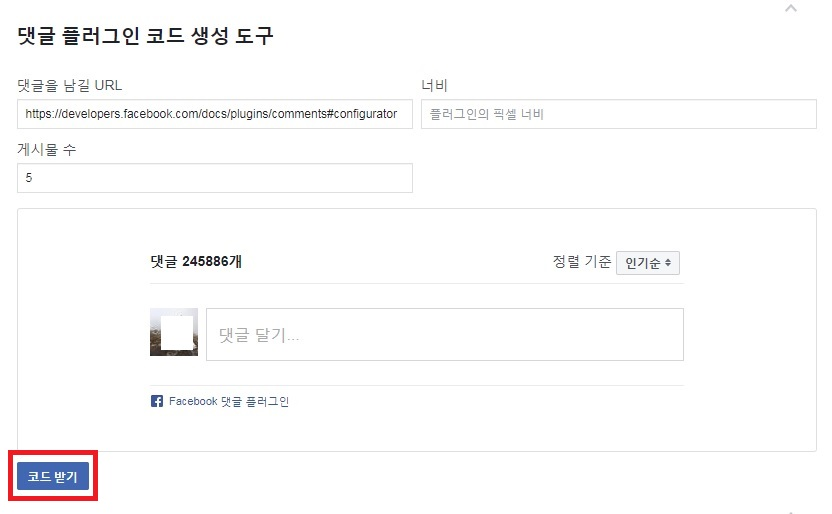
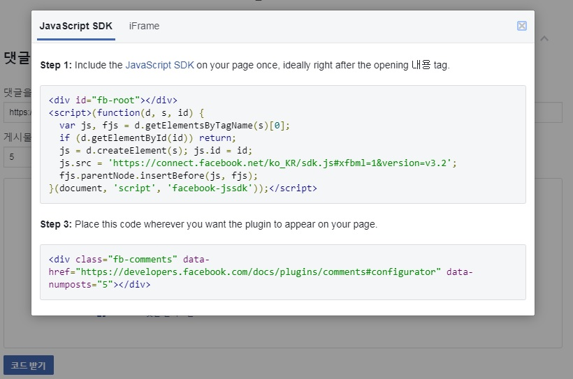
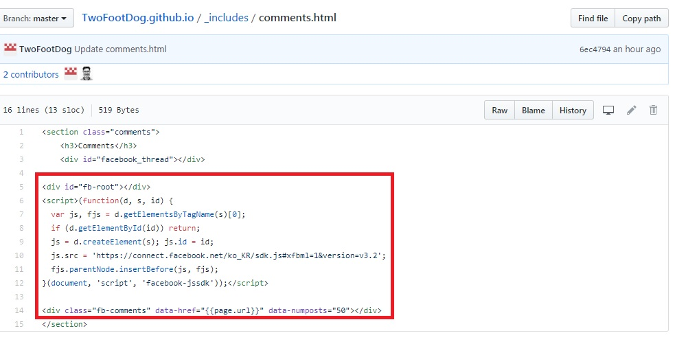

github와 지킬 테마를 이용하여 블로그를 만들었지만 댓글기능이 없다.
(disqus로 댓글 기능을 만들면 참 편하겠지만, 현재 한글이 지원이 되지 않는다.)
facebook 댓글 플러그인을 활용하여 블로그에 댓글 기능을 넣어보자.

1) facebook 댓글 플러그인으로 이동(<https://developers.facebook.com/docs/plugins/comments/>)

_ _ _

2) URL, 너비, 게시물 수 등 블로그에 맞게 수정한 후 
**댓글 플러그인 코드 생성도구**에서 코드 받기

_ _ _

3) 받아온 2개 코드를 활용하여 **./inclues/comments.hml** 수정하기
.comments에 대한 style이 **/src/styl/_footer.styl** 에 있기 때문에
comments 클래스로 전체 내용을 묶어주자

_ _ _

*출처 : 음슴*
