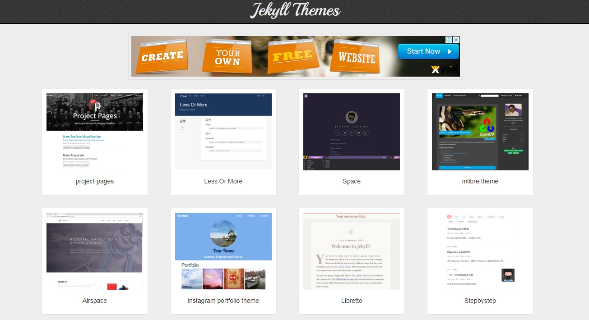
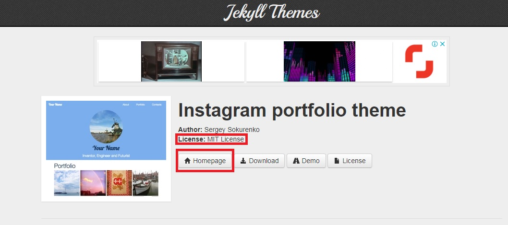
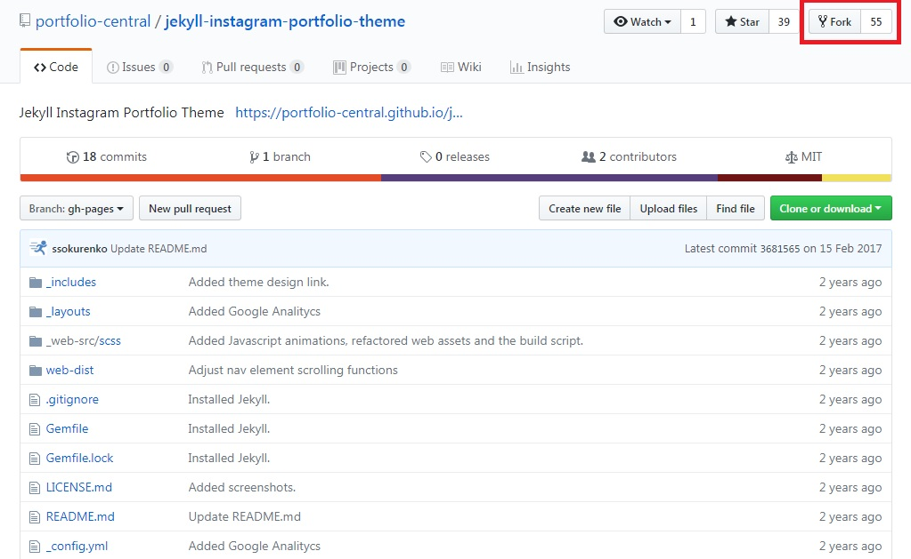
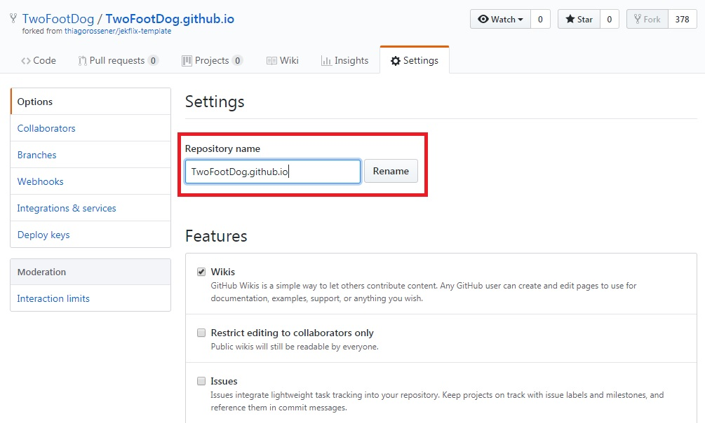
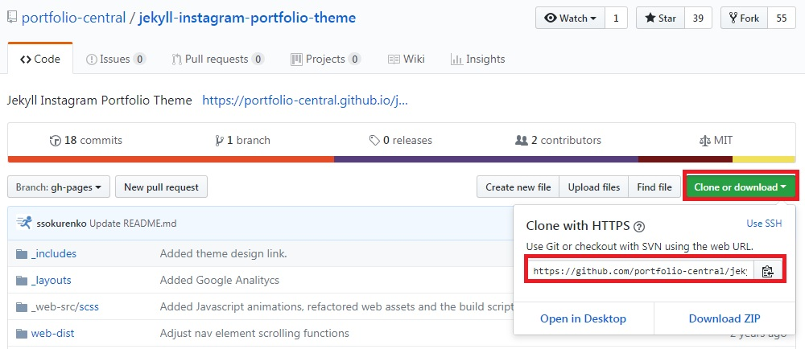
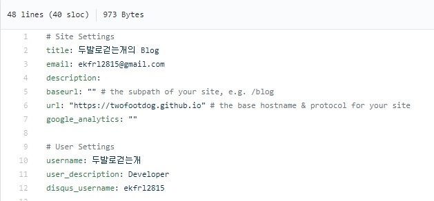

블로그를 만들기 위해서는 아래와 같은 순서로 진행하면 된다.

1) github 가입(<https://github.com/>)후 로그인.

_ _ _

2) github 창을 열어놓은 상태에서
   지킬 테마 사이트로 이동.(<http://jekyllthemes.org/>)
   원하는 테마를 선택
   
   

_ _ _

3) License 버튼을 클릭해서 **MIT 라이센스**인지 확인하고
   Homepage로 이동. Homepage로 이동하면 해당 테마의 github로 이동하게 됨.
   

_ _ _

4) 우측 상단의 **Fork** 클릭. 몇초 기다리면 로그인 되어있던 내 github에 신규 저장소가 생기면서 소스들이 복제됨. 내 닉네임으로 저장소가 생성되었는지 확인.
   

_ _ _

5) github **setting**으로 들어가서 Repository name을
**닉네임.github.io**로 변경함.
   

_ _ _

6) git bash 접속. fork한 소스를 관리할 디렉토리로 이동.
github로 돌아와서 우측에 있는 **clone and download** 클릭하여 URL 복사.
git bash로 돌아와서 **git clone (복사한 URL)** 실행하여 디렉토리로 소스 복제.
   

_ _ _

7) _config.yml 파일을 연다.
해당 파일의 title, email, username등을 자기 정보와 맞게끔 수정 후 저장한다.
baseurl때문에 블로그가 깨질 수 있으니 baseurl 정보도 변경해준다.
저장 후 해당 소스를 github로 올린다.
   

_ _ _

8) 각 디렉토리 별 기능은
- _includes : layout에 사용되는 소스
- _layout : 블로그의 layout
- _posts : 블로그의 글

_ _ _

9) 닉네임.github.io로 접속하여 블로그가 잘 돌아가는지 확인한다.

_ _ _

*출처 : <http://recoveryman.tistory.com/321> 를 참고했습니다.*
