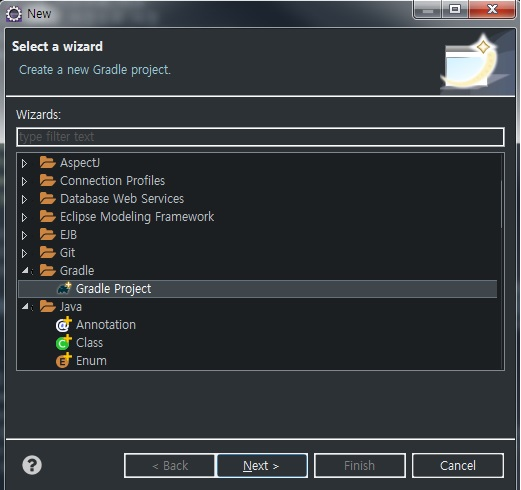

Spring5에서 Gradle을 활용하여 프로젝트를 만들기 위해서는 아래와 같은 작업을 진행해야 한다.

1) JDK 설치 및 Path 설정
 - JDK 다운 : <https://www.oracle.com/kr/index.html>
 - JDK 다운 후 환경변수에서 path 설정 : jdk설치폴더\bin; 추가

_ _ _

2) Eclipse 설치
<https://www.eclipse.org/downloads/>에서 최신버전 다운로드.

_ _ _

3) Tomcat 설치 및 설정
 - <https://tomcat.apache.org/>에서 최신 버전 다운로드.(tomcat 8.5)
 - 환경변수 추가

_ _ _

4) Eclipse에서 Gradle 프로젝트 생성
- New -> Other -> Gradle 프로젝트 생성

_ _ _

*출처 : 음슴*
