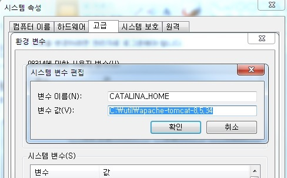
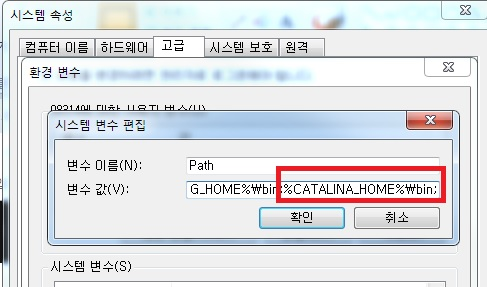

Spring5에서 Gradle을 활용하여 프로젝트를 만들기 위해서는 아래와 같은 작업을 진행해야 한다.


1) JDK 설치 및 Path 설정
 - JDK 다운 : <https://www.oracle.com/kr/index.html>
 - JDK 다운 후 환경변수에서 path 설정 : jdk설치폴더\bin; 추가


_ _ _


2) Eclipse 설치
<https://www.eclipse.org/downloads/>에서 최신버전 다운로드.


_ _ _


3) Tomcat 설치 및 설정
 - <https://tomcat.apache.org/>에서 최신 버전 다운로드.(tomcat 8.5)
 - 환경변수 추가




_ _ _


4) Gradle설치
<https://gradle.org/install/> 에서 Gradle 다운로드.


Eclipe 최신버전에서는 Gradle 혹은 Maven plugin 이 설치되어 있기 때문에 Gradle을 별도로 설치하지 않아도 되지만, 수동으로 Gralde 프로젝트를 수행하는 방법을 익혀보기 위해서 Gradle을 별도로 설치해 보았다.


4-1. <https://gradle.org/release/> 에서 최신 버전의 Gradle 다운로드.


4-2. 다운로드 후 PATH경로에 **"[Gradle설치폴더]\bin"** 추가.


4-3. cmd창에서 `gradle -version` 으로 버전 확인


4-4. 프로젝트 루트 디렉토리에서 build.gradle 파일 생성
```
apply plugin: 'java'

sourceCompatibility = 1.8
targetCompatibility = 1.8
compileJava.options.encoding = "UTF-8"

repositories {
	mavenCentral()
}

dependencies {
	compile 'org.springframework:spring-context:5.1.1.RELEASE'
}

task wrapper(type: Wrapper) {
	gradleVersion = '4.10'
}
```

4-5. 프로젝트 루트 디렉토리에서 `gradle wrapper` 명령어 실행하여 래퍼파일 생성. 실행이 성공하면 gradle.bat파일과 gradle파일, gradle폴더가 생성됨. 해당 파일들은 gradle 명령어 대신 사용할 수 있는 래퍼파일임. 이 래퍼파일을 사용하면 Gradle 설치 없이 Gradle 명령어를 사용할 수 있다.


4-6. `gradlew compileJava` 명령어로 컴파일.


4-7. Gradle 프로젝트를 Eclipse에서 import


4-8. Spring 프로그램 작성


_ _ _


*출처 : 음슴*
