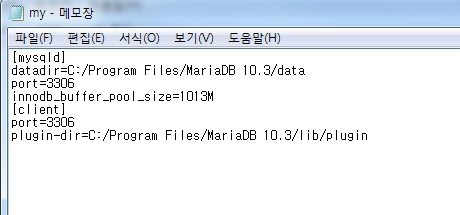
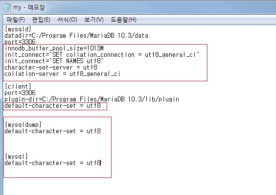

MaraiDB Character Set을 UTF-8로 변경하는 방법

MariaDB를 설치하고 한글 데이터를 테이블에 insert를 해 보면 한글 값이 깨져서 들어가는 것을 확인할 수 있다. 
DB에 한글값이 깨져서 들어가는 것을 막기 위해서는 MariaDB Character Set을 EUC-KR에서 UTF-8로 변경해야 한다.

변경하는 방법은 간단하다.

1) C:\Program Files\MariaDB 10.3\data로 이동하여 my.ini 파일을 연다.

_ _ _

2) my.ini 파일의 character set을 utf-8로 수정한다.

_ _ _

3) MariaDB(mysql) 서비스를 중지 후 재기동한다.

_ _ _

4) MariaDB 설정이 정상적으로 변경이 되었는지 확인한다.

`show variables like 'c%';`

*출처 : http://needjarvis.tistory.com/252
