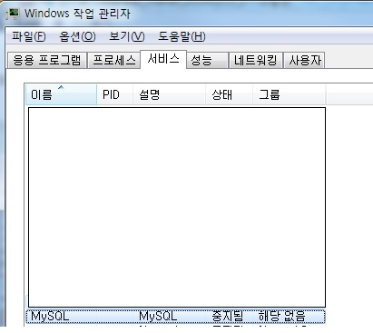

MaraiDB Character Set을 UTF-8로 변경하는 방법

MariaDB를 설치하고 한글 데이터를 테이블에 insert를 해 보면 한글 값이 깨져서 들어가는 것을 확인할 수 있다. 
DB에 한글값이 깨져서 들어가는 것을 막기 위해서는 MariaDB Character Set을 EUC-KR에서 UTF-8로 변경해야 한다.

변경하는 방법은 간단하다.

1) C:\Program Files\MariaDB 10.3\data로 이동하여 my.ini 파일을 연다.

_ _ _

2) my.ini 파일의 character set을 utf-8로 수정한다.

_ _ _

3) MariaDB(mysql) 서비스를 중지 후 재기동한다.

_ _ _

4) 3) MariaDB(mysql) character set 이 변경되었는지 확인한다.

_ _ _

5) 여기까지 했으면 DB에 한글이 insert가 되는줄 알았다. 그런데 실행을 해 보니 또다시 에러가 발생하고 있었다.

**에러 내용 : java.sql.SQLDataException: (conn=49) Incorrect string value: '\xEF\xBF\xBD\xEF\xBF\xBD...' for column 'reply' at row 1**

알고보니 데이터베이스와 테이블의 character set 이 utf8가 정상적으로 변경되지 않았다.

조회 명령어 : `show variables like 'c%';`

조회 결과 : utf8로 변경되지 않은 내용 존재

_ _ _

6) 데이터베이스의 character set을 utf8로 변경한다

명령어 : `ALTER DATABASE (데이터베이스명) DEFAULT CHARACTER SET='utf8' COLLATE='utf8_general_ci'`

조회결과 : 

_ _ _

7) 이젠 한글 insert가 쳐질줄 알았으나, 동일한 에러가 발생했다.
변경한 것은 database의 default character set이었다. 때문에 테이블을 만들 경우 character set이 default로 utf8로 설정되지만 이미 존재하는 테이블의 경우는 character set이 바뀌지 않았다.

명령어 : `show full columns from tbl_reply;`

조회결과 : 

_ _ _

8) 때문에 테이블의 character set도 변경을 해줘야 했다.

명령어 : `ALTER TABLE (테이블명) CONVERT TO CHARACTER SET utf8;`

변경 결과 : 

*출처 : http://needjarvis.tistory.com/252
