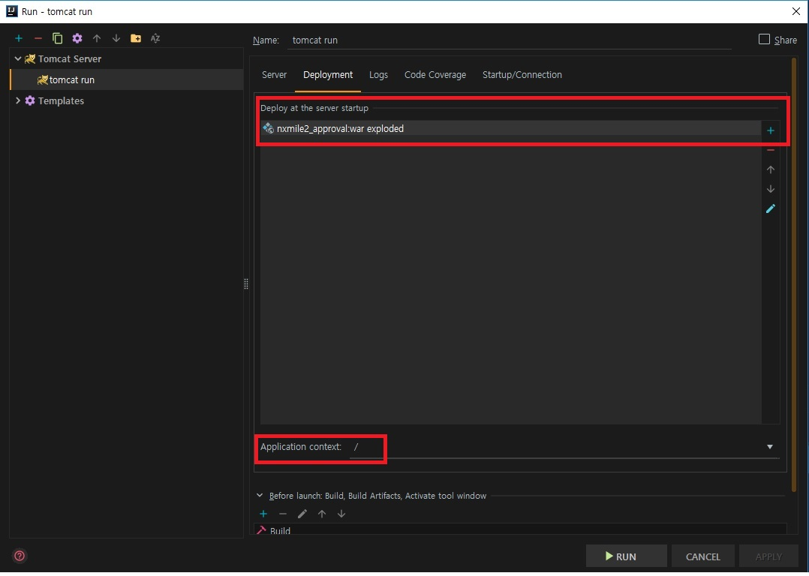

이클립스를 활용할 경우 Spring Legacy Project로 Spring MVC 프로젝트를 만들면 기본 디렉토리 구조가 생성되지만, IntelliJ로 Spring MVC 프로젝트를 만들 경우 이클립스와는 조금은 다르게 디렉토리 구조가 생성이 된다. 때문에 별도의 추가적인 작업이 필요하다.
지금부터는 IntelliJ를 활용하여 Spring MVC 프로젝트를 생성해보도록 하자.


1) IntelliJ 실행 후 Create New Project 실행 -> Maven 선택하고 **Create from archetype** 은 체크 해제 후 NEXT -> GroupId와 ArgifactId를 입력하여 프로젝트 생성.


_ _ _


2) 프로젝트 우클릭하여 Add Framework Support 클릭 -> Spring MVC 선택.
그러면 Spring 관련 Library가 다운이 되면서 Web 디렉토리 등이 새로 생성이 되는 것을 확인할 수 있다.


_ _ _


3) src 디렉토리 구조를 변경한다.
- src/main/java 밑에 필요한 패키지 들을 생성(controller, mapper, domain, service 등)
- src/main/resource 밑에도 mapper 디렉토리를 생성(패키지 아님. 디렉토리의 경우 한개씩 순차적으로 생성해야함.(예)com->zptutxptc->mapper )
- src/test 밑에도 src/main 과 동일한 패키지와 디렉토리를 생성해준다.

**src 디렉토리 구조**


_ _ _


4) web 디렉토리 구조를 변경한다. (web 디렉토리 구조 변경은 이클립스로 Spring MVC 프로젝트 생성 시 기본으로 생성되는 디렉토리 구조와 동일하게 하기 위함이다. 구조를 변경하지 않아도 상관없다. 단 **Web Resource Directory**를 web디렉토리 위치와 동일하게 변경이 필요하다.)
- web/WEB-INF 밑에 있는 applicationContext.xml, dispatcher-servlet.xml을 web/WEB-INF/spring-config(신규생성) 디렉토리로 옮김
- web/WEB-INF/ 밑에 view라는 디렉토리를 신규 생성하고, index.jsp는 삭제
- web 디렉토리를 src/main/ 밑으로 이동시키고 이름을 webapp으로 변경
- File->Project Structure 클릭. Modules의 web을 선택하여 **Web Resource Directroy**애 WEF-INF 경로가 다르게 설정되어 있을 수 있으니 webapp의 위치에 알맞게 변경한다.(필수)

**web 디렉토리 구조**


**Web Resource Directory 경로 변경**


_ _ _


5) web.xml 및 dispatcher-servlet.xml을 수정한다. (applicationContext.xml은 추후 bean등록이나 mybatis 설정 시 수정을 하고 지금은 수정이 불필요함.)

**web.xml**

```
<?xml version="1.0" encoding="UTF-8"?>
<web-app xmlns="http://xmlns.jcp.org/xml/ns/javaee"
         xmlns:xsi="http://www.w3.org/2001/XMLSchema-instance"
         xsi:schemaLocation="http://xmlns.jcp.org/xml/ns/javaee http://xmlns.jcp.org/xml/ns/javaee/web-app_4_0.xsd"
         version="4.0">
    <context-param>
        <param-name>contextConfigLocation</param-name>
        <param-value>/WEB-INF/spring-config/applicationContext.xml</param-value>
    </context-param>
    <listener>
        <listener-class>org.springframework.web.context.ContextLoaderListener</listener-class>
    </listener>
    <servlet>
        <servlet-name>dispatcher</servlet-name>
        <servlet-class>org.springframework.web.servlet.DispatcherServlet</servlet-class>
        <init-param>
            <param-name>contextConfigLocation</param-name>
            <param-value>/WEB-INF/spring-config/dispatcher-servlet.xml</param-value>
        </init-param>
        <load-on-startup>1</load-on-startup>
    </servlet>
    <servlet-mapping>
        <servlet-name>dispatcher</servlet-name>
        <url-pattern>/</url-pattern>
    </servlet-mapping>
    <filter>
        <filter-name>encoding</filter-name>
        <filter-class>org.springframework.web.filter.CharacterEncodingFilter</filter-class>
        <init-param>
            <param-name>encoding</param-name>
            <param-value>UTF-8</param-value>
        </init-param>
    </filter>
    <filter-mapping>
        <filter-name>encoding</filter-name>
        <servlet-name>dispatcher</servlet-name>
    </filter-mapping>
</web-app>

```


**dispatcher-servlet.xml**

```
<?xml version="1.0" encoding="UTF-8"?>
<beans xmlns="http://www.springframework.org/schema/beans"
       xmlns:xsi="http://www.w3.org/2001/XMLSchema-instance"
       xmlns:context="http://www.springframework.org/schema/context"
       xmlns:mvc="http://www.springframework.org/schema/mvc"
       xsi:schemaLocation="http://www.springframework.org/schema/beans http://www.springframework.org/schema/beans/spring-beans.xsd http://www.springframework.org/schema/cache http://www.springframework.org/schema/cache/spring-cache.xsd http://www.springframework.org/schema/context http://www.springframework.org/schema/context/spring-context.xsd http://www.springframework.org/schema/mvc http://www.springframework.org/schema/mvc/spring-mvc.xsd">
    <!-- annotaion  인식-->
    <mvc:annotation-driven />
    <mvc:resources mapping="/resources/**" location="/resources/" />

    <bean class="org.springframework.web.servlet.view.InternalResourceViewResolver">
        <property name="prefix" value="/WEB-INF/views/" />
        <property name="suffix" value=".jsp" />
    </bean>

    <context:component-scan base-package="com.zptutxptc.controller" />
</beans>

```


_ _ _


6) pom.xml을 수정 후 maven dependency re-import 수행(java, spring, aspectj, slf4j 버전 및 dependencies 추가 등)

```
<?xml version="1.0" encoding="UTF-8"?>
<project xmlns="http://maven.apache.org/POM/4.0.0"
         xmlns:xsi="http://www.w3.org/2001/XMLSchema-instance"
         xsi:schemaLocation="http://maven.apache.org/POM/4.0.0 http://maven.apache.org/xsd/maven-4.0.0.xsd">
    <modelVersion>4.0.0</modelVersion>
    <groupId>com.zptutxptc</groupId>
    <artifactId>approval_service</artifactId>
    <version>1.0-SNAPSHOT</version>
    <name>approval_service</name>
    <packaging>war</packaging>
    <properties>
        <java-version>1.8</java-version>
        <org.springframework-version>5.1.2.RELEASE</org.springframework-version>
        <org.aspectj-version>1.9.2</org.aspectj-version>
        <org.slf4j-version>1.7.25</org.slf4j-version>
    </properties>
    <dependencies>
        <!-- Spring -->
        <dependency>
            <groupId>org.springframework</groupId>
            <artifactId>spring-context</artifactId>
            <version>${org.springframework-version}</version>
            <exclusions>
                <!-- Exclude Commons Logging in favor of SLF4j -->
                <exclusion>
                    <groupId>commons-logging</groupId>
                    <artifactId>commons-logging</artifactId>
                </exclusion>
            </exclusions>
        </dependency>
        <dependency>
            <groupId>org.springframework</groupId>
            <artifactId>spring-webmvc</artifactId>
            <version>${org.springframework-version}</version>
        </dependency>


        <!-- AspectJ -->
        <dependency>
            <groupId>org.aspectj</groupId>
            <artifactId>aspectjrt</artifactId>
            <version>${org.aspectj-version}</version>
        </dependency>

        <!-- Logging -->
        <dependency>
            <groupId>org.slf4j</groupId>
            <artifactId>slf4j-api</artifactId>
            <version>${org.slf4j-version}</version>
        </dependency>
        <dependency>
            <groupId>org.slf4j</groupId>
            <artifactId>jcl-over-slf4j</artifactId>
            <version>${org.slf4j-version}</version>
            <scope>runtime</scope>
        </dependency>
        <dependency>
            <groupId>org.slf4j</groupId>
            <artifactId>slf4j-log4j12</artifactId>
            <version>${org.slf4j-version}</version>
            <scope>runtime</scope>
        </dependency>
        <dependency>
            <groupId>log4j</groupId>
            <artifactId>log4j</artifactId>
            <version>1.2.17</version>
            <exclusions>
                <exclusion>
                    <groupId>javax.mail</groupId>
                    <artifactId>mail</artifactId>
                </exclusion>
                <exclusion>
                    <groupId>javax.jms</groupId>
                    <artifactId>jms</artifactId>
                </exclusion>
                <exclusion>
                    <groupId>com.sun.jdmk</groupId>
                    <artifactId>jmxtools</artifactId>
                </exclusion>
                <exclusion>
                    <groupId>com.sun.jmx</groupId>
                    <artifactId>jmxri</artifactId>
                </exclusion>
            </exclusions>
        </dependency>

        <!-- @Inject -->
        <dependency>
            <groupId>javax.inject</groupId>
            <artifactId>javax.inject</artifactId>
            <version>1</version>
        </dependency>

        <!-- Servlet -->
        <dependency>
            <groupId>javax.servlet</groupId>
            <artifactId>javax.servlet-api</artifactId>
            <version>4.0.1</version>
            <scope>provided</scope>
        </dependency>
        <dependency>
            <groupId>javax.servlet.jsp</groupId>
            <artifactId>jsp-api</artifactId>
            <version>2.1</version>
            <scope>provided</scope>
        </dependency>
        <dependency>
            <groupId>javax.servlet</groupId>
            <artifactId>jstl</artifactId>
            <version>1.2</version>
        </dependency>

        <!-- Test -->
        <dependency>
            <groupId>junit</groupId>
            <artifactId>junit</artifactId>
            <version>4.12</version>
            <scope>test</scope>
        </dependency>
    </dependencies>
    <build>
        <plugins>
            <plugin>
                <artifactId>maven-eclipse-plugin</artifactId>
                <version>2.9</version>
                <configuration>
                    <additionalProjectnatures>
                        <projectnature>org.springframework.ide.eclipse.core.springnature</projectnature>
                    </additionalProjectnatures>
                    <additionalBuildcommands>
                        <buildcommand>org.springframework.ide.eclipse.core.springbuilder</buildcommand>
                    </additionalBuildcommands>
                    <downloadSources>true</downloadSources>
                    <downloadJavadocs>true</downloadJavadocs>
                </configuration>
            </plugin>
            <plugin>
                <groupId>org.apache.maven.plugins</groupId>
                <artifactId>maven-compiler-plugin</artifactId>
                <version>2.5.1</version>
                <configuration>
                    <source>1.8</source>
                    <target>1.8</target>
                    <compilerArgument>-Xlint:all</compilerArgument>
                    <showWarnings>true</showWarnings>
                    <showDeprecation>true</showDeprecation>
                </configuration>
            </plugin>
            <plugin>
                <groupId>org.codehaus.mojo</groupId>
                <artifactId>exec-maven-plugin</artifactId>
                <version>1.2.1</version>
                <configuration>
                    <mainClass>org.test.int1.Main</mainClass>
                </configuration>
            </plugin>
        </plugins>
    </build>
</project>

```


_ _ _


7) /src/main/java/ 밑에 com.zptutxptc.controller 패키지에 **HomeController.java**를 작성한다.

**HomeController.java**

```
package com.zptutxptc.controller;

import org.springframework.stereotype.Controller;
import org.springframework.ui.Model;
import org.springframework.web.bind.annotation.GetMapping;

@Controller
public class HomeController {

    @GetMapping("/")
    public String home(Model model) {
        model.addAttribute("hi", "Hello");
        return "home";
    }
}
```


_ _ _

8) /src/main/webapp/WEB-INF/views에 **home.jsp**를 작성한다.

**home.jsp**

```
<%@ page contentType="text/html;charset=UTF-8" language="java" %>
<html>
<head>
    <title>Home</title>
</head>
<body>
    <h2>Home Page</h2>
    <h1>${hi}</h1>
</body>
</html>

```


_ _ _

9) Run -> Edit Configurations(Alt + Shift + F10)에서 tomcat server 설정
 - tomcat 서버 신규 생성(local)
 - Server 의 URL 변경
 - Deployment를 war exploded로 등록 및 application context를 root(/)로 변경





10) 설정된 tomcat server 구동

*출처 : <https://doublesprogramming.tistory.com/171> 참고
