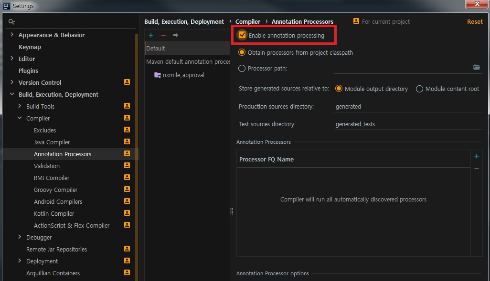

IntelliJ에서 Lombok 설정을 해보자.
Lombok이란, Java 개발을 하면서 가장 손이 많이 가는 작업 중에 하나가 Getter/Setter함수 생성, 생성자 생성 등인데 해당 작업을 어노테이션 하나로 수행가능하게 해주는 라이브러리다.

Lombok을 사용하려면 아래와 같은 방법을 통해 설치 후 사용해야 한다.


_ _ _


1) File -> Setting -> plugins에서 **Lombok Plugin** 설치


_ _ _


2) File -> Setting -> Build, Execution, Deployment -> Compiler -> Annotation Processors 에서 **Enable annotation processing** 체크



_ _ _


3) pom.xml 에 lombok dependency 추가(lombok의 버전은 maven repository에서 최신버전을 확인하여 작성하자.) 및 maven re-import

```
        <!-- Lombok-->
        <dependency>
            <groupId>org.projectlombok</groupId>
            <artifactId>lombok</artifactId>
            <version>1.18.4</version>
            <scope>provided</scope>
        </dependency>
```


_ _ _


4)IntelliJ 재기동 후 소스에 적용

```
package com.zptutxptc.domain;
import lombok.Data;

@Data
public class ZptutxptcInputVO {
    private String mbrsh_pgm_id;
    private String mbr_id;
    private String crd_no;
    private String orgn_deal_dy;
    private String orgn_deal_aprv_no;
    private String orgn_deal_amt;
    private String mcht_no;
}

```


*출처 : <https://gmlwjd9405.github.io/2018/11/29/intellij-lombok.html> 참고
