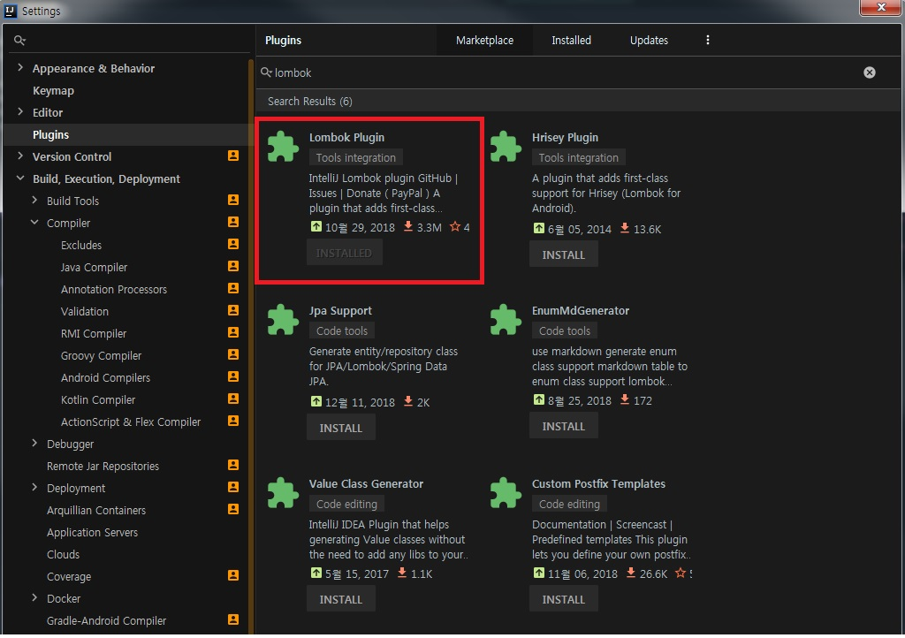

Spring 개발 중 DB와 연동하기 위해선 Mybatis를 활용하면 편하다.
Mybatis란 흔히 'SQL 매핑 프레임워크' 로 분류되는데, 개발자들이 JDBC 코드의 복잡한 작업을 피하는 용도로 많이 사용된다.
Mybatis의 특징으로는
- 자동으로 Connection close() 가능
- Mybatis 내부적으로 PreparedStatement 처리
- 리턴 타입을 지정하는 경우 자동으로 객체 생성 및 ResultSet 처리
등이 있다.


Mybatis와 Spring을 연동하기 위해서는 아래와 같이 진행하면 된다.(이 글에서는 Mybatis를 활용하여 **MariaDB**에 접속할 것이다.)

_ _ _


1) pom.xml에 mybatis를 위한 라이브러리 추가(mybatis, mybatis-spring, spring-tx, spring-jdbc 등). 해당 라이브러리들은 maven repository에서 검색하여 최신 버전으로 다운받는다. 추가로 connection pool, lombok, spring-test, sql logging 을 위한 라이브러리도 다운받는다. 
- spring-jdbc/spring-tx : 스프링에서 데이터베이스 처리와 트랜잭션 처리
- mybatis/mybatis-spring : mybatis와 스프링 연동용 라이브러리
```
        <!-- mybatis lib-->
        <dependency>
            <groupId>org.springframework</groupId>
            <artifactId>spring-jdbc</artifactId>
            <version>${org.springframework-version}</version>
        </dependency>
        <dependency>
            <groupId>org.springframework</groupId>
            <artifactId>spring-tx</artifactId>
            <version>${org.springframework-version}</version>
        </dependency>
        <dependency>
            <groupId>org.mybatis</groupId>
            <artifactId>mybatis</artifactId>
            <version>3.4.6</version>
        </dependency>
        <dependency>
            <groupId>org.mybatis</groupId>
            <artifactId>mybatis-spring</artifactId>
            <version>1.3.2</version>
        </dependency>

        <!-- MariaDB client lib-->
        <dependency>
            <groupId>org.mariadb.jdbc</groupId>
            <artifactId>mariadb-java-client</artifactId>
            <version>2.3.0</version>
        </dependency>

        <!-- connection pool lib-->
        <dependency>
            <groupId>com.zaxxer</groupId>
            <artifactId>HikariCP</artifactId>
            <version>3.2.0</version>
        </dependency>

        <!-- spring 테스트 lib-->
        <dependency>
            <groupId>org.springframework</groupId>
            <artifactId>spring-test</artifactId>
            <version>${org.springframework-version}</version>
        </dependency>

        <!-- SQL로그 확인용 lib-->
        <dependency>
            <groupId>org.bgee.log4jdbc-log4j2</groupId>
            <artifactId>log4jdbc-log4j2-jdbc4</artifactId>
            <version>1.16</version>
        </dependency>

        <!-- Lombok lib-->
        <dependency>
            <groupId>org.projectlombok</groupId>
            <artifactId>lombok</artifactId>
            <version>1.18.4</version>
            <scope>provided</scope>
        </dependency>
```


_ _ _


2) applicationContext.xml(혹은 root-context.xml)에 DB 연동을 위한 bean 등록(HikariCP, dataSource, SQLSessionFactory 등)
```
<?xml version="1.0" encoding="UTF-8"?>
<beans xmlns="http://www.springframework.org/schema/beans"
       xmlns:xsi="http://www.w3.org/2001/XMLSchema-instance"
       xmlns:mybatis-spring="http://mybatis.org/schema/mybatis-spring"
       xmlns:context="http://www.springframework.org/schema/context"
       xsi:schemaLocation="http://www.springframework.org/schema/beans http://www.springframework.org/schema/beans/spring-beans.xsd http://mybatis.org/schema/mybatis-spring http://mybatis.org/schema/mybatis-spring.xsd http://www.springframework.org/schema/context http://www.springframework.org/schema/context/spring-context.xsd">

    <!-- HikariCP connection pool bean 셋팅-->
    <bean id="hikariConfig" class="com.zaxxer.hikari.HikariConfig">
        <property name="driverClassName" value="net.sf.log4jdbc.sql.jdbcapi.DriverSpy"></property>
        <property name="jdbcUrl" value="jdbc:log4jdbc:mariadb://127.0.0.1:3306/test"></property>
        <property name="username" value="root"></property>
        <property name="password" value="1111"></property>
    </bean>

    <!-- 커넥션 pool을 사용할 dataSource bean 셋팅-->
    <bean id="dataSource" class="com.zaxxer.hikari.HikariDataSource" destroy-method="close">
        <constructor-arg ref="hikariConfig"></constructor-arg>
    </bean>

    <!-- DB connection 및 SQL전달/리턴을 위한 SQLSession을 만들어내는 SQLSessionFactory bean 셋팅-->
    <bean id="sqlSessionFactory" class="org.mybatis.spring.SqlSessionFactoryBean">
        <property name="dataSource" ref="dataSource"></property>
    </bean>

    <!-- base-package 에 정의된 package 내 클래스 및 xml을 SQL 처리를 위한 mapper로 인식-->
    <mybatis-spring:scan base-package="com.zptutxptc.mapper" />

    <!-- base-package에 정의된 package내 소스 중 @Component가 작성된 Class를 bean으로 인식-->
    <context:component-scan base-package="com.zptutxptc.service" />

</beans>
```



*출처 : ++코드로 배우는 스프링 웹 프로젝트(개정판)++ 참고
