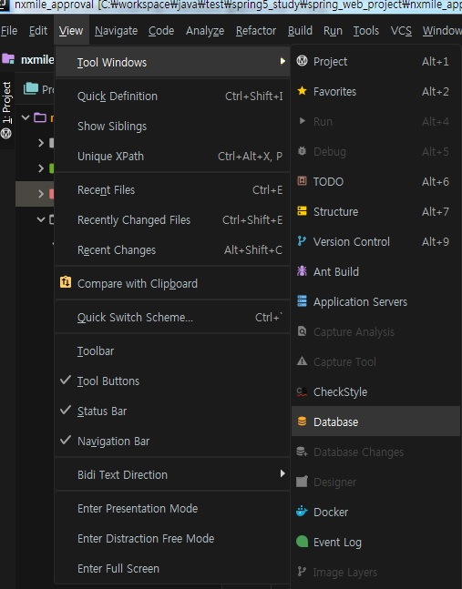
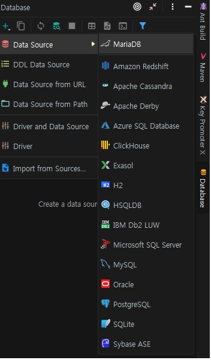
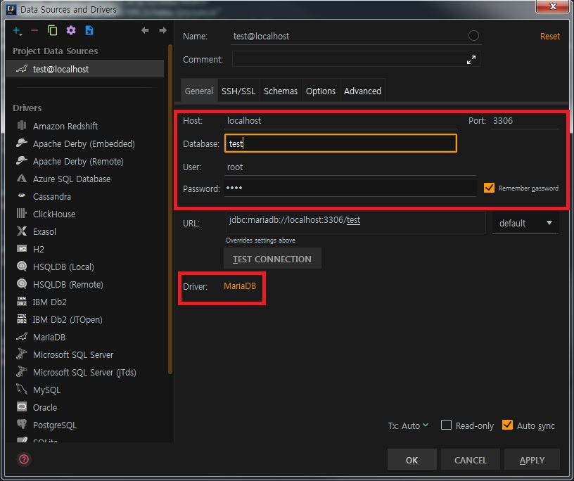
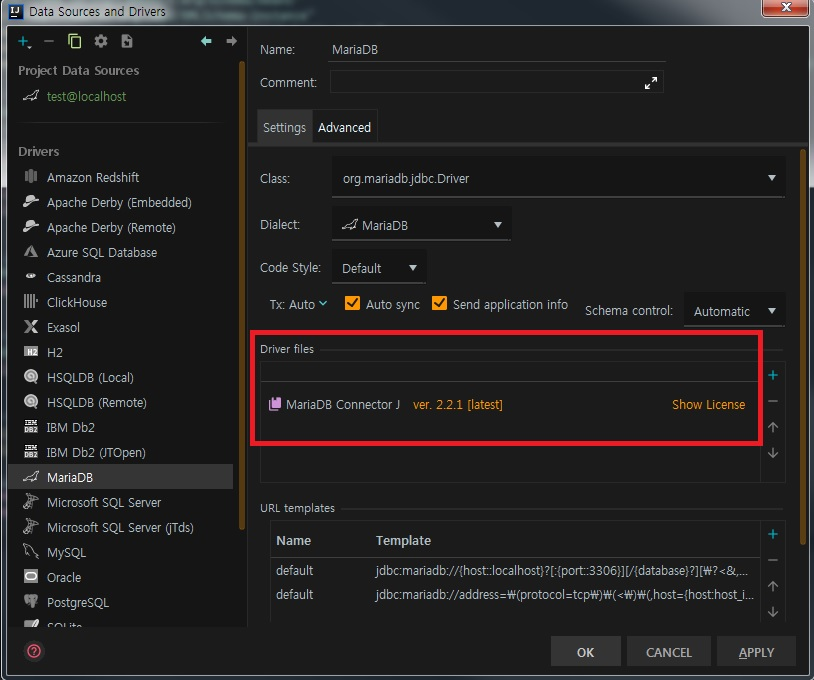
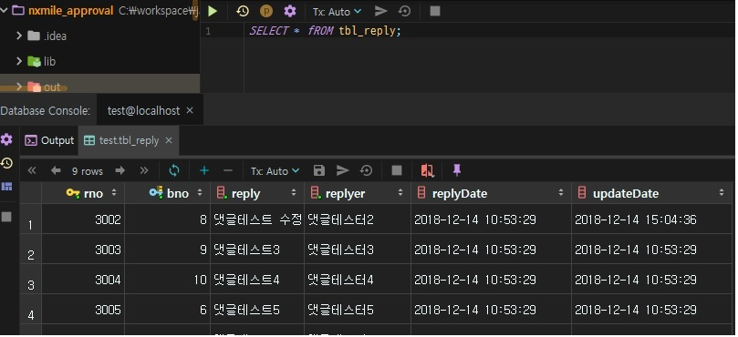

IntelliJ 기능 중 Database 정보를 확인할 수 있는 tool이 존재한다.
해당 기능을 사용하는 방법에 대해 알아보자.

_ _ _

1) IntelliJ 상단의 View -> Tool Windows -> Database 선택

_ _ _

2) 화면 우측에 Database창에서 +버튼 클릭 -> DataSource -> MariaDB(접속하려는 DBMS) 선택

_ _ _

3) database 명 및 user/password 정보 입력 후 밑에 Driver 부분의 MariaDB 클릭

_ _ _

4) Driver files의 MariaDB Connector J 우측에 **download** 버튼 클릭하여 connector 다운로드. 다운로드 완료 후 Apply버튼 클릭하고 OK버튼 클릭

_ _ _

5) Open Console(단축키 F4) 클릭하여 SQL 입력 가능한 화면 open. SQL로 데이터 CRUD 처리

*출처 : 음슴
