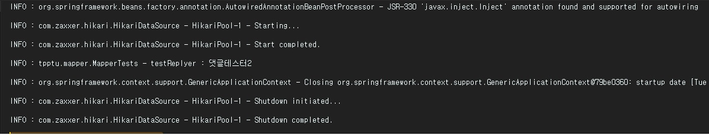
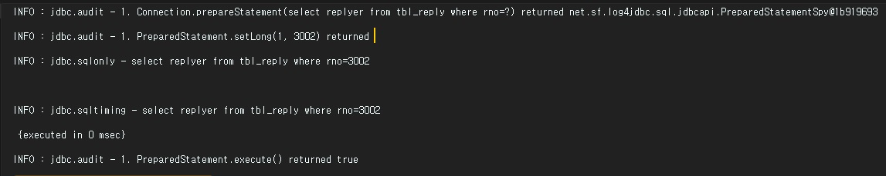

Mybatis를 사용할 경우 파라미터 값이 "?"로 치환되어 처리된다. 때문에 복잡한 SQL의 경우 "?"로 나오는 값이 제대로 되었는지 확인하기가 어렵고, 실행된 SQL의 내용을 정확히 확인하기가 어렵다. 때문에 파라미터 "?"가 어떤 값으로 처리되었는지 확인하는 기능을 추가하기 위해 **log4jdbc-log4j2** 라이브러리를 사용한다. 


_ _ _


1) pom.xml에 dependency를 추가 후 maven re-import.
```
        <!-- SQL로그 확인용 lib-->
        <dependency>
            <groupId>org.bgee.log4jdbc-log4j2</groupId>
            <artifactId>log4jdbc-log4j2-jdbc4</artifactId>
            <version>1.16</version>
        </dependency>
```


_ _ _


2) src/main/resource 밑에 log4jdbc.log4j2.properties파일을 생성하고 아래 코드를 작성한다.

```
log4jdbc.spylogdelegator.name=net.sf.log4jdbc.log.slf4j.Slf4jSpyLogDelegator
log4jdbc.drivers=org.mariadb.jdbc.Driver

```


_ _ _


3) src/webapp/WEB-INF/spring-config/applicationContext.xml파일에서 driverClassName과 jdbcUrl부분을 아래와 같이 수정한다.
```
    <!-- HikariCP connection pool bean 셋팅-->
    <bean id="hikariConfig" class="com.zaxxer.hikari.HikariConfig">
        <!--<property name="driverClassName" value="org.mariadb.jdbc.Driver"></property>-->
        <!--<property name="jdbcUrl" value="jdbc:mariadb://127.0.0.1:3306/test"></property>-->
        <property name="driverClassName" value="net.sf.log4jdbc.sql.jdbcapi.DriverSpy"></property>
        <property name="jdbcUrl" value="jdbc:log4jdbc:mariadb://127.0.0.1:3306/test"></property>
        <property name="username" value="root"></property>
        <property name="password" value="1111"></property>
    </bean>
```


_ _ _


4)결과 화면

변경 전



변경 후



*출처 : ++코드로 배우는 스프링 웹 프로젝트(개정판)++ 참고
