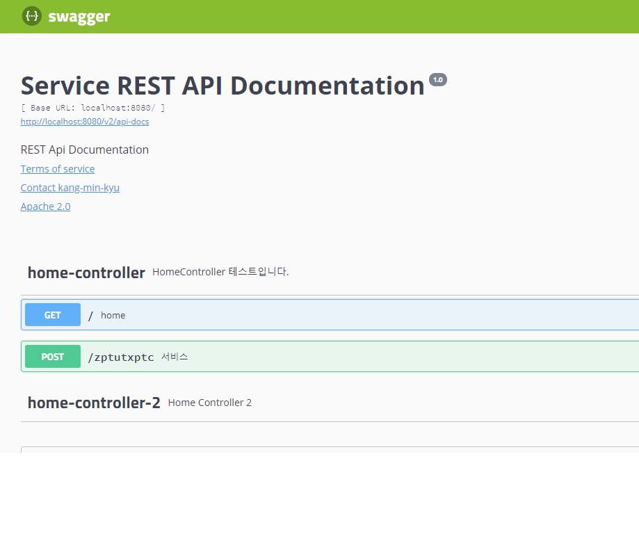

Spring 프로젝트를 진행하면서 Controller에 API를 만들게 되면 해당 API의 URL, 입출력값 등 API의 정보를 문서화하여 다른 개발자 들에게 공유할 필요가 있다. 하지만 엑셀이나 워드를 활용하여 별로의 문서를 만든다는건 여간 귀찮은 일이 아닐 수 없다. 
API 정보를 엑셀이나 워드이 아닌 HTML 문서로 만들어주는 기능이 있는데 그것을 **Swagger**라는 라이브러리이다.
이 라이브러리는 서버가 올라갈 때 자동으로 RestController 어노테이션을 읽어서 내부의 API를 분석하고 HTML 문서를 작성해 API 정보를 확인할 수 있게 해준다. 


Spring 프로젝트에 Swagger를 적용시키는 방법은 <https://www.baeldung.com/swagger-2-documentation-for-spring-rest-api>에도 잘 나와있지만 개인적으로 한번 정리해 보았다.


_ _ _


1) pom.xml에 dependency를 추가 후 maven re-import. 버전은 maven repository에서 최신 버전으로 적용하도록 하자.
```
        <!-- swagger -->
        <dependency>
            <groupId>io.springfox</groupId>
            <artifactId>springfox-swagger-ui</artifactId>
            <version>2.9.2</version>
        </dependency>
        <dependency>
            <groupId>io.springfox</groupId>
            <artifactId>springfox-swagger2</artifactId>
            <version>2.9.2</version>
        </dependency>
```


_ _ _


2) src/main/java/적당한 패키지명 밑에 SwaggerConfig 파일을 생성한다. 아래 작성한 SwaggerConfig는 Docket만 필수항목이고, getApiInfo() 와 getArrayList()는 작성하지 않아도 되며, 작성하지 않을 경우 Docket에서도 제외시켜준다. 

```
package com.commons.config;

import org.springframework.context.annotation.Bean;
import org.springframework.context.annotation.Configuration;
import org.springframework.web.bind.annotation.RequestMethod;
import springfox.documentation.builders.PathSelectors;
import springfox.documentation.builders.RequestHandlerSelectors;
import springfox.documentation.builders.ResponseMessageBuilder;
import springfox.documentation.service.ApiInfo;
import springfox.documentation.service.Contact;
import springfox.documentation.service.ResponseMessage;
import springfox.documentation.service.VendorExtension;
import springfox.documentation.spi.DocumentationType;
import springfox.documentation.spring.web.plugins.Docket;
import springfox.documentation.swagger2.annotations.EnableSwagger2;

import java.util.ArrayList;

@Configuration
@EnableSwagger2
public class SwaggerConfig {

    @Bean // 필수항목
    public Docket customImplementation() {
        return new Docket(DocumentationType.SWAGGER_2)
                .useDefaultResponseMessages(false)  // 기존적인 응답메시지 미사용
                .globalResponseMessage(RequestMethod.POST, getArrayList()) // getArrayList()함수에서 정의한 응답메시지 사용
                .apiInfo(getApiInfo())
                .select()                   // return ApiSelectoorBuilder(화면 관리)
                .apis(RequestHandlerSelectors.basePackage("com")) // Swagger를 적용할 패키지
                .paths(PathSelectors.any()) // url path 지정(예를들면 PathSelectors.ant("/home/**")인 경우 /home/ path를 가진 url만 공개하겠다는 의미. any인 경우 전체 url
                .build();                   // selector build
    }

    // 선택항목(Swagger UI에서 보여지는 정보)
    public ApiInfo getApiInfo() {
        return new ApiInfo("Service REST API Documentation",        // swagger 제목
                "REST Api Documentation",                     // swagger 설명
                "1.0",                                           // swaggeer 버전
                "localhost:8080",
                new Contact("kang-min-kyu","","aaa@gmail.com"), //작성자 정보
                "Apache 2.0", "http://www.apache.org/licenses/LICENSE-2.0",
                new ArrayList<VendorExtension>());
    }

    // 선택항목(responseMessage 리스트를 별도로 생성.(defaultResponseMessage 미사용))
    private ArrayList<ResponseMessage> getArrayList() {
        ArrayList<ResponseMessage> lists = new ArrayList<ResponseMessage>();
        lists.add(new ResponseMessageBuilder().code(500).message("이상한요청").build());
        lists.add(new ResponseMessageBuilder().code(403).message("황당한요청").build());
        lists.add(new ResponseMessageBuilder().code(401).message("비인증된접근").build());
        return lists;
    }
}


```


_ _ _


3) dispatcher-servlet.xml(혹은 servlet-context.xml) 파일에 아래와 같이 Swagger 관련 bean 정보 및 resource 정보를 추가해준다.


```
    <!-- swagger -->
    <bean id="swagger2Config" class="com.commons.config.SwaggerConfig"></bean>
    <mvc:resources location="classpath:/META-INF/resources/" mapping="swagger-ui.html"></mvc:resources>
    <mvc:resources location="classpath:/META-INF/resources/webjars/"  mapping="/webjars/**"></mvc:resources>
```


_ _ _


4) Controller에 아래와 같이 Swagger 코드를 입력한다.

```
package com.tpptu.controller;


import com.tpptu.domain.ZptutxptcInputVO;
import com.tpptu.domain.ZptutxptcOutputVO;
import com.tpptu.service.ZptutxptcService;
import io.swagger.annotations.Api;
import io.swagger.annotations.ApiOperation;
import io.swagger.annotations.ApiResponse;
import io.swagger.annotations.ApiResponses;
import lombok.AllArgsConstructor;
import org.springframework.http.MediaType;
import org.springframework.http.ResponseEntity;
import org.springframework.ui.Model;
import org.springframework.web.bind.annotation.GetMapping;
import org.springframework.web.bind.annotation.PostMapping;
import org.springframework.web.bind.annotation.RequestBody;
import org.springframework.web.bind.annotation.RestController;

import javax.servlet.http.HttpServletRequest;

@RestController
@AllArgsConstructor
@Api(value = "HomeControllerTest", description = "HomeController 테스트입니다.") // Controller에 대한 Swagger 설명
public class HomeController {

    CallService callService;

    @ApiOperation(  // API에 대한 Swagger 설명
            value="서비스",
            notes = "서비스입니다.",
            httpMethod = "POST",
            consumes = "application/json",
            produces = "application/json",
            protocols = "http",
            responseHeaders = {
                    //headers
            })
    @ApiResponses({  // Response Message에 대한 Swagger 설명
            @ApiResponse(code = 200, message = "OK"),
            @ApiResponse(code = 404, message = "No params")
    })
    @PostMapping(value="/service", consumes = MediaType.APPLICATION_JSON_VALUE)
    public ResponseEntity<OutputVO> service(HttpServletRequest Header,
                                                       @RequestBody InputVO inputVO) {

        return callService.syncCall(Header, inputVO);
    }

    @ApiImplicitParams({
            @ApiImplicitParam(name = "area", value = "지역", required = true, dataType = "String", paramType = "path"),
            @ApiImplicitParam(name = "param1", value = "파라미터1", required = true, dataType = "String", paramType = "query"),
            @ApiImplicitParam(name = "param2", value = "파마미터2", required = false, dataType = "int", paramType = "query")
    })
    @GetMapping(value = "/home/{area}")
    public String home(@PathVariable String area, @RequestParam String param1, @RequestParam int param2) {
        return "home";
    }
    
    @GetMapping(value = "/")
    public String home(Model model) {
        model.addAttribute("hi", "Hello~~");
        return "home";
    }
}

```


_ _ _


5) <http://localhost:8080/swagger-ui.html> 로 접속하면 내가 만든 Swagger 웹페이지를 확인할 수 있다.




*출처 : <https://steemit.com/kr-dev/@igna84/spring-boot-web-swagger> 참고
