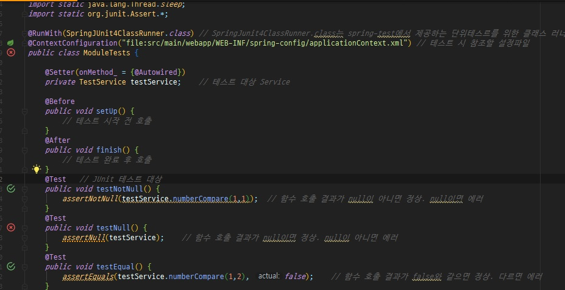
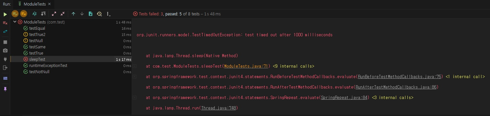

Spring 프로젝트를 어느정도 진행되다 보면 단위테스트를 수행하여 해당 프로그램이 정상적으로 작동되는지 테스트를 해봐야 한다.
이때 보통 JUnit을 활용하여 단위테스트를 진행한다.

1. JUnit이란

**JUnit은 java 프로그램 단위테스트를 쉽게 해주는 테스트용 Framework이다.**

2. JUnit의 장점
JUnit을 활용하면 system.out으로 번거롭게 디버깅 하지 않아도 되며 테스트 시 시간이 절약된다.
또한 테스트 결과를 단순 텍스트로 남기는 것이 아니라 Test클래스로 남기기 때문에 테스트 방법 및 이력을 남길 수 있어서 편리하다.
@Test 어노테이션을 활용하여 단순하게 코드를 만들 수 있으며, 성공시에는 녹색, 실패 시에는 붉은색으로 표시가 된다.


3. JUnit 테스트 방법

_ _ _


1) pom.xml에 spring-test 및 JUnit 라이브러리를 추가한다.(maven repo에서 최신버전으로 적용한다.)
```
        <dependency>
            <groupId>org.springframework</groupId>
            <artifactId>spring-test</artifactId>
            <version>5.1.2.RELEASE</version>
        </dependency>
        <dependency>
            <groupId>junit</groupId>
            <artifactId>junit</artifactId>
            <version>4.12</version>
            <scope>test</scope>
        </dependency>

```


_ _ _


2) Test 대상인 클래스를 생성한다.(서비스, 컨트롤러)

src/main/java/com/test/service/TestService.java
```
package com.test.service;

import org.springframework.stereotype.Service;

@Service
public class TestService {

    public boolean numberCompare(int number1, int number2) {
        if (number1 == number2) {
            return true;
        } else {
            return false;
        }
    }
}

```


src/main/java/com/test/controller/TestController.java
```
package com.test.controller;


import com.test.service.TestService;
import lombok.Setter;
import org.springframework.beans.factory.annotation.Autowired;
import org.springframework.web.bind.annotation.GetMapping;
import org.springframework.web.bind.annotation.RequestParam;
import org.springframework.web.bind.annotation.RestController;

@RestController
public class TestController {

    @Setter(onMethod_ = {@Autowired})
    private TestService testService;

    @GetMapping(value = "/test")
    public boolean test(@RequestParam int number1, @RequestParam int number2) {
        return testService.numberCompare(number1, number2);
    }
}


```


_ _ _


3) test/java 밑에 JUnit 테스트 클래스를 생성한다.(이 블로그에서는 test/java/com/test/ModuleTests.java 생성)
```
package com.test;


import com.test.service.TestService;
import lombok.Setter;
import org.junit.After;
import org.junit.Before;
import org.junit.Ignore;
import org.junit.Test;
import org.junit.runner.RunWith;
import org.springframework.beans.factory.annotation.Autowired;
import org.springframework.test.context.ContextConfiguration;
import org.springframework.test.context.junit4.SpringJUnit4ClassRunner;

import static java.lang.Thread.sleep;
import static org.junit.Assert.*;

@RunWith(SpringJUnit4ClassRunner.class) // SpringJunit4ClassRunner.class는 spring-test에서 제공하는 단위테스르를 위한 클래스 러너
@ContextConfiguration("file:src/main/webapp/WEB-INF/spring-config/applicationContext.xml") // 테스트 시 참조할 설정파일
public class ModuleTests {

    @Setter(onMethod_ = {@Autowired})
    private TestService testService;    // 테스트 대상 Service

    @Before
    public void setUp() {
        // 테스트 시작 전 호출
    }
    @After
    public void finish() {
        // 테스트 완료 후 호출
    }
    @Test   // JUnit 테스트 대상
    public void testNotNull() {
        assertNotNull(testService.numberCompare(1,1));  // 함수 호출 결과가 null이 아니면 정상. null이면 에러
    }
    @Test
    public void testNull() {
        assertNull(testService);    // 함수 호출 결과가 null이면 정상. null이 아니면 에러
    }
    @Test
    public void testEqual() {
        assertEquals(testService.numberCompare(1,2), false);    // 함수 호출 결과가 false와 같으면 정상. 다르면 에러
    }
    @Test
    public void testSame() {
        assertSame(testService, testService);   // 두 객체가 같은 객체이면 정상. 다르면 에러
    }
    @Test
    public void testTrue() {
        assertTrue(testService.numberCompare(1,1));     // 함수 호출 결과가 true를 리턴하면 정상. false면 에러
    }
    @Test
    public void testTrue2() {
        assertTrue(testService.numberCompare(2,1));     // 함수 호출 결과가 false 이므로 에러
    }
    @Test(expected = RuntimeException.class)            // RuntimeExcepion 이 발생할 경우 정상. 미 발생 시 에러
    public void runtimeExceptionTest() {
        throw new RuntimeException();
    }
    @Test(timeout=1000)                                 // Test timeout을 1000밀리초로 설정. 1000밀리초 이상 지연될 경우 에러
    public void sleepTest() throws Exception{
        sleep(10000);
    }
    @Test
    @Ignore         // 테스트를 skip하는 어노테이션
    public void ignoreTest() {
        assertTrue(1==2);
    }
}


```


_ _ _


4) JUnit 테스트를 실행한다.(Alt + Shift + F10) 테스트 시 결과가 녹색으로 뜰 경우는 정상, 그렇지 않은 경우 오류가 발생한 것이기 때문에 확인해야 한다.




_ _ _


참고) JUnit assert 주요 메서드

| assert 메서드                      | 설명                               |
|-----------------------------------|-----------------------------------|
|assertArrayEquals(a,b)             | 배열 A와 B가 일치함을 확인           |
|-----------------------------------|-----------------------------------|
|asserEquals(a,b)                  | 배열 A와 B가 일치함을 확인            |
|-----------------------------------|-----------------------------------|
|assertSame(a,b)                   | 객체 A와 B가 일치함을 확인            |
|-----------------------------------|-----------------------------------|
|assertTrue(a)                     | 조건 a가 참인가를 확인한다            |
|-----------------------------------|-----------------------------------|
|assertNotNull(a)                  | 객체 a가 null이 아님을 확인한다       |

이외의 함수는 <http://junit.sourceforge.net/javadoc/org/junit/Assert.html> 에서 확인 가능하다.


_ _ _


참고) JUnit 주요 어노테이션

JUnit 테스트를 위한 기본 셋팅
 
`@RunWith(SpringJUnit4ClassRunner.class) // SpringJunit4ClassRunner.class는 spring-test에서 제공하는 단위테스르를 위한 클래스 러너`

`@ContextConfiguration("file:src/main/webapp/WEB-INF/spring-config/applicationContext.xml") // 테스트 시 참조할 설정파일`


테스트하기
`
@Test
`


테스트 시작 전 호출
`
@Before
`


테스트 종료 후 호출
`
@After
`


메서드 수행 시간 제한하기
 
`
@Test(timeout=5000)
`


Exception 테스트하기
 
`
@Test(expected=RuntimeException.class)
`


테스트 무시하기
`
@Test
@Ignore
`


_ _ _


*출처 : 
<https://postitforhooney.tistory.com/entry/JavaSpringJUnit%EC%9D%84-%EC%9D%B4%EC%9A%A9%ED%95%9C-%EB%8B%A8%EC%9C%84-%ED%85%8C%EC%8A%A4%ED%8A%B8-%ED%8D%BC%EC%98%B4>참고
