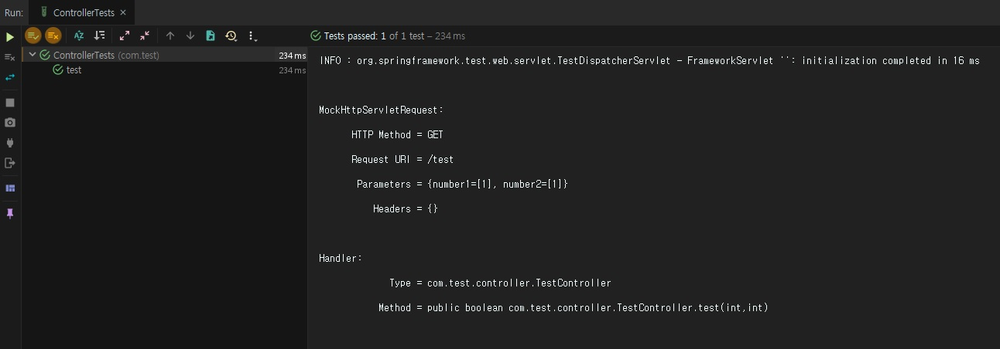
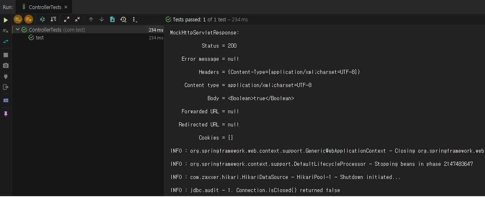

**Spring MVC JUnit 활용하기** 에서 JUnit을 활용한 서비스 단위테스트를 진행하였다.
이번에는 JUnit과 MockMvc를 활용하여 Contrller의 단위테스트를 진행해보도록 하자.


1. MocMvc란?

**브라우저에서의 요청과 응답을 의미하는 객체로서 Controller 테스트를 용이하게 해주는 라이브러리이며**
기존의 MockHttpServletRequest, MockHttpServletREsponse를 활용한 단위테스트에서 발전되었다. MockMvc는 Spring3.2부터 사용 가능하며 Spring-test 라이브러리에 포함되어 있다.


3. MockMvc를 활용한 Controller 테스트 방법

_ _ _


1) pom.xml에 spring-test 및 JUnit 라이브러리를 추가한다.(maven repo에서 최신버전으로 적용한다.)
```
        <dependency>
            <groupId>org.springframework</groupId>
            <artifactId>spring-test</artifactId>
            <version>5.1.2.RELEASE</version>
        </dependency>
        <dependency>
            <groupId>junit</groupId>
            <artifactId>junit</artifactId>
            <version>4.12</version>
            <scope>test</scope>
        </dependency>
        <dependency>	<!-- WebAppConfiguration을 사용하기 위함 -->
            <groupId>javax.servlet</groupId>
            <artifactId>javax.servlet-api</artifactId>
            <version>4.0.1</version>
        </dependency>

```


_ _ _


2) Test 대상인 클래스를 생성한다.(서비스, 컨트롤러)

src/main/java/com/test/service/TestService.java
```
package com.test.service;

import org.springframework.stereotype.Service;

@Service
public class TestService {

    public boolean numberCompare(int number1, int number2) {
        if (number1 == number2) {
            return true;
        } else {
            return false;
        }
    }
}

```


src/main/java/com/test/controller/TestController.java
```
package com.test.controller;


import com.test.service.TestService;
import lombok.Setter;
import org.springframework.beans.factory.annotation.Autowired;
import org.springframework.web.bind.annotation.GetMapping;
import org.springframework.web.bind.annotation.RequestParam;
import org.springframework.web.bind.annotation.RestController;

@RestController
public class TestController {

    @Setter(onMethod_ = {@Autowired})
    private TestService testService;

    @GetMapping(value = "/test")
    public boolean test(@RequestParam int number1, @RequestParam int number2) {
        return testService.numberCompare(number1, number2);
    }
}


```


_ _ _


3) test/java 밑에 JUnit 컨트롤러 테스트 클래스를 생성한다.(이 블로그에서는 test/java/com/test/ControllerTests.java 생성)
```
package com.test;


import com.test.controller.TestController;
import org.junit.Before;
import org.junit.Test;
import org.junit.runner.RunWith;
import org.springframework.beans.factory.annotation.Autowired;
import org.springframework.test.context.ContextConfiguration;
import org.springframework.test.context.junit4.SpringJUnit4ClassRunner;
import org.springframework.test.context.web.WebAppConfiguration;
import org.springframework.test.web.servlet.MockMvc;
import org.springframework.test.web.servlet.setup.MockMvcBuilders;
import org.springframework.web.context.WebApplicationContext;

import static org.springframework.test.web.servlet.request.MockMvcRequestBuilders.get;
import static org.springframework.test.web.servlet.result.MockMvcResultHandlers.print;
import static org.springframework.test.web.servlet.result.MockMvcResultMatchers.status;

@RunWith(SpringJUnit4ClassRunner.class)
@ContextConfiguration({"file:src/main/webapp/WEB-INF/spring-config/applicationContext.xml", "file:src/main/webapp/WEB-INF/spring-config/dispatcher-servlet.xml"})
@WebAppConfiguration	// WebApplicationContext를 생성할 수 있도록 하는 어노테이션
public class ControllerTests {

    @Autowired
    private WebApplicationContext context; // MockMvc 객체 생성을 위한 context
    private MockMvc mockMvc;

    @Autowired
    TestController testController;

    @Before
    public void setUp() {
        this.mockMvc = MockMvcBuilders.standaloneSetup(testController).build();     //test를 위한 MockMvc 객체 생성. testController 1개만 주입.
//        this.mockMvc = MockMvcBuilders.webAppContextSetup(this.context).build();  //test를 위한 MockMvc 객체 생성. 스프링이 로드한 WebApplicationContext의 인스턴스로 작동
    }

    @Test
    public void test() throws Exception {
        mockMvc.perform(get("/test")        // controller의 /test URI를 get방식으로 호출
                .param("number1", "1")  // 파라미터 number1에 1 입력
                .param("number2", "1")) // 파라미터 number2에 1입력
                .andDo(print())                        // 결과를 print. MockMvcBuilders의 alwaysDo(print())로 대체 가능
                .andExpect(status().isOk());           // 호출 결과값이 OK가 나오면 정상처리
    }
}


```


4) 코드 간단 설명


4-1) @WebAppConfiguration
 - WebApplicationContext를 생성할 수 있도록 하는 어노테이션


4-2) MockMvc
 - Controller 테스트를 위한 객체. .perform() 메소드를 지원하며 해당 메소드를 통해 Controller 호출 테스트를 한다.


4-3) setup()
 - 테스트 전 셋업코드를 작성한다. 방식은 크게 두가지가 있는데 
`this.mockMvc = MockMvcBuilders.standaloneSetup(testController).build();` 는 테스트 할 컨트롤러를 수동으로 주입하는 것이며, 한 컨트롤러에 집중하여 테스트하는 용도로만 사용한다는 점에서 유닛테스트와 유사하다.
`this.mockMvc = MockMvcBuilders.webAppContextSetup(this.context).build();` 는 스프링에서 로드한 WebApplicationContext의 인스턴스로 작동하기 때문에 스트링 컨트롤러는 물론 의존성까지 로드되기 때문에 완전한 통합테스트를 할 수 있다.


4-4) perform()
 - perform() 안에는 controller 호출 방식인 get("호출URI"), post("호출URI"), put("호출URI"), delete("호출URI")가 들어갈 수 있다.(예 : perform(post("/test")))
 - 또한 get(), post() 뒤에 controller 호출 시 header값인 .header(), accept정보를 설정해주는 .accept(), JSON이나 XML타입을 결정해주는 .contentType(), Post방식일 경우 body값인 .content(), get 방식인 경우 파라미터인 .param() 등을 호출할 수 있다.
(예 : post().header("header1", "aa").contentType(MediaType.APPLICATION_JSON_UTF8_VALUE).content(mapper.writeValueString(new inputVO())) ....)

(post 예제코드)
```
package com.tpcom_apr.service;


import com.fasterxml.jackson.databind.ObjectMapper;
import com.tpcom_apr.controller.HomeController2;
import com.tpcom_apr.domain.OnmsgchkInputVO;
import lombok.extern.log4j.Log4j;
import org.junit.Before;
import org.junit.Test;
import org.junit.runner.RunWith;
import org.mockito.InjectMocks;
import org.mockito.Mock;
import org.mockito.MockitoAnnotations;
import org.mockito.Spy;
import org.springframework.beans.factory.annotation.Autowired;
import org.springframework.http.MediaType;
import org.springframework.test.context.ContextConfiguration;
import org.springframework.test.context.junit4.SpringJUnit4ClassRunner;
import org.springframework.test.context.web.WebAppConfiguration;
import org.springframework.test.web.servlet.MockMvc;
import org.springframework.test.web.servlet.setup.MockMvcBuilders;
import org.springframework.web.context.WebApplicationContext;

import static org.springframework.test.web.servlet.request.MockMvcRequestBuilders.post;
import static org.springframework.test.web.servlet.result.MockMvcResultHandlers.print;
import static org.springframework.test.web.servlet.result.MockMvcResultMatchers.status;

@RunWith(SpringJUnit4ClassRunner.class) // SpringJunit4ClassRunner.class는 spring-test에서 제공하는 단위테스르를 위한 클래스 러너
@WebAppConfiguration    // WebApplicationContext를 생성할 수 있도록 하는 어노테이션
@ContextConfiguration({"file:src/main/webapp/WEB-INF/spring-config/applicationContext.xml", "file:src/main/webapp/WEB-INF/spring-config/dispatcher-servlet.xml"})
public class MockMvcTests {
    @Autowired
    private WebApplicationContext context; // MockMvc 객체 생성을 위한 context
    private MockMvc mockMvc;    // controller에 request를 수행해주는 mock 객체
    ObjectMapper mapper; // 객체를 json 형식으로 변경 시 사용

    @Autowired
    HomeController2 homeController2;

    @Before // @Test 이전에 실행
    public void setUp() {
        this.mockMvc = MockMvcBuilders.standaloneSetup(homeController2).build();
        mapper = new ObjectMapper();
    }
    @Test
    public void testOk() throws Exception {
        mockMvc.perform(post("/test")        // Controller의 /test URI를 Post방식으로 호출
                .contentType(MediaType.APPLICATION_JSON_VALUE)    // contentType은 json 형식
                .content(mapper.writeValueAsString(         // 객체를 json로 변경. content에는 post의 body가 들어감.
                        new TestInputVO(
                                "useService11",
                                "S40",
                                "xxxx",
                                "1111",
                                "2222")))
                .andExpect(status().isOk())                 // 상태값은 OK가 나오면 정상처리
                .andDo(print());                            // 처리 내용을 출력
    }
}
```


4-5) ResyktActions
 - MockMvc.perform() 메소드로 리턴되는 인터페이스. 지원 메소드는 andExpect(), andDo(), andReturn() 등이 있다.
 - andExpect()는 예상값을 검증한다. assert* 메소드와 유사한 기능이다.(예 : andExpect(status().isOk()))
 - andDo()는 요청에 대한 처리를 한다. 보통 print() 메소드를 많이 쓴다.(예 : .andDo(print()))
 - 테스트한 결과 객체를 받을 때 사용한다.


4-6) jsonPath
 - 위 예제에선 사용하지 않았지만 요청 결과가 json이라면 jsonPath를 사용하여 검증하는 것도 좋은 방법이다.
 - 우선 pom.xml에 jsonPath dependency를 추가하고
```
        <dependency>
            <groupId>com.jayway.jsonpath</groupId>
            <artifactId>json-path</artifactId>
            <version>2.4.0</version>
        </dependency>
```
 - jsonPath를 활용하여 인자 한개한개의 값을 검증할 수 있다.
```
        mockMvc.perform(post("/test1")                 
                .contentType(MediaType.APPLICATION_JSON_UTF8_VALUE)     
                .content(mapper.writeValueAsString(new TestInputVO("11", "22"))))          
                .andExpect(status().isOk())                            
                .andExpect(header().string("ans_cd", "0000"))
                .andExpect(jsonPath("$.value1").value("A"))
                .andExpect(jsonPath("$.value2").isNotEmpty())
                .andExpect(jsonPath("$.value3").value("0000"));
```

_ _ _


5) JUnit 테스트를 실행한다.(Alt + Shift + F10) 테스트 시 결과가 녹색으로 뜰 경우는 정상, 그렇지 않은 경우 오류가 발생한 것이기 때문에 확인해야 한다.




_ _ _


_ _ _


*출처 : 
<https://jdm.kr/blog/165>참고
