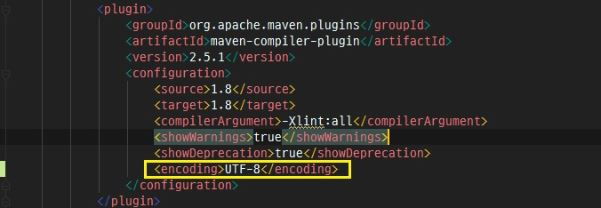

Maven프로젝트를 Maven으로 컴파일 시 **unmappable character for encoding MS949** 에러가 발생하는 경우가 있다. 
이 경우 pom.xml의 maven-compiler-plugin 부분의 encoding 타입을 UTF-8로 지정해주면 된다.

*출처 : 
<https://blog.taeseong.me/305>
참고
