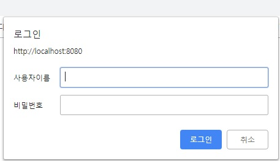
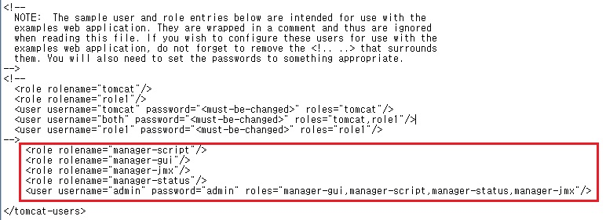
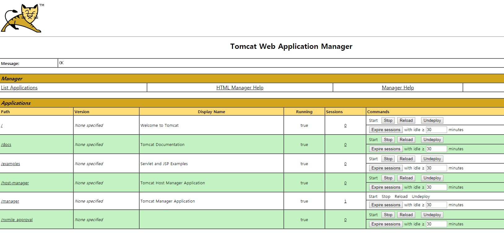
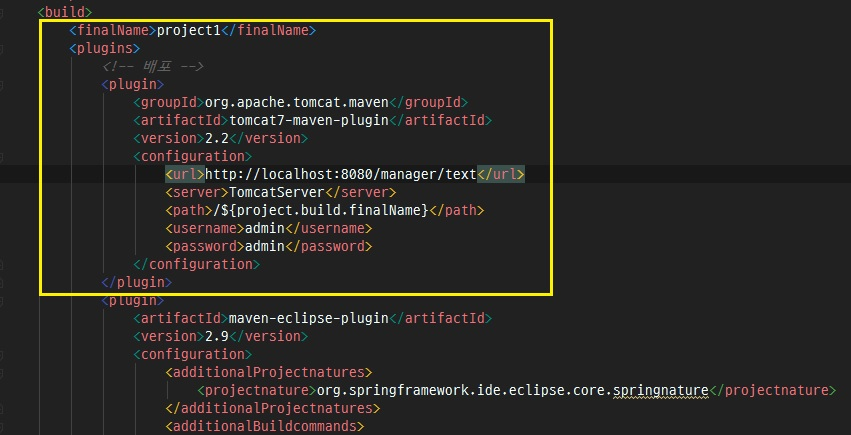
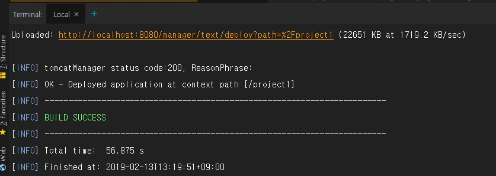
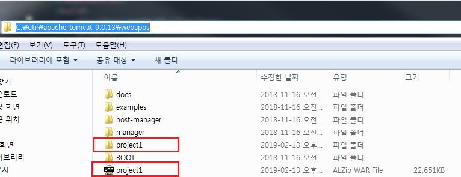
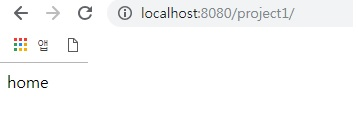
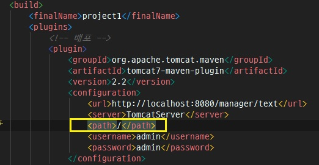

톰캣(Tomcat)은 서블릿 컨테이너 구현체 중 하나다. 개발자가 Java로 제작한 서블릿을 WAR로 압축하여 Tomcat의 웹 어플리케이션 루트인 **톰켓디렉토리/webapps** 디렉토리(필자는 C:\util\apache-tomcat-9.0.13\webapps)에 올리면 자동으로 압축을 풀어 서블릿으로 등록하고 관리해준다.(참고로 자동 압축 풀기는 톰켓 옵션으로 설정할 수 있습니다.)
FTP로 tomcat/webapps에 올리기만 하면 톰켓이 자동으로 압축을 풀어 앱으로 등록하기 때문에, FTP도 WAR 배포 수단이 될 수 있다.
다른 방법으로는 **톰켓 어플리케이션 관리자 도구**를 활용하여 배포할 수 있다. 지금부터 해당 방법에 대해서 소개하겠다. (개발 꼰대처럼 버튼 클릭이 아닌 CLI로 진행하도록 하겠다.)


_ _ _


1) tomcat을 구동해보자. tomcat 설치 후 path가 잡혀있으면(CATALINA_HOME 등) cmd를 실행시키고 **startup** 명령어를 실행하면 tomcat이 구동된다.


_ _ _


2) 인터넷 브라우저에 **localhost:8080/manager**로 접속해보자. 사용자이름/비밀번호 입력창이 나오는데 아직 설정을 해 주지 않았기 때문에 입력을 할 수가 없다. 가볍게 무시해주자.



_ _ _


3) 톰켓디렉토리/conf에 있는 tomcat-user.xml 파일의 <tomcat-users> 태그 안에 아래 내용을 추가해주자.
manger-gui는 tomcat 관리자 기능을 웹페이지에서 볼수 있는 role이고, manager-script는 war파일을 관리자를 통해 배포가 가능하도록 한다. 사용자로는 admin을 등록했고, 해당 사용자는 manager-gui, manager-script등을 사용할 수 있다.
```
    <role rolename="manager-script"/>
    <role rolename="manager-gui"/>
    <role rolename="manager-jmx"/>
    <role rolename="manager-status"/>
    <user username="admin" password="admin" roles="manager-gui,manager-script,manager-status,manager-jmx"/>
```



단 위 방식으로 localhost나 127.0.0.1에서만 접근 가능하다고 한다. 때문에 원격지에서 접근을 하려면 한가지 설정을 더 해야 한다.
톰켓디렉토리/conf/Catalina/localhost/에 manager.xml을 만들고 아래 내용을 입력한다.(보안상으론 위험하지만 테스트니깐~)
```
<Context privileged="true" antiResourceLocking="false" docBase="${catalina.home}/webapps/manager">
        <Valve className="org.apache.catalina.valves.RemoteAddrValve" allow="^.*$"/>
</Context>
```


_ _ _


4) tomcat 중지 후 재기동한다(tomcat 중지 명령어 : 톰캣경로/bin/shutdown, tomcat 기동 명령어 : startup).
재기동 후 **localhost:8080/manager**로 사용자이름/비밀번호 입력후 재 접속해보자. 아래와 같이 접속이 되는 것을 확인할 수 있다.



_ _ _


5) 톰캣 어플리케이션 관리자 도구의 설정은 완료되었다. 
이제 pom.xml파일에 아래 내용을 추가해주자. url은 http://(배포서버):(포트)/manager/text로 작성하고, finalName에는 war파일명(보통 프로젝트명), path에는 war파일이 압축이 풀렸을 때의 디렉토리를 나타낸다(보통 루트(/)나 프로젝트 명을 적는다). 때문에 배포 완료 후에는 http://(배포서버):(포트)/(path명) 으로 프로젝트 접근이 가능하다. (아래의 경우는 http://localhost:8080/project1). 

```
    <build>
        <finalName>project1</finalName>
        <plugins>
            <!-- 배포 -->
            <plugin>
                <groupId>org.apache.tomcat.maven</groupId>
                <artifactId>tomcat7-maven-plugin</artifactId>
                <version>2.2</version>
                <configuration>
                    <url>http://localhost:8080/manager/text</url>
                    <server>TomcatServer</server>
                    <path>/${project.build.finalName}</path>
                    <username>admin</username>
                    <password>admin</password>
                </configuration>
            </plugin>
```



_ _ _


6) 콘솔창에서 maven 프로젝트 디렉토리로 이동 후 **mvn tomcat7:redeploy** 명령어로 원격 서버(이 글에서는 http://localhost:8080/)에 배포를 수행한다. 해당 명령어를 실행하면 war파일(이 글에서는 project1.war)이 톰캣디렉토리/webapps에 생성이 되고, 톰캣에 의해 압축이 풀리면서 배포가 완료된다. 만약 배포 war파일과 압축이 풀린 디렉토리(이 글에선 project1)가 이미 존재한다면 방법1)**mvn tomcat7:redeploy** 명령어를 수행하여 재 배포하거나, 방법2)**mvn tomcat7:undeploy**로 배포된 내용을 제거한 후 **mvn tomcat7:deploy**로 재 배포한다. 
배포를 하게 되면 우선 프로젝트디렉토리/target에 필요한 resource들이 옮겨지고 mvn compile이 진행되고 compile된 class들이 mvn package 처리되어 war파일이 생성된다. 이 생성된 war파일은 mvn deploy에 의해 톰캣디렉토리/webapps로 옮겨지게 된다. 




_ _ _


7) 인터넷 브라우저에서 http://localhost:8080/project1 을 입력하면 톰캣에 올린 프로젝트가 정상 접속되는 것을 확인할 수 있다.



_ _ _


8) 만약 root 디렉토리로 배포를 하고 싶으면(예를들면 프로젝트 접속 시 http://localhost:8080으로 접속하고 싶으면) pom.xml작성 시 path부분만 root로 변경하면 된다. 단 아래와 같이 할 경우 프로젝트디렉토리/target에 생성된 war파일은 finalName에 의해 project1이 되고, 배포가 된 톰켓 디렉토리에는 ROOT.war파일로 묶이게 된다.



_ _ _


*출처 : 
<https://www.bsidesoft.com/?p=7123>

<https://all-record.tistory.com/185>

참고
