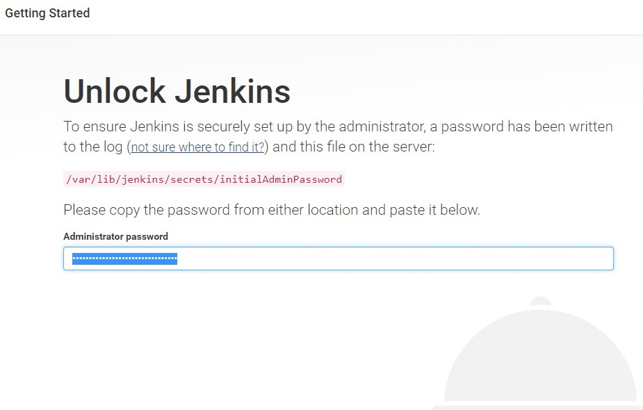
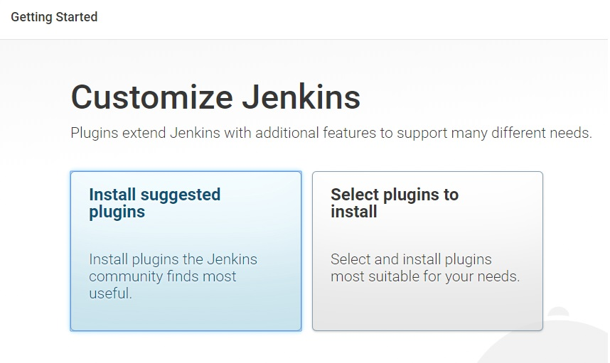
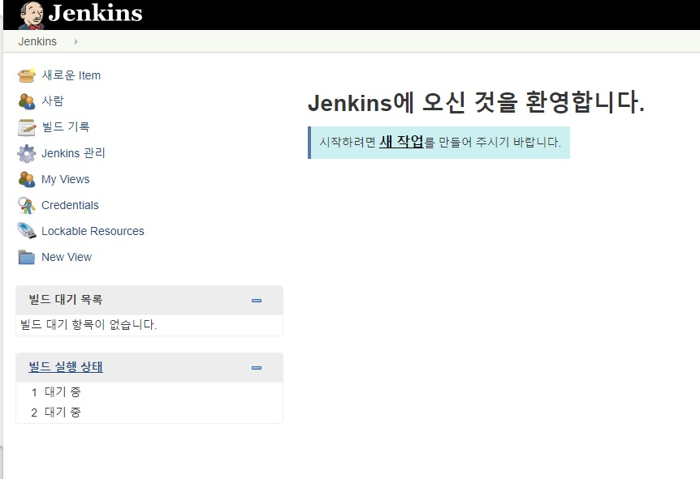

### 젠킨스(Jenkins)
란 Open Source Ci(Continuous Integration) Tool로써 팀의 구성원들이 작업한 내용을 정기적으로 통합하는 것을 의미한다. 원래는 '허드슨'이라는 이름으로 잘 알려져있었지만 2010년 오라클과의 상표권 문제로 인해 Jenkins로 이름을 바꾸게 되었다.

Jenkins 홈페이지 : <https://jenkins.io/>

###CI(Continuous Integration)

#####CI(Continuous Integration)
는 팀의 구성원들이 작업한 내용을 정기적으로 통합하는 것을 말한다. 하나의 프로젝트를 리드하는 매니저가 일을 여러가지로 나눠서 팀원들에게 분배하고 각자 개발한 부분을 Git이나 SVN을 통해서 Submit된 코드들을 정기적으로 통합하는 것이다. 

_ _ _

###Jenkins가 제공하는 기능
- 웹 인터페이스를 통한 간편한 설정
- 강력하고 편리한 Reporting 기능
- 지속적인 자동화 빌드
- 지속적인 자동화 테스트
- 커버리지 감시
- 코드 품질 감시
- 다양한 인증기반과 결한한 인증 및 권한 관리 기능
- Groovy script를 이용한 고수준의 Job Scheduling 기능
- 커멘드라인 인터페이스 제공
- 자동화된 배포 관리
- 분산 빌드 기능
- 윈도우 커맨드 스케쥴링 실행가능

_ _ _

###Jenkins를 사용하는 이유?
- 프로젝트의 빌드가 정상적으로 되고 있는지 체크할 때.
- 자동으로 유닉 테스트(Unit Test)와 통합 테스트(Integration Test)의 정기적인 실행과 결과에 문제가 있을 경우에 이메일을 통해서 결과 확인
- 코드의 길이 조절

_ _ _

###형상관리 Tool(Github)과의 연동

젠킨스 이전에는 일정 시간마다 빌드를 실행하는 nightly-build(주로 심야 시간대에 타이머에 의해 진행된 빌드)를 주로 하곤하였다. 젠킨스는 정기적인 빌드에서 더 나아가 Git과 같은 형상관리 Tool과 연동함으로써 소스의 Commit을 감지하면 자동적으로 자동홭 ㅔ스트가 포함된 빌드가 작동되도록 설정할 수 있다. 물론 Commit 횟수만큼 빌드를 실행하는 것이 아니라 Queueing 되어 자신의 실행순서를 기다린다.

#자동화된 빌드가 가져다 주는 이점
- 프로젝트 표준 컴파일 환경에서의 컴파일 오류 검증
- 자동화 테스트 수행
- 정적 코드 분석에 의한 코딩 규약 준수여부 체크
- 프로파일링 툴을 이용한 소스 변경에 따른 성능변화 감시
- 결합 테스트 환경에 대한 배포작업
- 각종 배치 작업의 간략화
- 순수 개발 작업 이외에 DB셋업, 환경설정, 디플로이 작업과 같은 단순 작업에 쓰이는 시간을 줄이도록 함
- 데이터베이스의 구축, 서버에의 디플로이, 라이브러리 릴리즈와 같이 커맨드라인에서 진행되던 작업들을 웹 인터페이스를 통해 가능하도록 함

_ _ _

###그러면 젠킨스 설치 및 환경설정을 해보자.

1) 젠킨스 설치 명령어
`sudo wget -q -O - http://pkg.jenkins-ci.org/debian/jenkins-ci.org.key | sudo apt-key add -`

`sudo sh -c 'echo deb http://pkg.jenkins-ci.org/debian binary/ > /etc/apt/sources.list.d/jenkins.list'`

`sudo apt-get update && sudo apt-get install -y jenkins`

_ _ _

2) 젠킨스 포트 변경
apt-get으로 설치하게 되면 jenkins 계정이 생성된다. 젠킨스 홈 디렉토리는 **/var/lib/jenkins**이다. 젠킨스는 내부적으로 톰캣을 서버로 사용하므로 설치 후 시작하면 톰캣 기본포트인 8080을 사용하며 시작된다. 젠킨스를 톰캣과 구동하기 위해선 기본포트를 변경할 필요가 있다. 
젠킨스의 기본 설정파일은 **/etc/default/jenkins**이다. 포트를 변경한 후 **sudo service jenkins restart** 명령어로 재시작하면 적용된다.(참고로 젠킨스의 로그파일은 /var/log/jenkins/jenkins.log 이다)

_ _ _

3) 인터넷 브라우저에서 젠킨스 접속 : http://(서버ip):(포트)

위와 같이 초기 비밀번호 입력 창이 뜨면 아래 명령어를 입력한 뒤, 나온 비밀번호를 입력한다.
`sudo cat /var/lib/jenkins/secrets/initialAdminPassword`

_ _ _

4) 필요한 플러그인을 설치한다. 아직 어떤 플러그인이 필요한지 정확히 모르니 **Install suggested plugins**를 선택한다.

_ _ _

5) admin 정보를 입력한다.

_ _ _

6) 설치가 끝나면 jenkins 대쉬보드로 넘어간다

_ _ _

*출처 : 
- <http://redbyzan.github.io/writing/jenkins-setting/>
- <https://www.fun25.co.kr/blog/jenkins-ubuntu-16-04-install/?page=4>
- <https://plus4070.github.io/new%20things/Jenkins.html>
참고
