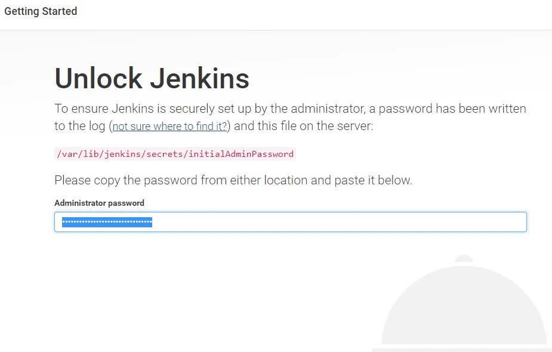
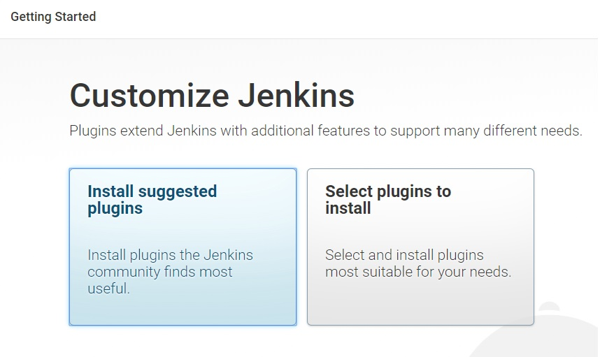
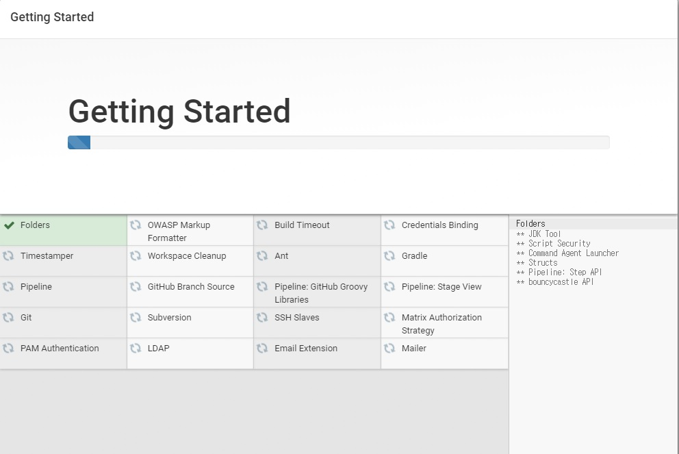
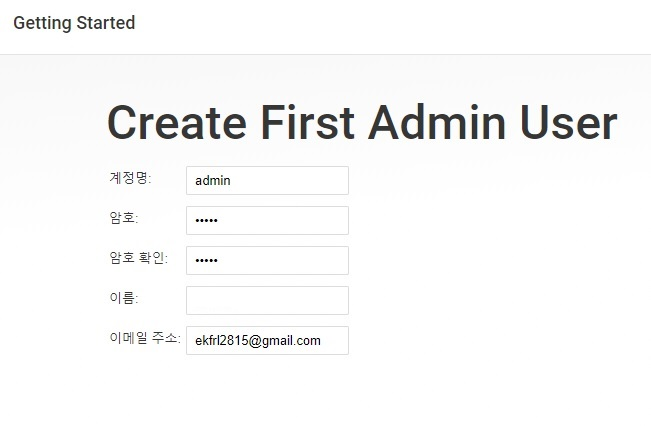
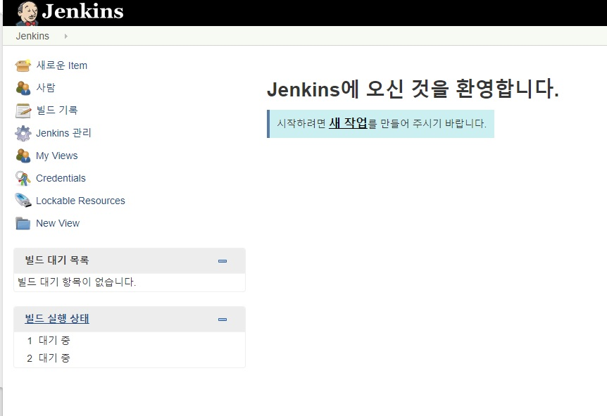

젠킨스(Jenkins)는 CI를 제공해주는 소프트웨어이다. 
CI란 Continuous Integration의 줄임말로 지속적 통합이라고 불린다. 대표적으로 젠킨스가 있으며, Agile의 창시자 중 한명인 마틴 파울러가 주장한 지속적 통합을 구현하기 위한 자바 오픈소스 소프트웨어 웹 어플리케이션 형태를 하고 있다. 원래는 허드슨이란 명칭을 가지고 있었으나, 오라클과의  상표권 문제로 젠킨스로 이름을 바꾸게 되었다.

젠킨스의 장점

그러면 젠킨스 설치 및 환경설정을 해보자.

_ _ _

1) 젠킨스 설치
`sudo wget -q -O - http://pkg.jenkins-ci.org/debian/jenkins-ci.org.key | sudo apt-key add -`
`sudo sh -c 'echo deb http://pkg.jenkins-ci.org/debian binary/ > /etc/apt/sources.list.d/jenkins.list'`
`sudo apt-get update && sudo apt-get install -y jenkins`

_ _ _

2) 젠킨스 포트 변경
apt-get으로 설치하게 되면 jenkins 계정이 생성된다. 젠킨스 홈 디렉토리는 /var/lib/jenkins이다. 젠킨스는 내부적으로 톰캣을 서버로 사용하므로 설치 후 시작하면 톰캣 기본포트인 8080을 사용하며 시작된다. 젠킨스를 다른 톰캣과 구동하기 위해선 기본포트를 변경할 필요가 있다. 
젠킨스의 설정파일은 **/etc/default/jenkins**이다. 포트를 변경한 후 **sudo service jenkins restart** 명령어로 재시작하면 적용된다.

_ _ _

3) 젠킨스 접속 : http://(서버ip):(포트)

_ _ _

초기 비밀번호 확인 : 아래 명령어를 입력한 뒤, 나온 비밀번호를 입력한다.
`sudo cat /var/lib/jenkins/secrets/initialAdminPassword`

_ _ _

필요한 플러그인을 설치한다. 아직 어떤 플러그인이 필요한지 정확히 모르니 **Install suggested plugins**를 선택한다.

_ _ _

admin 정보를 입력한다.

_ _ _

설치가 끝나면 jenkins 대쉬보드로 넘어간다

_ _ _

*출처 : 
- <http://redbyzan.github.io/writing/jenkins-setting/>
- <https://www.fun25.co.kr/blog/jenkins-ubuntu-16-04-install/?page=4>
- <http://blog.naver.com/PostView.nhn?blogId=kbh3983&logNo=220816001641&categoryNo=17&parentCategoryNo=0&viewDate=&currentPage=1&postListTopCurrentPage=1&from=postView>
- 
참고
