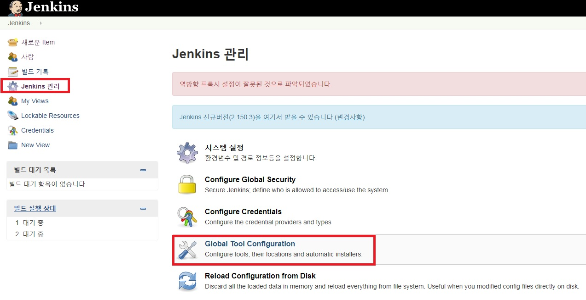

젠킨스 설치가 완료되었으니 이번 포스트에서는 환경셋팅 및 Github와의 연동을 진행해본다.

_ _ _

##[Manage Users]

- **http://(서버ip):(젠킨스port)** 로 접속한다.
- 좌측 메뉴의 **Jenkins관리 -> Manage Users -> 사용자 생성**으로 들어가서 사용자를 새로 생성해준다.

_ _ _

##[Configure Global Security]

- **Jenkins관리 -> Configure Global Security** 선택
- 사용자 가입을 허용하기 위해 **Security Realm**의 **Jenkins own user database**를 선택하고, 사용자의 가입허용 체크박스에 체크한다.
- 사용자 별 권한을 관리하기 위해 Authorization의 Matrix-based-security를 선택한다.
- Add user or group으로 존재하는 계정을 입력한다.
- 권한 설정 제일 오른쪽에 있는 체크박스는 전체선택, 전체해제이다.

_ _ _

##[Global Tool Configuration]
- 젠킨스에서 사용하는 JDK, Git, Maven 설정 정보를 입력한다.

1) JDK 설치

`apt-cache search jdk` : 우분투에서 JDK 검색

`apt-get install openjdk-8-jdk` : JDK8 버전 설치

`/usr/lib/jvm/java-8-openjdk-amd64` : JDK 설치 디렉토리

`sudo vi /etc/bash.bashrc` : bash.bashrc 파일 오픈

`export JAVA_HOME=/usr/lib/jvm/java-8-openjdk-amd64` : 만 아래에 JAVA_HOME 추가

`source /etc/bash.bashrc` : bash.bashrc 파일 다시 읽기

2) Git 설치

3) Maven 설치

4) 설정정보 입력

_ _ _

*출처 : 
- <https://dukeom.wordpress.com/2017/03/20/jenkinsgithubmaven-%EC%9C%BC%EB%A1%9C-%EB%B9%8C%EB%93%9C%EB%B0%B0%ED%8F%AC%ED%95%98%EA%B8%B0-24/>
