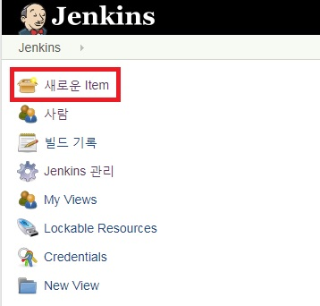

젠킨스 설치가 완료되었으니 이번 포스트에서는 환경셋팅 및 Github와의 연동하여 Maven으로 배포하게끔 설정해본다.


_ _ _


### [Manage Users]

1) **http://(서버ip):(젠킨스port)** 로 접속한다.
2) 좌측 메뉴의 **Jenkins관리 -> Manage Users -> 사용자 생성**으로 들어가서 사용자를 새로 생성해준다.


_ _ _


### [Configure Global Security]

1) **Jenkins관리 -> Configure Global Security** 선택

2) 사용자 가입을 허용하기 위해 **Security Realm**의 **Jenkins own user database**를 선택하고, 사용자의 가입허용 체크박스에 체크한다.

3) 사용자 별 권한을 관리하기 위해 Authorization의 Matrix-based-security를 선택한다.

4) Add user or group으로 존재하는 계정을 입력한다.

5) 권한 설정 제일 오른쪽에 있는 체크박스는 전체선택, 전체해제이다.


_ _ _


### [Global Tool Configuration]

1) 젠킨스에서 사용하는 JDK, Git, Maven 설치 및 설정 정보를 입력한다.
- JDK 설치
	- `apt-cache search jdk` : 우분투 리눅스 서버에 JDK 검색
	- `sudo apt-get install openjdk-8-jre openjdk-8-jdk` : JDK8 버전 설치
	- `/usr/lib/jvm/java-8-openjdk-amd64` : JDK 설치 디렉토리
- Git 설치
	- `sudo apt-get install git-core` : 우분투 리눅스 서버에 git 설치
	- `/usr/bin/git` : git 설치 디렉토리
- Maven 설치
	- `sudo apt install maven` : 우분투 리눅스 서버에 maven 설치
	- `mvn -v` : maven 설치 확인 및 정보 확인
	- `/usr/share/maven` : maven 설치 디렉토리

2) 설정정보 입력(Jenkins관리 -> Global Tool Configuration -> JDK, Git, Maven 설치 디렉토리 입력. Install automatically 해제)


_ _ _


### [시스템 설정]

1) 우선 <https://github.com>에서 Github API Token을 생성한다.(**Profile 클릭 -> Settings -> Developer settings -> Personal access tokens -> Generate new token**)


2) Token description을 입력하고, select scops에 repo, admin:repo_hook을 선택한 후 Generate token을 클릭한다.


3) 아래와 같이 Token이 생성된다. Token 확인 후 복사한다.


4) jenkins로 돌아와서 **jenkins 관리 -> 시스템 설정 -> Github** 에서 Github Servers를 추가하고 정보를 입력한다. Kind에는 "Secret text"로 선택하고, Secret에 복사한 Token 값을 입력한다. 입력이 완료되면 Test Connection을 누르고 서버와 연결되는지 확인하고 저장을 누른다.


_ _ _


### [빌드를 위한 프로젝트 생성 및 셋팅]

1) 왼쪽상단의 **새로운Item** 메뉴 선택 -> Item name 입력 및 Freestyle project 선택 



2) General에서 Github Project 체크 후 Github repository URL 입력


3) 소스 코드 관리에서 Git 체크 후 Repository URL과 Credentials 입력(Credentials는 Github 접속 id와 password입력)


4) Build에서 **Invoke top-level Maven targets** 선택 -> Maven Version, Goals 입력 후 고급 선택 -> POM 입력 후 저장(pom.xml 위치는 보통 **젠킨스디렉토리/workspace/프로젝트디렉토리** 밑에 존재)


_ _ _


### [배포를 위한 프로젝트 셋팅 - 방법 1]
배포를 위한 프로젝트 셋팅으로 방법이 두가지가 있는데, 그중 tomcat manager를 이용하는 방법이다.


1) Tomcat 설치 디렉토리(이 글에서는 ~/apache-tomcat-9.0.16/conf)의 **tomcat-users.xml** 파일 맨 밑에 아래 코드 추가
```
    <role rolename="manager-script"/>
    <role rolename="manager-gui"/>
    <role rolename="manager-jmx"/>
    <role rolename="manager-status"/>
    <user username="admin" password="XXXXX" roles="manager-gui,manager-script,manager-status,manager-jmx"/>
```
2) Tomcat 리스타트
- `~/apache-tomcat-9.0.16/bin/shutdown.sh`
- `~/apache-tomcat-9.0.16/bin/startup.sh`

3) Tomcat Manager 접근 가능여부 확인(http://(서버ip):(tomcat포트)/manager). 
자세한 내용은 [Maven 프로젝트 Tomcat 배포하기](https://twofootdog.github.io/Spring-Maven%EC%9D%84-%ED%99%9C%EC%9A%A9%ED%95%9C(Tomcat7-maven-plugin)-%ED%94%84%EB%A1%9C%EC%A0%9D%ED%8A%B8-%EC%9B%90%EA%B2%A9-%EB%B0%B0%ED%8F%AC(Deploy)/) 참고


4) Build 후 WAS 컨테이너에 배포를 하기 위한 정보 입력
- 빌드 후 조치 추가 클릭 -> Deploy war/ear to a container를 선택해야 하는데 Deploy war/ear to a container가 미존재한다.....(OTL). **검색을 해보니 Deploy to container Plugin 플러그인을 설치해야 한다.** 우선 저장하고 Jenkins 메인화면으로 돌아가서 **Jenkins 관리 -> 플러그인 관리로 들어간다.**


- 설치 가능 탭 -> Deploy to container 선택하여 설치


- Jenkins 홈으로 가서 아까 추가했던 Jenkins Item 선택(이 글에선 spring mvc project)


- 왼쪽 메뉴의 **구성** 선택


- Build후 조치에서 **Deploy war/ear to a container** 선택


- WAR/EAR files 및 Context path(war파일이 배포되는 곳) 추가 -> Add Container에 Tomcat8.X 추가(현재 구동중인 Tomcat은 9.0이지만 8.X로 추가한다) -> Credentials 추가하여 tomcat manager 정보 입력(admin...)


_ _ _

### [배포를 위한 프로젝트 셋팅 - 방법 2]
두번째 방법은 shell script를 이용하는 방법이다.**(tomcat manager로 배포와 shell script로 배포 둘중 한개를 선택하면 된다!!)** war파일을 tomcat의 webapps 디렉토리에 넣으면 자동으로 압축이 풀리므로, jenkins workspace에 있는 war파일을 tomcat의 webapps 디렉토리로 옮기는 스크립트를 작성하면 된다.

1) jenkins -> 프로젝트 선택 -> 구성 -> Build -> **Execute shell** 추가


2) /etc/sudoers 파일에 jenkins 계정 추가(sudo 실행 시 비밀번호 입력 등을 skip하기 위함)
- 명령어 : `sudo vi /etc/sudoers`


_ _ _


### [배포 실행]

1)프로젝트 리스트에서 프로젝트 선택


2) 왼쪽 메뉴의 Build Now 선택하면, 왼쪽 메뉴 하단에 Build Progress Bar가 생성된다.


3) 생성된 Progress Bar 클릭 -> 왼쪽 메뉴의 **Console Output** 을 클릭하게 되면 Build Log를 확인할 수 있다.


4) 배포 완료


_ _ _


*출처 : 
- <https://dukeom.wordpress.com/2017/03/20/jenkinsgithubmaven-%EC%9C%BC%EB%A1%9C-%EB%B9%8C%EB%93%9C%EB%B0%B0%ED%8F%AC%ED%95%98%EA%B8%B0-24/>
- <https://blog.hanumoka.net/2018/05/23/jenkins-20180523-jenkins-use-job-with-svn/>
- <https://ict-nroo.tistory.com/35>

