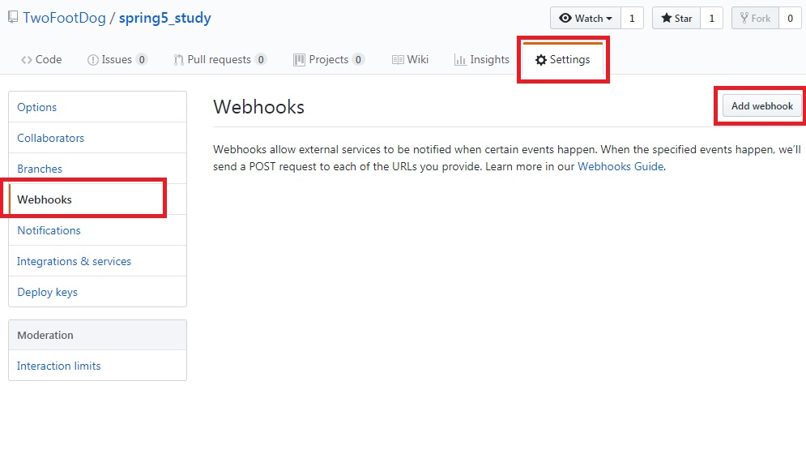
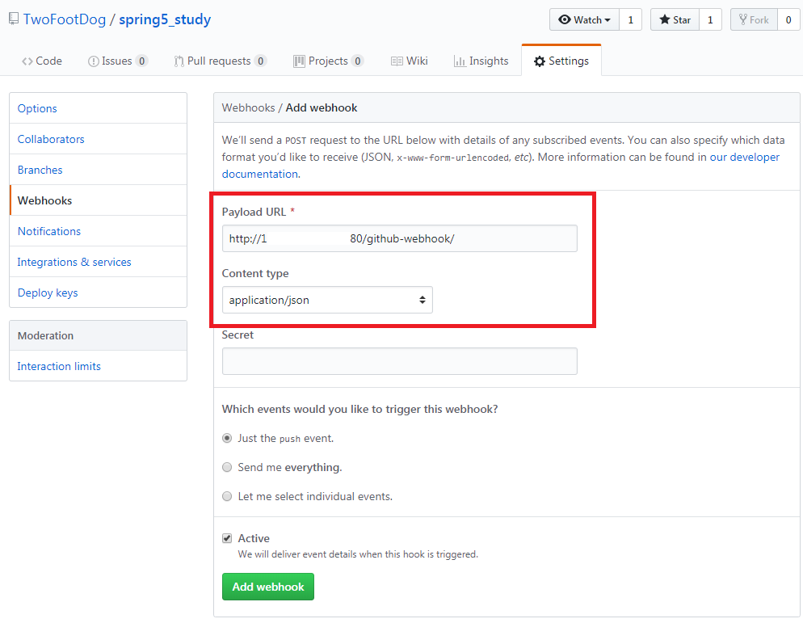
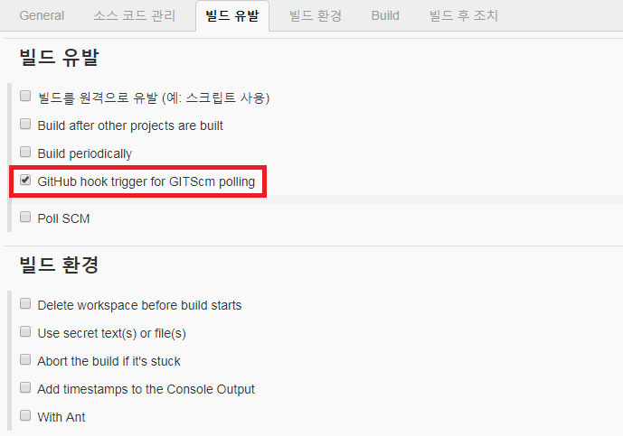
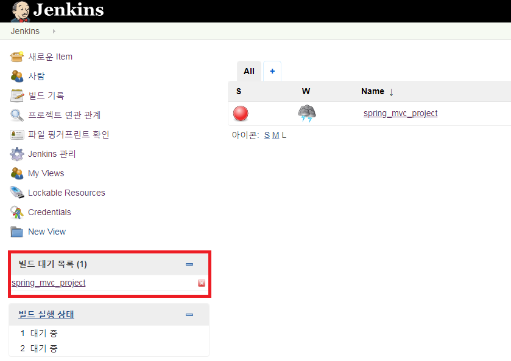
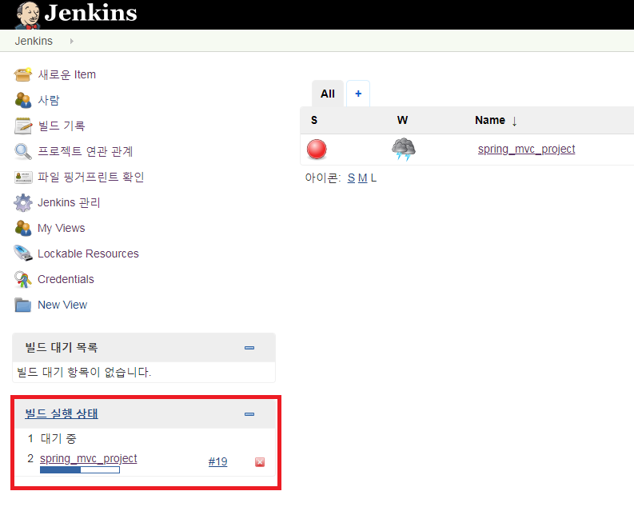

jenkins에서 배포가 필요할 때마다 배포버튼을 누르는 것은 여간 귀찮은 일이 아니다. 

일을 좀 편하게 하기 위해 **Github Webhook**을 활용하여 ++Github로 소스를 push 했을 때 자동으로 jenkins에 빌드 배포되도록 설정해보자.++  아래 설정은 ([젠킨스사용법1](https://twofootdog.github.io/Jenkins-Jenkins-%EC%82%AC%EC%9A%A9%EB%B2%951(%EC%9A%B0%EB%B6%84%ED%88%AC%EC%97%90%EC%84%9C-Jenkins-%EC%8B%9C%EC%9E%91%ED%95%98%EA%B8%B0)/) 과 [젠킨스사용법2](https://twofootdog.github.io/Jenkins-Jenkins-%EC%82%AC%EC%9A%A9%EB%B2%952(Jenkins%EC%99%80-Github-%EC%97%B0%EB%8F%99%ED%95%98%EA%B8%B0)/) 이 적용되어 github와 jenkins간의 연동이 완료된 후에 작업이 진행되어야 한다) 

_ _ _

### [Github에서 Webhooks 등록]

1) <https://github.com/> -> 배포 프로젝트 선택 -> Settings -> Webhooks -> Add webhook 선택

2) Payload URL에 **(젠킨스URL)/github-webhook/** 으로 입력. Content type은 **application/json** 으로 입력.

_ _ _

### [Jenkins 설정 변경]

1) 젠킨스 프로젝트 List 에서 프로젝트 선택 -> 구성 -> 빌드 유발 -> **Github hook trigger for GitScm polling** 체크

_ _ _

### [jenkins 자동 배포 확인]

1) 로컬 소스 변경 후 github repositry로 업로드(git push 실행)
- `git add .`
- `git commit -m "20190222_test"`
- `git push origin master`

2) jenkins에서 소스가 자동으로 배포되는지 확인

_ _ _

*출처 : 
- <https://bcho.tistory.com/1237>
