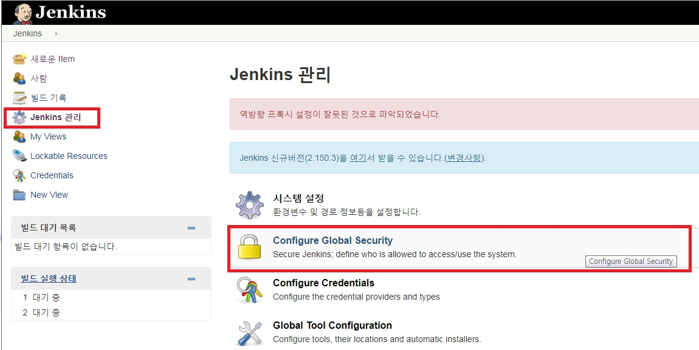

_ _ _

지금까지 [젠킨스사용법1](https://twofootdog.github.io/Jenkins-Jenkins-%EC%82%AC%EC%9A%A9%EB%B2%951(%EC%9A%B0%EB%B6%84%ED%88%AC%EC%97%90%EC%84%9C-Jenkins-%EC%8B%9C%EC%9E%91%ED%95%98%EA%B8%B0)/) 과 [젠킨스사용법2](https://twofootdog.github.io/Jenkins-Jenkins-%EC%82%AC%EC%9A%A9%EB%B2%952(Jenkins%EC%99%80-Github-%EC%97%B0%EB%8F%99%ED%95%98%EA%B8%B0)/)를 수행하여 github와 jenkins간의 연동이 완료되었다. 이제 github로 소스를 push 했을 때 자동으로 jenkins에 빌드 배포되도록 설정해보자.

### [Manage Users]

1) **http://(서버ip):(젠킨스port)** 로 접속한다.
2) 좌측 메뉴의 **Jenkins관리 -> Manage Users -> 사용자 생성**으로 들어가서 사용자를 새로 생성해준다.

_ _ _

### [Configure Global Security]

1) **Jenkins관리 -> Configure Global Security** 선택

2) 사용자 가입을 허용하기 위해 **Security Realm**의 **Jenkins own user database**를 선택하고, 사용자의 가입허용 체크박스에 체크한다.

3) 사용자 별 권한을 관리하기 위해 Authorization의 Matrix-based-security를 선택한다.

4) Add user or group으로 존재하는 계정을 입력한다.

5) 권한 설정 제일 오른쪽에 있는 체크박스는 전체선택, 전체해제이다.

_ _ _

_ _ _

*출처 : 
- <https://bcho.tistory.com/1237>
