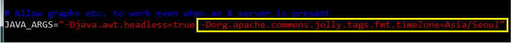
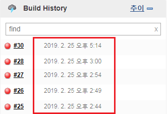

jenkins로 배포를 하게 되면 배포 시각이 한국시각으로 찍히지 않고 미국시각으로 찍히는 것을 확인할 수 있다.
jenkins timezone을 변경하여 배포시각을 한국시각으로 설정해보자.

_ _ _

### [/etc/default/jenkins 파일 수정]
- /etc/default/jenkins 파일에 해당 문구로 수정 : `JAVA_ARGS="-Djava.awt.headless=true -Dorg.apache.commons.jelly.tags.fmt.timeZone=Asia/Seoul"`

_ _ _

## [jenkins 재기동]
- 명령어 : `sudo jenkins service restart`

_ _ _

### [jenkins 배포목록의 배포시각 변경 확인]

_ _ _

*출처 : 
- <https://moigo4.tistory.com/entry/jenkins-timezone-%EB%B3%80%EA%B2%BD%ED%95%98%EA%B8%B0> 참고