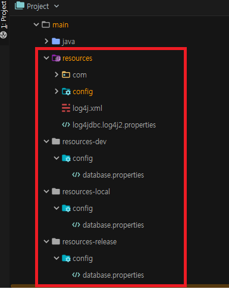
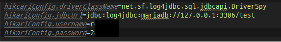
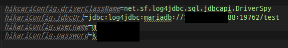
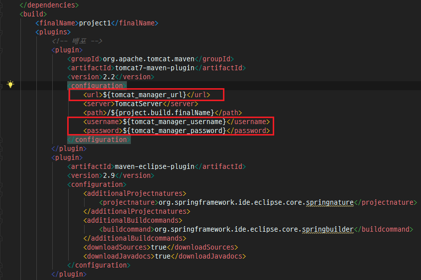
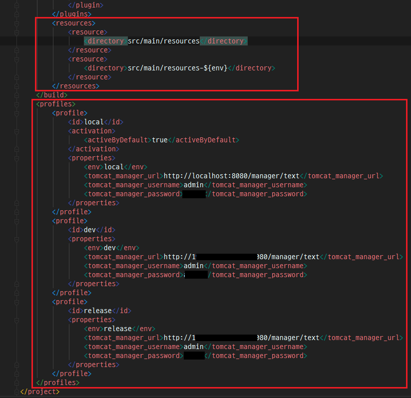

개발 시 로컬/개발/운영서버의 환경설정 값들이 다른 경우가 있다. 예를들면 DB 접속 정보라던지, tomcat url등이 있다. 때문에 배포 시에 이런 환경설정 정보를 서버별로 다르게 배포를 할 필요가 있다.
지금부터 Maven으로 war파일 배포 시 배포 서버별 환경설정(resource)를 다르게 배포하는 법에 대해서 알아보자.

_ _ _

### [각 배포 서버별 resources 디렉토리 및 properties 생성]
1) 공통/로컬/개발/운영 서버 별로 resources 디렉토리 생성 및 로컬/개발/운영 resources 디렉토리에 database.properties 파일 생성(공통에 있는 database.properties는 삭제)

2) 공통에는 각 서버에서 공통으로 사용하는 환경설정 정보를 넣고, 그 외에 각 서버별 별도로 사용하는 환경설정 정보는 각 서버별 resources디렉토리에 넣는다.
- 로컬 : src/main/resources-local

- 개발 : src/main/resources-dev

- 운영 : src/main/resources-release

_ _ _

### [Profile을 활용한 pom,xml 파일 수정]
1) 각 배포서버별 환경설정 값 중 pom.xml에 작성이 필요한 환경설정은 변수로 셋팅

2) resource 및 profile 설정
- resource는 공통 resources 디렉토리와 각 서버별 resources 디렉토리 두개 셋팅. 각 서버별 resource 디렉토리는 변수 사용
- profile에 각 서버별 환경설정 값 셋팅. 

_ _ _

### [각 서버별 배포]

1) IntelliJ에서 tomcat 기동 혹은 local에 war파일로 배포 시 profile에 적용된 activeByDefault가 local이 true기 때문에 local 환경정보(local tomcat manager URL 및 유저정보, local database.properties)로 빌드됨. (local 배포 명령어 : mvn tomcat7:redeploy)

2) 개발서버 배포 명령어 : **mvn -P (개발서버env정보) (mvn goals)** 입력(이 글에서는 mvn -P dev tomcat7:redeploy)

3) 운영서버 배포 명령어 : **mvn -P (운영서버env정보) (mvn goals)** 입력(이 글에서는 mvn -P release tomcat7:redeploy)

_ _ _

*출처 : 
- <http://www.mungchung.com/xe/spring/21264>
- <https://yookeun.github.io/java/2015/07/20/maven-pacaking/> 참고