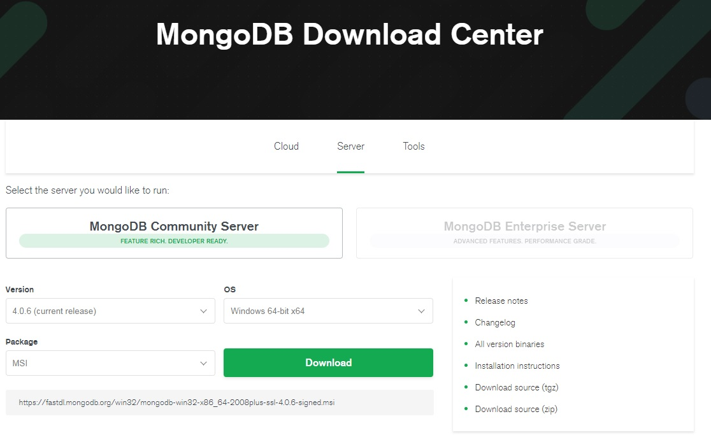
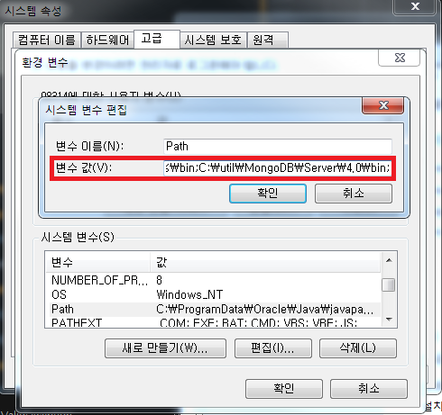
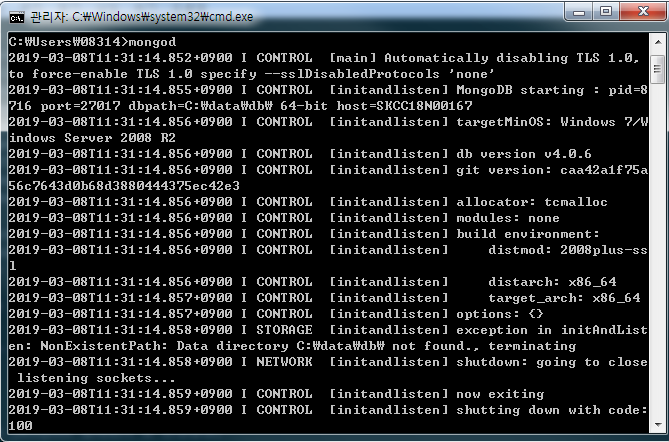
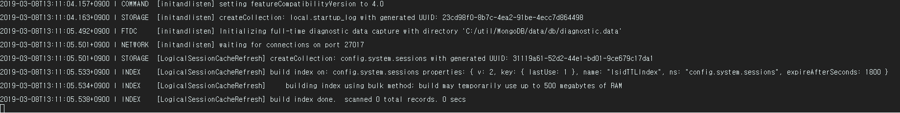

### [MongoDB란?]
MongoDB는 도큐먼트(Document) 지향 데이터베이스 시스템이다. 흔히 NoSQL이라고 하는데 많은 NoSQL 중에서 가장 인기가 많은 시스템이다.

### [NoSQL이란?]
NoSQL이란 Not Only SQL의 약자로, 기존의 RDBMS의 한계를 극복하기 위해 만들어진 새로운 형태의 데이터 저장소이다. 관계형 DB가 아니므로, RDBMS처럼 고정된 스키마 및 JOIN이 존재하지 않는다.

### [Document란?]
Document Oriented 데이터베이스에서의 Document란 RDBMS의 record와 비슷한 개념으로, 이의 데이터 구조는 한개 이상의 key-value pair로 이루어져 있다. Document는 동적(dynamic) schema를 가지고 있다. 같은 Collection 안에 있는 Document끼리 다른 schema를 갖을 수 있다. 쉽게 말해서 서로 다른 데이터(다른 key)를 가지고 있을 수 있다.

### [Collection이란?]
Collection은 MongoDB Document의 그룹이다. Document들이 Collection 내부에 위치하고 있따. RDBMS의 table과 비슷한 개념이지만 RDBMS와는 달리 shema를 따로 가지고 있지 않다. 

### [Database란?]
Database는 Collection들의 물리적인 컨테이너이다. 각 Database는 파일시스템에 여러 파일로 저장된다.

### [RDBMS와의 비교]
| RDBMS       | MongoDB            |
|-------------|--------------------|
| Database    | Database           |
| Table       | Collcetion         |
| Tuple/Row   | Document           |
| Column      | Key/Field          |
| Table Join  | Embedded Documents |
| Primary Key | Primary key(_id)   |
| mysqld      | mongod             |
| mysql       | mongo              |

### [장점]
- schema가 없다. 같은 Collection 안에 있을지라도 다른 Schema를 가지고 있을 수 있다.
- 각 객체의 구조가 뚜렷하다.
- 복잡한 JOIN이 없다.
- Deep Query ability. 문서지향적 Query Language를 사용하여 SQL만큼 강력한 Query 성능을 제공한다.
- 어플리케이션에서 사용되는 객체를 데이터베이스에 추가 할 때 Conversion / Mapping 이 불필요하다.

그럼 MongoDB를 아래와 같이 설치 및 환경설정을 해보도록 하자.
_ _ _

### [MongoDB 설치하기 및 환경설정]

1) [MongoDB 다운로드 사이트](https://www.mongodb.com/download-center/community) 접속. OS는 Windows, package는 MSI로 다운로드

_ _ _

2) msi파일을 실행하여 mongodb 설치. (setup type은 custom으로 선택하여 디렉토리 별도 지정함)
MongoDB 를 쉽게 관리하기 위한 GUI 툴인 compass는 설치 안함(추후 robomongo로 실습할 예정)

_ _ _

3) 환경변수 추가
- mongod라는 실행파일이 있는데 커맨드라인에서 경로를 들어가지 않아도 바로 실행할 수 있도록 환경변수를 추가한다.

_ _ _

4) mongodb 실행
- Windows키 + R -> cmd 실행하여 **mongod** 명령어 입력. **C:\data\db\** 폴더가 없기 때문에 아래와 같은 에러메시지가 발생한다.**
해당 경로에 폴더를 만들어줘도 되고, 직접 경로를 지정해줘도 된다. 

- **mongodb --help**를 통하여 명령어를 확인하면 **--dbpath arg** 형식으로 입력하면 dbpath를 설정할 수 있다. 아래와 같이 명령어를 입력해서 dbpath를 설정해주자(옵션에 들어가는 폴더는 직접 만들어주어야 한다). 
`mongod --dbpath C:\util\MongoDB\data\db`

- **wating for connections on port 27017** 이라고 출력되면 정상적으로 실행된 것이다. 27017은 포트번호이다.

- 브라우저를 실행시켜 localhost:27017을 입력하여 아래처럼 메시지가 출력하면 된다.

_ _ _

*출처 : 
- <https://javacpro.tistory.com/64> 참고