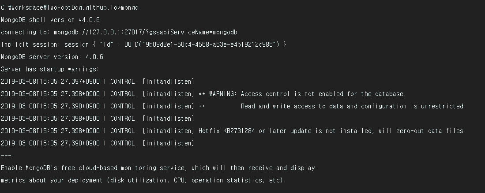

MongoDB를 활용하기 위해선 Database, Collection(dbms의 table), Document(dbms의 data) 관련 명령어를 숙지해야 한다. 아래 명령어가 주로 쓰이는 MongoDB 명령어이다.
_ _ _

### [Database 명령어]

**1) mongodb 실행**
- 명령어 : `mongo`

**2) database 생성**
- 명령어 : `use DATABASE_NAME`
- 데이터베이스를 생성 후 사용한다. 데이터베이스가 이미 존재하는 경우에는 해당 데이터베이스를 사용한다

**3) 사용중인 database 확인**
- 명령어 : `db`

**4) 데이터베이스 리스트 확인**
- 명령어 : `show dbs`
- 데이터베이스 리스트를 확인한다. 단 한개의 Document가 존재하는 경우만 리스트에서 확인된다.(때문에 현재 글에서는 test_db 데이터베이스가 리스트에서 확인 안됨)

- document 한개 추가 후 조회

**5) Database 제거**
- 명령어 : db.dropDatabase();
- 이 명령어를 사용하기 전에는 use DATABASE_NAME 으로 데이터베이스를 선택 후(use DATABASE_NAME) 삭제해야 한다.

_ _ _

### [Collection 명령어]

**1) Collection 생성**
- 명령어 : `db.createCollection(name, [Options])`
- name은 생성하려는 collection 이름이고, option은 document 타입으로 구성된 해당 컬렉션의 설정값이다. options 매개변수는 선택적인 매개변수로 생략 가능하다.
- option
	- capped
		- 타입 : Boolean
		- 설명 : true일 경우 고정된 크기의 Collection(Capped Collection)을 활성화시키는데, size가 초과되면 가장 오래된 데이터를 덮어쓴다. 이 값을 설정하면 size값을 꼭 설정해야 한다.
	- size
		- 타입 : number
		- Capped Collection을 위해 해당 Collection의 최대사이즈를 ~byte로 지정
	- max
		- 타입 : number
		- 해당 Collection에 추가할 수 있는 최대 갯수를 설정

**2) Collection 리스트 확인**
- 명령어 : `show collections`

**3) Collection 삭제**
- 명령어 : `db.COLLECTION_NAME.drop()`

_ _ _

### [Document 명령어]

**1) Document 추가**
- 명령어 : `db.COLLECTION_NAME.insert(document)`
- 배열 형식의 인자를 전달해주면 여러 다큐먼트를 동시에 추가할 수 있음.

**2) Document 조회(collection 전체)**
- 명령어 : `db.books.find()`
- 

**3) Document 조회(단일 조회)**
- 명령어 : `db.books.find(document)`

**3) Document 삭제**
- 명령어 : `db.COLLECTION_NAME.remove(criteria, justOne)`
- option
	- criteria
		- type : document
		- 설명 : 삭제할 데이터의 기준값(criteria)입니다. 이 값이 {} 이면 컬렉션의 모든 데이터를 제거한다.
	- justOne
		- type : boolean
		- 설명 : 선택적(Optional) 매개변수이며 이 값이 true면 1개의 다큐먼트만 제거한다. 이 매개변수가 생략되면 기본값은 false로서, criteria에 해당되는 모든 다큐먼트를 제거한다.
- 다큐먼트를 삭제할 때는 실수하지 않기 위해 find()를 먼저해서 확인하는 걸 습관화하자
- 

_ _ _

*출처 : 
- <https://velopert.com/457> 참고