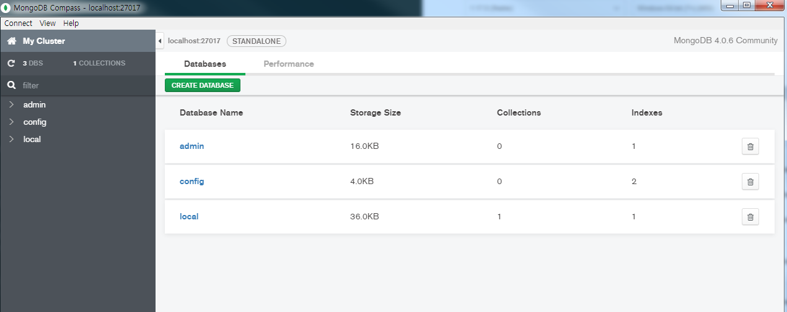

### [MongoDB Compass Community Edition 란?]
원래 MongoDB를 사용할 때 cmd창을 켜서 쓰는데, cmd창이 오타가 날 경우 수정도 불편하고 쓰기도 힘들기 때문에 MongoDB GUI 툴을 이용하여 관리를 하게 된다. Compass는 MongoDB GUI 툴 중 한개로 아래와 같은 기능을 제공한다.
- DB와 컬렉션을 조회하고 추가하고 삭제할 수 있다.
- 느린 쿼리를 식별하고 실시간으로 실행 성능을 확인할 수 있다.
- Create, Read, Update, Delete를 하루 수 있다.
- ad hoc 쿼리를 만들고 실행할 수 있다.(트리거와 비슷)
- 데이터베이스의 데이터를 탐색하고 조회
- 실행계획을 보고 튜닝할 수 있다.
- 인덱스를 만들고 조회하고 삭제할 수 있다.
- 데이터 정합성 규칙을 생성하고 수정할 수 있다.

설치하는 방법은 아래와 같다
_ _ _

**1) 홈페이지 접속 후 Compass 다운로드**
- <https://www.mongodb.com/products/compass> 에 접속하여 Try It Now 선택 -> Windows 버전으로 Download -> 설치(금방된다)

**2) Compass 실행 -> connect로 연결**

**3) MongoDB 사용하기**
- 자세한 사용법은 MongoDB 홈페이지의 가이드 문서를 참고하면 된다(<https://docs.mongodb.com/compass/master/>)

_ _ _

*출처 : 
- <https://docs.ncloud.com/ko/database/database-10-5.html> 참고