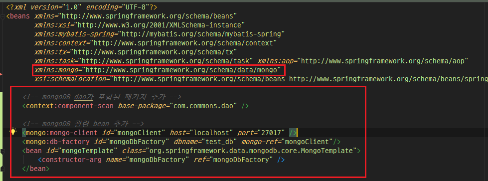

### [MongoDB 설치]
MongoDB설치는 아래 POST를 참고하여 설치하면 된다.

[몽고DB설치하기](https://twofootdog.github.io/MongoDB-MongoDB-%EC%8B%9C%EC%9E%91%ED%95%98%EA%B8%B0(MongoDB-%EC%A0%95%EC%9D%98,-%EC%84%A4%EC%B9%98,-%ED%99%98%EA%B2%BD%EC%84%A4%EC%A0%95(Windows))/)


_ _ _


### [pom.xml 에 MongoDB 관련 의존성 추가]
```
        <!-- MongoDB 관련 -->
        <dependency>
            <groupId>org.mongodb</groupId>
            <artifactId>mongo-java-driver</artifactId>
            <version>3.10.1</version>
        </dependency>
        <dependency>
            <groupId>org.springframework.data</groupId>
            <artifactId>spring-data-mongodb</artifactId>
            <version>2.1.5.RELEASE</version>
        </dependency>
```


_ _ _


### [applicationContext.xml 파일 수정]
몽고DB 환경설정정보 입력 및 namespace 추가. factory 프로퍼티로 서버 설정에 대한 다양한 정보를 입력. id는 MongoTemplate에서 참조하기 위해 필요한 값, host는 서버 ip 주소, port는 몽고DB 설치 시 기본적으로 27017을 사용하며, dbname은 몽고db 데이터베이스 이름이다. bean으로 MongoTemplate을 정의한다. ref로 몽고DB 서버 설정 정보를 참조한다. namespace영역도 몽고DB관련 내용을 추가해준다.
```
<beans 
xmlns:mongo="http://www.springframework.org/schema/data/mongo" >

	<!-- mongoDB dao가 포함된 패키지 추가 -->
	<context:component-scan base-package="com.commons.dao" />

    <!-- mongoDB 관련 bean 추가 -->
    <mongo:mongo-client id="mongoClient" host="localhost" port="27017" />
    <mongo:db-factory id="mongoDbFactory" dbname="test_db" mongo-ref="mongoClient"/>
    <bean id="mongoTemplate" class="org.springframework.data.mongodb.core.MongoTemplate">
        <constructor-arg name="mongoDbFactory" ref="mongoDbFactory" />
    </bean>
```



_ _ _


### [web.xml 설정]
몽고DB로 CRUD 작업을 수행하기 위해선 서버와의 인코딩 설정이 필요하다. 기본적으로 한글 지원 등을 위해 UTF-8로 설정한다.
```
    <servlet-mapping>
        <servlet-name>dispatcher</servlet-name>
        <url-pattern>/</url-pattern>
    </servlet-mapping>
    <filter>
        <filter-name>encoding</filter-name>
        <filter-class>org.springframework.web.filter.CharacterEncodingFilter</filter-class>
        <init-param>
            <param-name>encoding</param-name>
            <param-value>UTF-8</param-value>
        </init-param>
    </filter>
    <filter-mapping>
        <filter-name>encoding</filter-name>
        <servlet-name>dispatcher</servlet-name>
    </filter-mapping>
```


_ _ _


### [MongoDB관련 DAO 생성]

**MongoDBDao.java**
```
package com.commons.dao.inserface;

public interface MongoDBDao {
    public void inputDataInsert(Object input);
    public void outputDataInsert(Object output);
}

```


**MongoDBDaoImpl.java**
```
package com.commons.dao;

import com.commons.dao.inserface.MongoDBDao;
import lombok.Setter;
import org.springframework.beans.factory.annotation.Autowired;
import org.springframework.data.mongodb.core.MongoTemplate;
import org.springframework.stereotype.Repository;

import java.text.SimpleDateFormat;
import java.util.Date;
import java.util.HashMap;
import java.util.Map;

@Repository
public class MongoDBDaoImpl implements MongoDBDao {
    @Setter(onMethod_ = {@Autowired})
    private MongoTemplate mongoTemplate;

    public void inputDataInsert(Object input) {
        Map<String, Object> inputDataMap = new HashMap<String, Object>();
        inputDataMap.put("timestamp", new SimpleDateFormat("yyyyMMddHHmmss").format(new Date()));
        inputDataMap.put("inputData", input);
        mongoTemplate.insert(inputDataMap, "input_data");
    }

    public void outputDataInsert(Object output) {
        Map<String, Object> outputDataMap = new HashMap<String, Object>();
        outputDataMap.put("timestamp", new SimpleDateFormat("yyyyMMddHHmmss").format(new Date()));
        outputDataMap.put("outputData", output);
        mongoTemplate.insert(outputDataMap, "output_data");
    }

}

```


_ _ _


### [MongoDB DAO 활용]

**InsertDataAspect.java**

```
package com.commons.aop;

import com.commons.dao.MongoDBDaoImpl;
import com.commons.domain.CustomizeHeaderVO;
import com.commons.exception.ValidException;
import lombok.Setter;
import lombok.extern.log4j.Log4j;
import org.aspectj.lang.ProceedingJoinPoint;
import org.aspectj.lang.annotation.Around;
import org.aspectj.lang.annotation.Aspect;
import org.aspectj.lang.annotation.Pointcut;
import org.springframework.beans.factory.annotation.Autowired;
import org.springframework.stereotype.Component;


@Aspect
@Log4j
@Component
public class InsertDataAspect {

    @Setter(onMethod_ = {@Autowired})
    private CustomizeHeaderVO header;

    @Setter(onMethod_ = {@Autowired})
    private MongoDBDaoImpl mongoDBDao;

    @Pointcut("execution(* com.*.service.Z*.*(..)) && args(object)")
    private void publicTarget(Object object) {
    }
    @Around("publicTarget(input)")
    public Object InsertData(ProceedingJoinPoint joinPoint, Object input) throws Throwable {
        Object result = null;

        try {
            mongoDBDao.inputDataInsert(input);      // 입력 data를 mongodb에 저장
            result = joinPoint.proceed();           // 메인 서비스 호출
            mongoDBDao.outputDataInsert(result);    // 입력 data를 mongodb에 저장

        } catch (ValidException e) {
            throw new ValidException(e.getAns_cd(), e.getAns_msg());
        } catch (Exception e) {
            throw new ValidException("9999", "시스템실 연락바람");
        }

        return result;
    }
}
```


_ _ _


*출처 : 
- <https://m.blog.naver.com/PostView.nhn?blogId=scw0531&logNo=221005412595&proxyReferer=https%3A%2F%2Fwww.google.com%2F> 참고