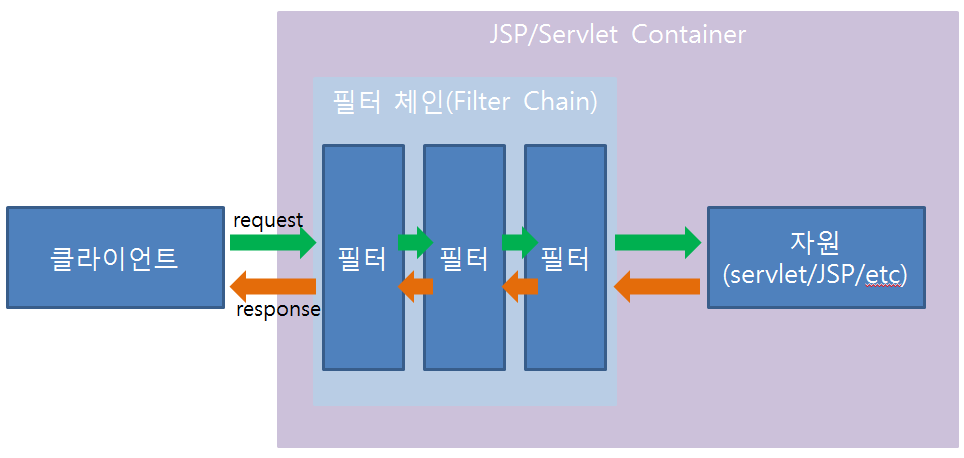

Spring Project 를 수행하다가 Parameter나 Header값이 아닌 POST방식으로 전송된 body 데이터("application/json" 타입)를 추출해야 할 필요가 생겼다. 
그러다가 필터(Filter) 활용을 통해서 문제를 해결하였는데, 그러다가 필터의 정의에 대해서 좀 더 명확하게 정리를 할 필요가 생겨서 이렇게 정리해본다. 마침 내가 원하는 내용을 모두 담고 있는 블로그를 발견하여 해당 내용을 활용하여 정리해본다.(해당 블로그를 읽고 너무나도 명확하게 정리가 되어서 무릎을 탁 쳤다. 알고보니 스프링계에서 유명인이신 최범균님이 쓰신 블로그인 것 같다. 앞으로 자주 애용할 생각이다. )


_ _ _


### [필터(Filter)란 무엇인가?]
**HTTP 요청과 응답을 변경할 수 있는 재사용 가능한 코드이며,** 서블릿 2.3 규약에 새롭게 추가되었다. 필터는 객체의 형태로 존재하며 클라이언트로부터 오는 요청(request)과 최종자원(서블릿/JSP/기타 문서) 사이에 위치하며 클라이언트의 요청 정보를 알맞게 변경할 수 있으며, 또한 필터는 최종 자원과 클라이언트로 가는 응답(response) 사이에 위치하여 최종 자원의 요청 결과를 알맞게 변경할 수 있다.


_ _ _


### [필터의 기본 구조]

그림으로 보면 **자원이 받게 되는 요청 정보는 클라이언트와 자원 사이에 존재하는 필터에 의해 변경된 요청정보가 되며, 클라이언트가 보게 되는 응답 정보는 클라이언트와 자원사이에 존재하는 필터에 의해 변경된 응답정보가 된다.** 필터는 클라이언트와 자원사이에 1개가 존재하는 경우가 보통이지만, 여러개의 필터가 모여서 하나의 체인(chain)을 형성할 수 있다. 

여러개의 필터가 모여서 하나의 체인을 형성할 때 첫번째 필터가 변경하는 요청정보는 클라이언트의 요청정보가 되지만, 체인의 두번째 필터가 변경하는 요청정보는 첫번째 필터를 통해서 변경된 요청정보가 된다. 즉 요청정보는 변경에 변경에 변경을 거듭한다. 응답정보의 경우도 요청정보와 비슷한 과정을 거치지만 차이점은 필터의 적용순서가 요청때와는 반대다.

또한 필터는 요청/응답 정보를 변경하는 역할 뿐 아니라 흐름을 변경하는 역할도 할 수 있다. **즉 필터는 클라이언트의 요청을 필터체인의 다음단계에 보내는 것이 아니라, 다른 자원의 결과를 클라이언트에 전송할 수도 있다.** 필터의 이러한 기능은 사용자 인증이나 권한 체크와 같은 곳에서 사용 가능하다.


_ _ _


### [필터 관련 인터페이스 및 클래스]
필터를 구현하는데 핵심적인 역할을 하는 인터페이스/클래스가 3개 있다. 그것은 바로 javax.servlet.Filter 인터페이스, javax.servlet.ServletRequestWrapper클래스, javax.servlet.ServletResponseWrapper클래스이다. 이 중 Filter 인터페이스는 클라이언트와 최종 자원 사이에 위치하는 필터를 나타내는 객체가 구현해야 하는 인터페이스다. 그리고 ServletRequestWrapper 클래스와 ServletResponseWrapper 클래스는 필터가 요청을 변경한 결과 또는 응답을 변경한 결과를 저장할 래퍼 클래스를 나타낸다. 개발자는 이 두 클래스를 알맞게 상속하여 요청/응답 정보를 변경하면 된다.


_ _ _


### [필터 인터페이스]
Filter 메소드는 다음과 같은 메소드가 선언되어 있다.
- **public void init(FilterConfig filterConfig) throw ServletException** : 필터를 웹 콘테이너에 생성한 후 초기화할 때 호출
- **public void doFilter(ServletRequest request, SevletResponse response, FilterChain chain) throws java.io.IOException, ServletException** : 체인을 따라 다음에 존재하는 필터로 이동한다. 체인의 가장 마지막에는 클라이언트가 요청한 최종 자원이 위치한다.
- **public void destroy()** : 필터가 웹 콘테이너에서 삭제될 때 호출된다.

위 메소드에서 필터의 역할을 하는 메소드가 바로 **doFilter()** 메소드이다. 서블릿 콘테이너는 사용자가 특정한 자원 요청 시 그 자원 사이에 필터가 존재하는 경우 그 필터 객체의 doFilter() 메소드를 호출하며, 바로 그 시점부터 필터가 작용하기 시작한다. 아래는 Filter 구현 예이다.
```
  public class FirstFilter implements javax.servlet.Filter {
  
     public void init(FilterConfig filterConfig) throws ServletException {
        // 필터 초기화 작업
     }
     
     public void doFilter(ServletRequest request,
                          ServletResponse response,
                          FilterChain chain)
                          throws IOException, ServletException {
        chain.doFilter(request, response);       
     }
     
     public void destroy() {
        // 주로 필터가 사용한 자원을 반납
     }
  }
```

만약 클라이언트의 자원 요청이 필터를 거치는 경우, 클라이언트의 요청이 있을 때마다 doFilter() 메소드가 호출된다. 위 코드에서 doFilter() 메소드의 세번째 파라미터로 FilterChain 객체를 전달받는데, 이는 클라이언트가 요청한 자원에 이르기까지 클라이언트 요청이 거쳐가게 될 필터 체인을 나타낸다. FilterCahing을 사용하여 필터는 체인에 있는 다음 필터에 변경한 요청과 응답을 건내줄 수 있다.

또한 요청을 필터링한 필터 객체에서 응답도 필터링이 된다. doFilter()메소드에서 이루어지는 작업 순서를 정리해보면 아래와 같다.
- request 파라미터를 이용하여 클라이언트 요청 필터링(RequestWrapper 클래스를 사용하여 클라이언트의 요청을 변경)
- chain.doFilter()메소드 호출(요청의 필터링 결과를 다음 필터에 전달)
- 필터 체인을 통해서 전달된 응답 데이터를 변경하여 그 결과를 클라이언트에 전송


_ _ _


### [필터의 설정]
필터를 사용하기 위해서는 어떤 필터가 어떤 자원에 대해서 적용된다는 것을 서블릿/JSP 컨테이너에 알려주어야 한다. 서블릿 규약은 웹 어플리케이션과 관련된 설정은 웹 어플리케이션 디렉토리의 /WEB-INF 디렉토리에 존재하는 web.xml 파일을 통해 하도록 하고 있으며, 필터 역시 web.xml 파일을 통해 설정한다. web.xml파일에서 필터를 설정하기 위해서는 아래와 같이 <filter> 와 <filter-mapping> 태그를 활용하면 된다.
```
  <web-app>
     
     <filter>
        <filter-name>HighlightFilter</filter-name>
        <filter-class>javacan.filter.HighlightFilter</filter-class>
        <init-param>
           <param-name>paramName</param-name>
           <param-value>value</param-value>
        </init-param>
     </filter>
     
     <filter-mapping>
        <filter-name>HighlightFilter</filter-name>
        <url-pattern>*.txt</url-pattern>
     </filter-mapping>
     
  </web-app>
```
태그 간단 설명
- <filter> : 어플리케이션에서 사용될 필터를 지정
- <filter-mapping> : 특정 자원에 대해서 어떤 필터를 사용할지 지정(위 예제의 경우 txt 확장자를 갖는 자원을 요청할 경우 HighlightFilter가 사용되도록 지정됨)
- <init-param> : 필터가 초기화될때, 즉 init() 메소드가 호출될 때 전달되는 파라미터 값. 주로 필터를 사용하기 전에 초기화해야하는 객체나 자원을 할당할 때 필요한 정보를 제공하기 위해 사용된다.
- <url-pattern> : 클라이언트가 요청한 특정 URI에 대해서 필터링 할 때 사용된다. 기준은 아래와 같다
	- '/'로 시작하고 '/*'로 끝나는 url-pattern은 경로 매핑 시 사용됨
	- '*.'로 시작하는 url-pattern은 확장자에 대한 매핑 시 사용됨
	- 나머지 다른 문자열은 정확한 매핑을 위해 사용됨

예를들면 아래와 같이 <filter-mapping> 태그를 지정할 경우 /pds/a.zip을 요청하든 /pds/b.zip 요청하는지에 상관없이 AuthCheckFilter가 필터로 사용된다
```
     <filter-mapping>
        <filter-name>AuthCheckFilter</filter-name>
        <url-pattern>/pds/*</url-pattern>
     </filter-mapping>
```

<url-pattern> 태그를 사용하지 않고 <servlet-name> 태그를 사용하여 특정 서블릿에 대한 요청에 대해서 필터를 적용할 수도 있다. 예를들면 아래와 같이 FileDownload인 서블릿에 대해서 AuthCheckFilter를 필터로 사용하도록 할 수 있다.
```
     <filter-mapping>
        <filter-name>AuthCheckFilter</filter-name>
        <servlet-name>FileDownload</servlet-name>
     </filter-mapping>
     
     <servlet>
        <servlet-name>FileDownload</servlet-name>
        ...
     </servlet>
```


_ _ _


### [래퍼(Wrapper) 클래스]
필터가 필터로서의 제 기능을 하기 위해서는 클라이언트의 요청을 변경하고, 클라이언트로 가는 응답을 변경할 수 있어야 한다. **이러한 변경을 할 수 있도록 해주는 것이 바로 ServletRequestWrapper와 ServletResponseWrapper이다.** 서블릿 요청/응답 래퍼 클래스를 이용하여 클라이언트의 요청정보를 변경하여 최종자원(서블릿/JSP/HTML/기타 자원)에 전달할 수 있고, 최종 자원으로부터의 응답 결과를 변경하여 클라이언트에 보낼 수 있다.

서블릿 요청/응답 래퍼 클래스로서 역할을 수행하려면 javax.servlet 패키지에 정의된 **ServletRequestWrapper/ServletResponseWrapper** 클래스를 상속받으면 된다. 하지만 대부분 HTTP 프로토콜에 대한 요청/응답을 필터링하기 때문에 두 클래스를 상속받아 알맞게 구현한 **HttpServletRequestWrapper/HttpServletResponseWrapper** 클래스를 상속받는 경우가 대부분이다.

HttpServletRequestWrapper클래스와 HttpServletResponseWrapper 클래스는 모두 javax.servlet.http 패키지에 정의되어 있으며, 이 두 클래스는 각각 HttpServletRequest/HttpServletResponse 인터페이스에 정의되어 있는 모든 메소드를 이미 구현해 놓고 있다. **필터를 통해서 변경을 하고 싶은 정보가 있을 경우 그 정보를 추출하는 메소드(예를들면 getInputStream() 등)를 알맞게 오버라이딩해서 필터의 doFilter()메소드에 넘겨주면 된다.** 예를들면 클라이언트가 전송한 "dog"란 파라미터 값을 무조건 "pig" 로 변경하는 요청 래퍼 클래스는 아래와 같이 HttpServletRequestWrapper클래스를 상속받은 후 getParameter()메소드를 알맞게 구현하면 된다.
```
  package com.java.filter;
  
  import javax.servlet.http.*;
  
  public class ParameterWrapper extends HttpServletRequestWrapper {
     
     public ParameterWrapper(HttpServletRequest wrapper) {
        super(wrapper);
     }
     
     public String getParameter(String name) {
        if ( name.equals("dog") ) {
           return "pig";
        } else {
           return super.getParameter(name);	// dog 가 아닌 경우 상위클래스의 getParameter 호출
        }
     }
  }
```

**이렇게 작성한 래퍼 클래스는 필터 체인을 통해 최종 자원까지 전달되어야 그 효과가 있을 것이다.** 즉 최종 자원인 서블릿/JSP에서 request.getParameter("dog") 를 호출했을 때 parameterWrapper 클래스의 getParameter() 메소드가 사용되기 위해서는 parameterWrapper 객체가 HttpServletRequest 객체를 대체해야 하는데, 이는 **Filter 인터페이스의 doFilter() 내에서 ParameterWrapper 객체를 생성한 후 파라미터로 전달받은 FilterChain의 doFilter() 메소드를 호출함으로써 가능하다.** 코드로 구현하면 아래와 같다.
```
  package com.java.filter;
  
  import javax.servlet.*;
  import javax.servlet.http.*;
  
  public class ParameterFilter implements Filter {
     
     private FilterConfig filterConfig;
     
     public ParameterFilter() {
     }
     
     public void init(FilterConfig filterConfig) {
        this.filterConfig = filterConfig;
     }
     
     public void destroy() {
        filterConfig = null;
     }
     
     public void doFilter(ServletRequest request,
                          ServletResponse response,
                          FilterChain chain)
                          throws java.io.IOException, ServletException {
        // 요청 래퍼 객체 생성
        HttpServletRequestWrapper requestWrapper = 
                     new ParameterWrapper((HttpServletRequest)request);
        // 체인의 다음 필터에 요청 래퍼 객체 전달
        chain.doFilter(requestWrapper, response);     }
  }
```

요청/응답 정보의 변경의 출발점은 래퍼 클래스이다. XML+XSL/T 기법이나 사용자 인증과 같은 것들을 최종 자원과 분리시켜 객체 지향적으로 구현하기 위해서 요청/응답 래퍼 클래스를 사용하는 것은 필수적이다. 


_ _ _


### [필터 체인의 순서]
체인을 형성한다는 것은 어떤 특정한 순서에 따라 필터가 적용된다는 것을 의미한다. 서블릿2.3 규약은 다음과 같은 규칙에 기반하여 필터 체인 내에서 필터의 적용 순서를 결정한다.
- url-pattern 매칭은 web.xml 파일에 표기된 순서대로 필터체인 형성
- 그런 후 servlet-name 매칭이 web.xml 파일에 표기된 순서대로 필터체인 형성


_ _ _


*출처 : 
- <https://javacan.tistory.com/entry/58> 참고