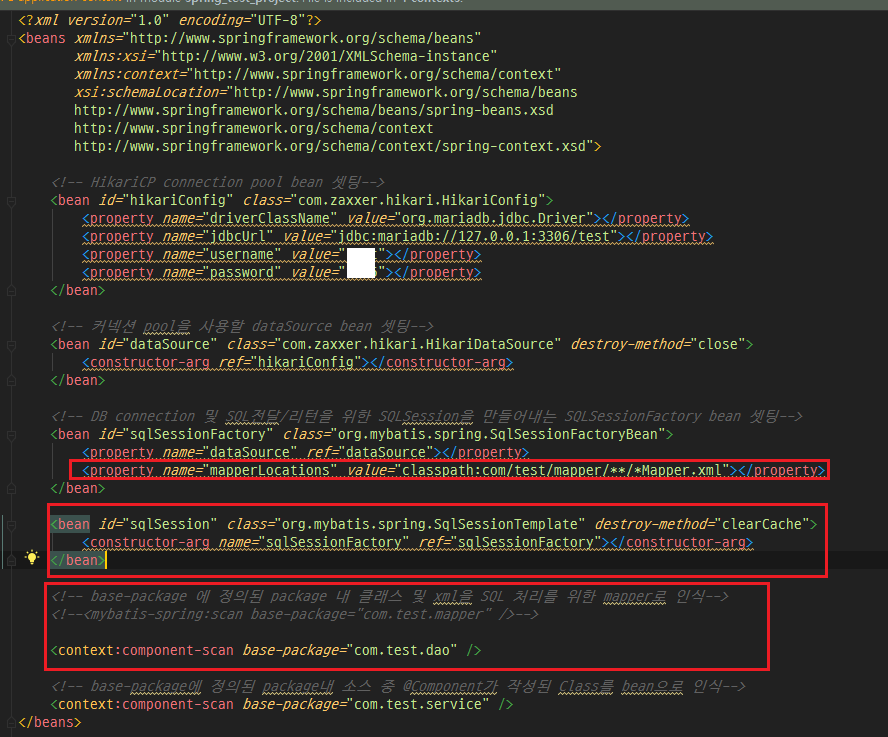

Spring 프로젝트를 진행하면서 다양한 프로젝트 소스를 참고하다가 한가지 고민이 생겼다. 필자는 스프링 프로젝트의 구조를 잡을 때 **1) Controller.java - Service.java - Mapper.java - Mapper.xml** 형식으로 구조를 잡았는데, 다른 스프링 프로젝트 구조를 보면 **2) Controller.java - Service.java - DAO.java - Mapper.xml** 형식으로 구조를 잡고 있었다. 단순히 순서상으로만 보면 Mapper.java와 DAO.java만 변경하면 되는 것처럼 보이지만, 1)의 구조에서 Mapper.java는 단순 인터페이스지만, 2)구조에서 DAO.java는 인터페이스와 클래스의 결합된 형태였고, 그 외에도 여러 다른 점들이 눈에 띄었다. 

DAO를 활용한 프로젝트와 Mapper를 활용한 프로젝트의 명확한 차이점을 확인하기 위해서 위 두가지 구조로 프로젝트를 만들어 볼 것이다. 우선 DAO와 Mapper의 정의에 대해 설명하고 두 구조로 프로젝트를 만들어 보자.

_ _ _

### [DAO와 Mapper인터페이스의 정의]

**1.DAO란?**
- Data Access Object의 약어로 실질적으로 DB에 접근하여 데이터를 조회하거나 조작하는 기능을 전담하는 객체를 말한다. DAO의 사용 이유는 효율적인 커넥션 관리와 보안성 때문이다. DAO는 저수준의 Logic과 고급 비즈니스 Logic을 분리하고 domain logic으로부터 persistence mechanism을 숨기기 위해 사용한다. 

**Mapper인터페이스란?**
- Mybatis 매핑XML에 기재된 SQL을 호출하기 위한 인터페이스이다. Mybatis3.0부터 생겼다.

**Mapper인터페이스를 사용하지 않을 경우**
- SqlSession을 등록해줘야 한다.
- DAO인터페이스와 인터페이스를 구현한 DAO클래스를 생성해줘야한다.
- Mapper인터페이스를 사용하지 않았을 때는 네임스페이스 + "." + SQL ID로 지정해야 한다.(예를들면 sesseion.selectOne("com.test.mapper.TimeMapper.getReplyer, bno ))
- 문자열로 작성하기 때문에 버그가 생길 수 있다.
- IDE에서 제공하는 code assist를 사용할 수 없다.

**Mapper인터페이스를 사용하는 방법**
- Mapper인터페이스는 개발자가 직접 작성한다.
- mapper 네임스페이스는 패키지명을 포함한 인터페이스 명으로 작성한다.
- SQL id는 인터페이스에 정의된 메서드명과 동일하게 작성한다

_ _ _

### [Controller.java - Service.java - Mapper.java - Mapper.xml구조로 프로젝트 생성]

**1. 프로젝트 구조**

**2. applicationContext.xml**

**3. dispatcher-servlet.xml**

**4. pom.xml**
- [Mybatis연동하기](https://twofootdog.github.io/Spring-Mybatis%EC%99%80-Spring-%EC%97%B0%EB%8F%99%ED%95%98%EA%B8%B0/) 의 pom.xml 참고(해당 post와 동일)

**5. Controller.java**

**6. Service.java**

**7. Mapper.java**

**8. Mapper.xml**

**9. 실행결과**

_ _ _

### [Controller.java - Service.java - DAO.java - Mapper.xml구조로 프로젝트 생성]
다음은 DAO를 활용하여 프로젝트를 생성하겠다. Mapper인터페이스를 활용한 구조와 차이점은 빨간색으로 표시하도록 하겠다.

**1. 프로젝트 구조**
mapper(인터페이스) 패키지 대신 dao 패키지를 생성하였다. 

**2. applicationContext.xml**
Mapper.xml의 위치를 설정해주어야 하고, sqlSession 을 bean으로 선언해주어야 한다. sqlSession은 개발자들이 DAO와 DB를 직접 연결 맺고 종료할 필요가 없게 해주며 기본적인 트랜잭션 관리나 쓰레드 처리의 안정성 등을 보장해준다. 또한 base-package에 등록한 mapper는 삭제하고, dao를 추가하였다.

**3. dispatcher-servlet.xml(변화 없음)**

**4. pom.xml(변화 없음)**

**5. Controller.java(변화 없음)**

**6. Service.java**
매퍼 객체 호출에서 DAO 객체 호출로 변경되었다.

**7. DAO.java**
Mapper 인터페이스가 삭제되고 DAO인터페이스와 서비스가 신규 추가되었다.

**8. Mapper.xml(변화 없음)**

**9. 실행결과(변화 없음)**

_ _ _

### [결론]

_ _ _

*출처 : 
- <https://bigstupid.tistory.com/23>
- <https://genesis8.tistory.com/214> 참고