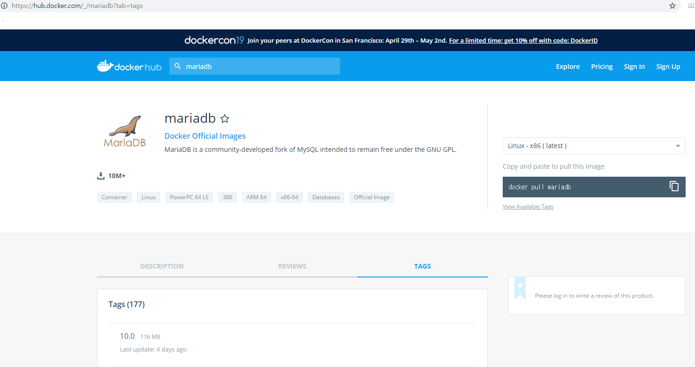
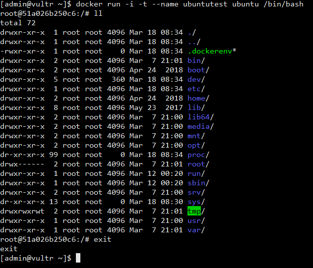
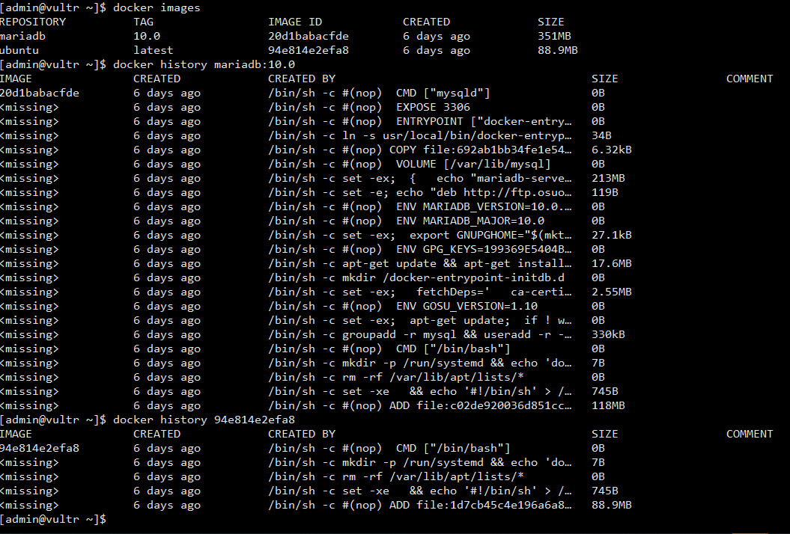
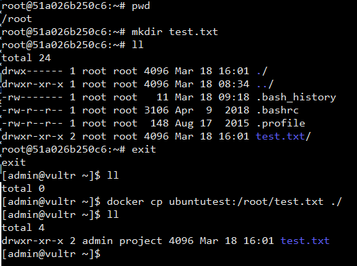
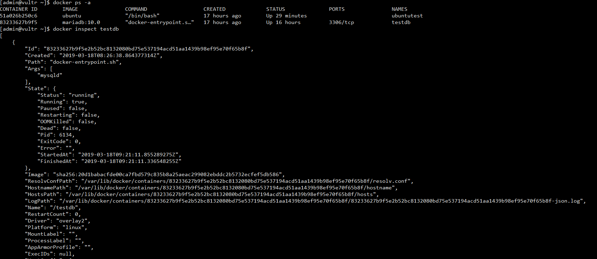
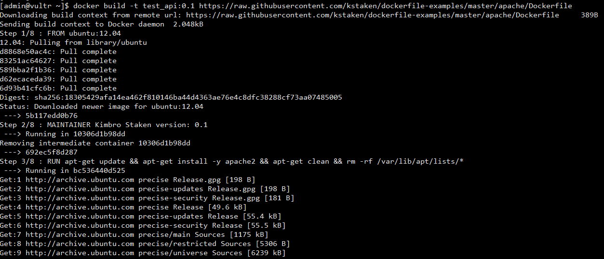

Docker에서 주로 사용하는 명령어를 정리해보자(해당 명령어는 해당 계정이 docker group에 추가되어 있다는 것을 전제로 작성하였다.)

_ _ _

### [1. search]
- 설명 : 도커의 이미지를 검색
- 사용 방법 : `docker search (검색이미지)`
- 사용 예 : `docker search centos`

_ _ _

### [2. pull]
- 설명 : 도커의 이미지를 받아옴. docker hub(<https://hub.docker.com/>)에서 이미지 검색 후 TAG탭에서 이미지 버전 확인이 가능하다.
- 사용 방법 : `docker pull (이미지):(태그)`
- 사용 예 : `docker pull mariadb:10.0`

_ _ _

### [3. images] 
- 설명 : 다운받은 도커 이미지 목록 출력
- 사용 방법 : `docker images (이미지)`
- 사용 예 : `docker images mariadb`, `docker images`

_ _ _

### [4. run]
- 설명 : 도커 이미지를 컨테이너로 생성(도커 이미지 실행)
- 사용 방법 : `docker run <옵션> (이미지):(태그) ....` (이미지 별로 사용 방법이 조금 다른듯?)
- 사용 예 : 
	- mariadb실행 : `docker run --name testdb -e MYSQL_ROOT_PASSWORD=(패스워드) -d mariadb:10.0`

	- ubuntu실행 : `docker run -i -t --name ubuntutest ubuntu /bin/bash` : centos에서 ubuntu docker 실행 후 ubuntu에 접속됨

- run 옵션정리
	1) -a, --attach=[]: 컨테이너에 표준 입력(stdin), 표준 출력(stdout), 표준 에러(stderr)를 연결합니다.
	    - 예 : --attach=”stdin”
	    
	2) --add-host=[]: 컨테이너의 /etc/hosts에 호스트 이름과 IP 주소를 추가합니다.
	    - 예 : --add-host=hello:192.168.0.10
	3) -c, --cpu-shares=0: CPU 자원 분배 설정입니다. 설정의 기본 값은 1024이며 각 값은 상대적으로 적용됩니다.(이 설정 값은 리눅스 커널의 cgroups에서 사용됩니다.)
	    - 예 : --cpu-shares=2048처럼 설정하면 기본 값 보다 두 배 많은 CPU 자원을 할당합니다.
	   
	4) --cap-add=[]: 컨테이너에서 cgroups의 특정 Capability를 사용합니다. ALL을 지정하면 모든 Capability를 사용합니다.
	    - 예 :  --cap-add=”MKNOD” --cap-add=”NET_ADMIN”처럼 설정합니다. 모든 Capability 목록은 다음 링크를 참조하기 바랍니다. <http://linux.die.net/man/7/capabilities>
	    
	5) --cap-drop=[]: 컨테이너에서 cgroups의 특정 Capability를 제외합니다.
	6) --cidfile=””: cid 파일 경로를 설정합니다. cid 파일에는 생성된 컨테이너의 ID가 저장됩니다.
	7) --cpuset=””: 멀티코어 CPU에서 컨테이너가 실행될 코어를 설정합니다.
	    - 예 :  --cpuset=”0,3”처럼 설정하면 첫 번째, 네 번째 CPU 코어를 사용합니다.

	8) -d, --detach=false: Detached 모드입니다. 보통 데몬 모드라고 부르며 컨테이너가 백그라운드로 실행됩니다.
    
	9) --device=[]: 호스트의 장치를 컨테이너에서 사용할 수 있도록 연결합니다. <호스트 장치>:<컨테이너 장치> 형식입니다.
		- 예 :--device=”/dev/sda1:/dev/sda1”처럼 설정하면 호스트의 /dev/sda1 블록 장치를 컨테이너에서도 사용할 수 있습니다.
		
	10) --dns=[]: 컨테이너에서 사용할 DNS 서버를 설정합니다.
		- 예 : --dns=”8.8.8.8”
		
	11) --dns-search=[]: 컨테이너에서 사용할 DNS 검색 도메인을 설정합니다.
		- 예 : --dns-search=”example.com”처럼 설정하면 DNS 서버에 hello를 질의할 때 hello.example.com을 먼저를 찾습니다.
		
	12) -e, --env=[]: 컨테이너에 환경 변수를 설정합니다. 보통 설정 값이나 비밀번호를 전달할 때 사용합니다.
		- 예 : -e MYSQL_ROOT_PASSWORD=examplepassword
		
	13) --entrypoint=””: Dockerfile의 ENTRYPOINT 설정을 무시하고 강제로 다른 값을 설정합니다.
		- 예 : --entrypoint=”/bin/bash”
		
	14) --env-file=[]: 컨테이너에 환경 변수가 설정된 파일을 적용합니다.
		- 예 : --env-file=”/etc/environment”
		
	15) --expose=[]: 컨테이너의 포트를 호스트와 연결만 하고 외부에는 노출하지 않습니다.
		- 예 : --expose=”3306”
		
	16) -h, --hostname=””: 컨테이너의 호스트 이름을 설정합니다.
    
	17) -i, --interactive=false: 표준 입력(stdin)을 활성화하며 컨테이너와 연결(attach)되어 있지 않더라도 표준 입력을 유지합니다. 보통 이 옵션을 사용하여 Bash에 명령을 입력합니다.
    
	18) --link=[]: 컨테이너끼리 연결합니다. <컨테이너 이름>:<별칭> 형식입니다.
		- 예 : --link=”db:db”
		
	19) --lxc-conf=[]: LXC 드라이버를 사용한다면 LXC 옵션을 설정할 수 있습니다.
		- 예 : --lxc-conf=”lxc.cgroup.cpuset.cpus = 0,1”
	
	20) -m, --memory=””: 메모리 한계를 설정합니다. <숫자><단위> 형식이며 단위는 b, k, m, g를 사용할 수 있습니다.
		- 예 : --memory=”100000b”, --memory=”1000k”, --memory=”1g”
		
	21) --name=””: 컨테이너에 이름을 설정합니다.
    
	22) --net=”bridge”: 컨테이너의 네트워크 모드를 설정합니다.
		- bridge: Docker 네트워크 브리지에 새 네트워크를 생성합니다.
		- none: 네트워크를 사용하지 않습니다.
		- container:<컨테이너 이름, ID>: 다른 컨테이너의 네트워크를 함께 사용합니다.
		- host: 컨테이너 안에서 호스트의 네트워크를 그대로 사용합니다. 호스트 네트워크를 사용하면 D-Bus를 통하여 호스트의 모든 시스템 서비스에 접근할 수 있으므로 보안에 취약해집니다.
		
	23) -P, --publish-all=false: 호스트에 연결된 컨테이너의 모든 포트를 외부에 노출합니다.
    
	24) -p, --publish=[]: 호스트에 연결된 컨테이너의 특정 포트를 외부에 노출합니다. 보통 웹 서버의 포트를 노출할 때 주로 사용합니다.
		- <호스트 포트>:<컨테이너 포트> 예) -p 80:80
		- <IP 주소>:<호스트 포트>:<컨테이너 포트> 호스트에 네트워크 인터페이스가 여러 개이거나 IP 주소가 여러 개 일 때 사용합니다. 예) -p 192.168.0.10:80:80
		- <IP 주소>::<컨테이너 포트> 호스트 포트를 설정하지 않으면 호스트의 포트 번호가 무작위로 설정됩니다. 예) -p 192.168.0.10::80
		- <컨테이너 포트> 컨테이너 포트만 설정하면 호스트의 포트 번호가 무작위로 설정됩니다. 예) -p 80
		
	25) --privileged=false: 컨테이너 안에서 호스트의 리눅스 커널 기능(Capability)을 모두 사용합니다.
    
	26) --restart=””: 컨테이너 안의 프로세스 종료 시 재시작 정책을 설정합니다.
		- no: 프로세스가 종료되더라도 컨테이너를 재시작하지 않습니다. 예) --restart=”no”
		- on-failure: 프로세스의 Exit Code가 0이 아닐 때만 재시작합니다. 재시도 횟수를 지정할 수 있습니다. 횟수를 지정하지 않으면 계속 재시작합니다. 예) --restart=”on-failure:10”
		- always: 프로세스의 Exit Code와 상관없이 재시작합니다. 예) --restart=”always”
		
	27) --rm=false: 컨테이너 안의 프로세스가 종료되면 컨테이너를 자동으로 삭제합니다. -d 옵션과 함께 사용할 수 없습니다.
    
	28) --security-opt=[]: SELinux, AppArmor 옵션을 설정합니다.
		- 예 : --security-opt=”label:level:TopSecret”
        
	29) --sig-proxy=true: 모든 시그널을 프로세스에 전달합니다(TTY 모드가 아닐 때도). 단 SIGCHLD, SIGKILL, SIGSTOP 시그널은 전달하지 않습니다.
    
	30) -t, --tty=false: TTY 모드(pseudo-TTY)를 사용합니다. Bash를 사용하려면 이 옵션을 설정해야 합니다. 이 옵션을 설정하지 않으면 명령을 입력할 수는 있지만 셸이 표시되지 않습니다.
    
	31) -u, --user=””: 컨테이너가 실행될 리눅스 사용자 계정 이름 또는 UID를 설정합니다.
    
	32) -v, --volume=[]: 데이터 볼륨을 설정입니다. 호스트와 공유할 디렉터리를 설정하여 파일을 컨테이너에 저장하지 않고 호스트에 바로 저장합니다. 호스트 디렉터리 뒤에 :ro, :rw를 붙여서 읽기 쓰기 설정을 할 수 있으며 기본 값은 :rw입니다. 자세한 내용은 ‘6.4 Docker 데이터 볼륨 사용하기’를 참조하기 바랍니다.
		- <컨테이너 디렉터리> 예) -v /data
		- <호스트 디렉터리>:<컨테이너 디렉터리> 예) -v /data:/data
		- <호스트 디렉터리>:<컨테이너 디렉터리>:<ro, rw> 예) -v /data:/data:ro
		- <호스트 파일>:<컨테이너 파일> 예) -v /var/run/docker.sock:/var/run/docker.sock
		- 예 : --volumes-from=[]: 데이터 볼륨 컨테이너를 연결하며 <컨테이너 이름, ID>:<ro, rw> 형식으로 설정합니다. 기본적으로 읽기 쓰기 설정은 -v 옵션의 설정을 따릅니다. 자세한 내용은 ‘6.5 Docker 데이터 볼륨 컨테이너 사용하기’를 참조하기 바랍니다.
	    - 예 : --volumes-from=”hello”
	    - 예 : --volumes-from=”hello:ro”처럼 설정하면 데이터 볼륨을 읽기 전용으로 사용합니다.
	    - 예 : --volumes-from=”hello:rw”처럼 설정하면 데이터 볼륨에 읽기 쓰기 모두 할 수 있습니다.
	33) -w, --workdir=””: 컨테이너 안의 프로세스가 실행될 디렉터리를 설정합니다.
	    - 예 : --workdir=”/var/www”
_ _ _

### [5. ps]
- 설명 : 컨테이너의 목록을 출력. -a옵션을 주면 모든 컨테이너 정지된 컨테이너까지 모두 출력, 옵션을 사용하지 않으면 실행중인 컨테이너만 출력
- 사용 방법 : `docker ps (옵션)`
- 사용 예 : `docker ps`, `docker ps -a`

_ _ _

### [6. start]
- 설명 : 컨테이너를 실행시킨다
- 사용 방법 : `docker start (컨테이너명 or 컨테이너ID)`
- 사용 예 : `docker start ubuntutest`

_ _ _

### [7. restart]
- 설명 : 컨테이너를 재부팅한다
- 사용 방법 : `docker restart (컨테이너명 or 컨테이너ID)`
- 사용 예 : `docker restart ubuntutest`

_ _ _

### [8. stop]
- 설명 : 컨테이너를 정지시킨다
- 사용 방법 : `docker stop (컨테이너명 or 컨테이너ID)`
- 사용 예 : `docker stop ubuntutest`

_ _ _

### [9. attach]
- 설명 : 시작한 도커 컨테이너에 접속한다. 빠져나올 때는 exit 명령어나 ctrl+D로 빠져나온다.
- 사용 방법 : `docker attach (컨테이너명 or 컨테이너ID)`
- 사용 예 : `docker attach ubuntutest`

_ _ _

### [10. exec]
- 설명 : 도커 컨테이너에 접속하지 않고(현재 ubuntutest 컨테이너는 /bin/bash로 실행된 상태임) 외부에서 컨테이너 안의 명령어를 실행
- 사용 방법 : `docker exec (컨테이너명 or 컨테이너ID) (명령어)`
- 사용 예 : `docker exec ubuntutest echo "Hello"`

_ _ _

### [11. rm]
- 설명 : 도커 컨테이너를 삭제한다
- 사용 방법 : `docker rm (컨테이너명 or 컨테이너ID)`
- 사용 예 : `docker rm silly_liskov`

_ _ _

### [12. rmi]
- 설명 : 도커 이미지를 삭제한다
- 사용 방법 : `docker rmi ((이미지명):(태그명) or (이미지ID))`
- 사용 예 : `docker rmi hello-world:latest` 

_ _ _

### [13. history]
- 설명 : 도커 이미지의 히스토리를 조회한다
- 사용 방법 : `docker history ((이미지명):(태그명) or (이미지ID))`
- 사용 예 : `docker history mariadb:10.0` 

_ _ _

### [14. cp]
- 설명 : 도커 컨테이너에서 호스트로 파일을 복사한다
- 사용 방법 : `docker cp (컨테이너명):<경로> <호스트경로>`
- 사용 예 : `docker cp ubuntutest:/root/test.txt ./` 

_ _ _

### [15. commit]
- 설명 : 도커 컨테이너의 변경 사항을 이미지 파일로 생성한다
- 사용 방법 : `docker commit <옵션> (컨테이너명 or 컨테이너ID) (이미지이름):(태그)`
- 사용 예 : `docker commit -a "kang" -m "add test.txt" ubuntutest ubuntu:99.0`

_ _ _

### [16. diff]
- 설명 : 도커 컨테이너가 실행되면서 변경된 파일 목록을 출력한다. 비교 기준은 컨테이너를 생성한 이미지 내용이다
- 사용 방법 : `docker diff (컨테이너명 or 컨테이너ID)`
- 사용 예 : `docker diff ubuntutest`

_ _ _

### [17. inspect]
- 설명 : 도커 이미지나 컨테이너의 세부 정보를 출력합니다.
- 사용 방법 : `docker inspect (컨테이너명 or 컨테이너ID) or (이미지명 or 이미지ID)`
- 사용 예 : `docker inspect testdb`

_ _ _

### [18. build]
- 설명 : Dockerfile로 도커 이미지를 생성한다
- 사용 방법 : 
	- `docker build <옵션> <Dockerfile 경로>`
- 사용 예 : 
	- `docker build -t test_api:0.1 /opt/hello`
	- `docker build -t test_api:0.1 -f Dockerfile.test .`
	- `docker build -t test_api:0.1 https://raw.githubusercontent.com/kstaken/dockerfile-examples/master/apache/Dockerfile`

- build 옵션 : 
	1) --force-rm=false: 이미지 생성에 실패했을 때도 임시 컨테이너를 삭제합니다.
    
	2) --no-cache=false: 이전 빌드에서 생성된 캐시를 사용하지 않습니다. Docker는 이미지 생성 시간을 줄이기 위해서 Dockerfile의 각 과정을 캐시하는데, 이 캐시를 사용하지 않고 처음부터 다시 이미지를 생성합니다.
    
	3) -q, --quiet=false: Dockerfile의 RUN이 실행한 출력 결과를 표시하지 않습니다.
    
	4) --rm=true: 이미지 생성에 성공했을 때 임시 컨테이너를 삭제합니다.
    
	5) -t, --tag=””: 저장소 이름, 이미지 이름, 태그를 설정합니다. <저장소 이름>/<이미지 이름>:<태그> 형식입니다.

_ _ _

### [19. version]
- 설명 : 도커의 버전을 확인한다
- 사용 방법 : `docker version`

_ _ _

*출처 : 
- <http://longbe00.blogspot.com/2015/03/docker_98.html> 참고