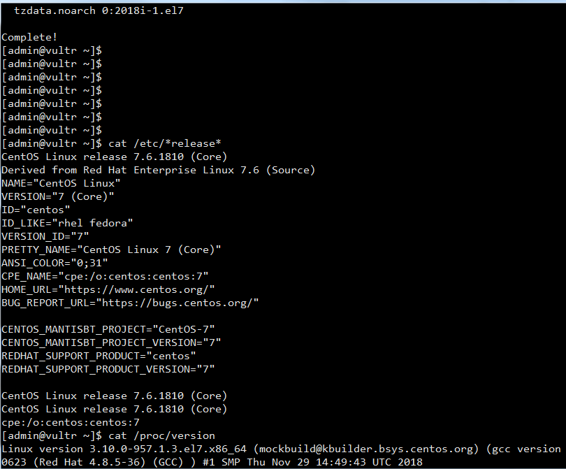
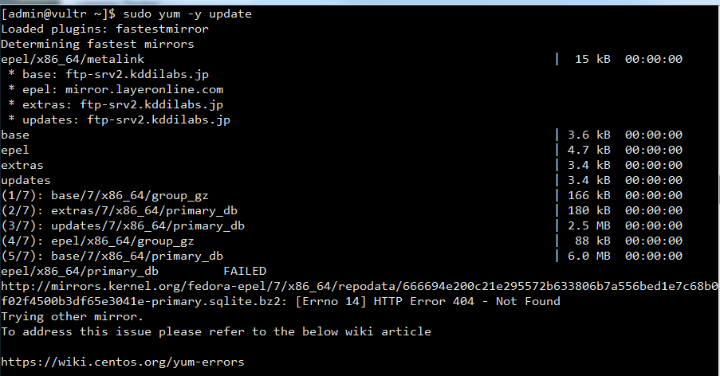
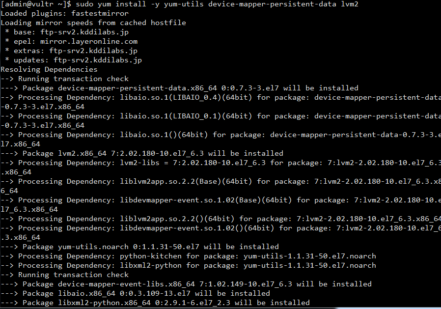
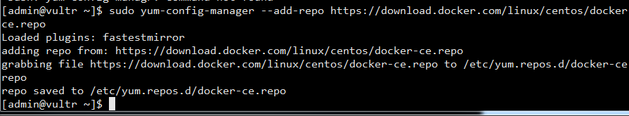
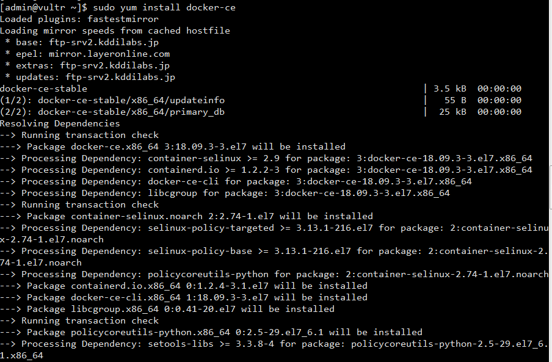
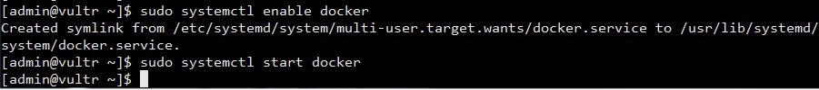
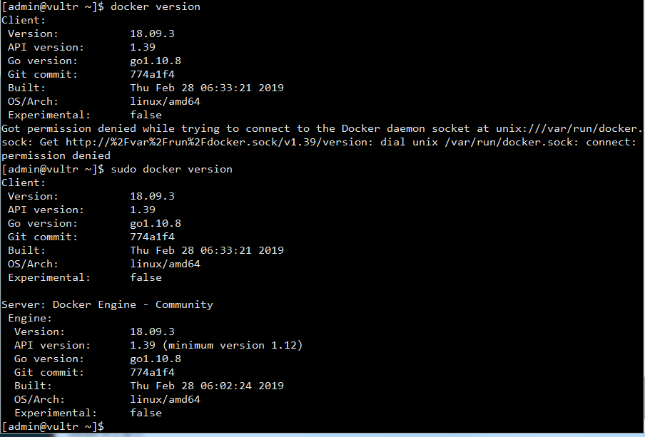
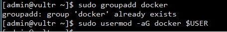
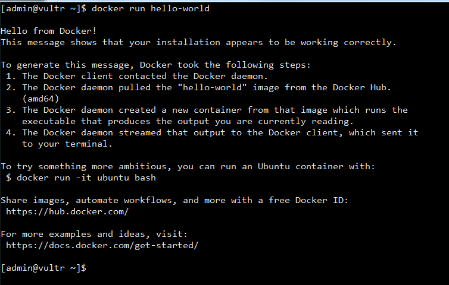

CentOS7에서 Docker를 설치해보자

_ _ _

### [1. CentOS 버전 확인]

**운영체제 버전 확인**
- `cat /etc/*release*`

**리눅스 커널버전 확인**
- `cat /proc/version`

_ _ _

### [2. yum 업데이트 및 재부팅]
**yum 커널 업데이트**
`sudo yum -y update`

**centOS 재기동**
`systemctl reboot`

_ _ _

### [3. Docker 설치] 

**yum-utils 설치**(yum-utils는 패키지 관리자 yum에 추가적인 기능과 보완할 수 있는 유틸리티들을 모아 놓은 컬렉션입니다. 이 yum-utils를 이용해 레포지토리 추가를 손쉽게 하는 기능을 추가할 수 있습니다.)
`sudo yum install -y yum-utils device-mapper-persistent-data lvm2`

**최신 저장소 설정**('yum install docker' 로도 Docker를 설치할 수 있지만 최신 버전을 설치하기 위해서는 Docker에서 배포하는 저장소를 추가해야 합니다. 안정적인 버전이 필요하시면 저장소를 추가하지 마시고, 'yum install docker'를 이용해 설치하세요)
`sudo yum-config-manager --add-repo https://download.docker.com/linux/centos/docker-ce.repo`

**Docker 설치**
`sudo yum install docker-ce`

_ _ _

### [4. Docker 서비스 등록 및 시작] 
**Docker 서비스 등록(부팅 시 실행) 및 시작**
`sudo systemctl enable docker`
`sudo systemctl start docker`

**Docker 버전확인**
`docker version`

**(선택사항)docker 유저그룹 생성 및 특정 유저를 docker 그룹에 귀속(이 명령어를 실행하면 해당 계정으로 docker 명령어 실행 시 sudo를 치지 않아도 된다.)**
`sudo groupadd docker`
`sudo usermod -aG docker $USER`
`걔정 로그아웃 후 재로그인`

**docker run 확인 **
`docker run hello-world`

_ _ _

*출처 : 
- <https://suwoni-codelab.com/docker/2018/06/06/Docker-Install/>
- <https://webdir.tistory.com/103>
- <https://seujeum.tistory.com/12> 참고