### [1. 개요]

Dockerfile이란 도커 이미지를 생성하기 위한 스크립트이며, Dockerfile을 빌드하면 완성된 이미지를 얻게 된다. 하지만 굳이 Dockerfile을 만들지 않고, 컨테이너에 여러 가지 작업을 한 후 commit을 하여 이미지를 생성해도 되는데 굳이 Dockerfile을 왜 쓸까? 하는 의문을 가질 수 있다. 하지만 Dockerfile을 사용하는 것은 아래와 같은 이유 때문에 매우 유용하기 때문에 필요하다.

1. 이미지가 어떻게 만들어졌는지 기록한다.
- 특정 이미지에서 자신이 원하는 애플리케이션을 담은 이미지를 만들어내기까지, 그 과정이 어떠하고 중간에 어떠한 과정을 수정해야 하는지 등을 알아야 하는 경우가 있는데 그런 경우 매우 유용하게 사용된다.
2. 배포에 용이하다
- 크기가 큰 이미지를 활용해서 배포하기 보다는, 그 이미지를 만들수 있는 Dockerfile을 활용하여 배포하면 매우 편리하다(Dockerfile을 실행시키면 관련된 이미지를 자동으로 얻어오기 때문에)
3. 컨테이너(이미지)가 특정 행동을 수행하도록 한다.
- 어플리케이션을 개발하다보면 특정 행동을 취하도록 하는 컨테이너(이미지)를 만들어야 할 때가 있다.

_ _ _

### [2. 간단한 작성법 가이드]
**Dockerfile을 생성한다**
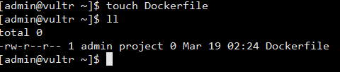

**FROM**
- 설명 : 어떤 이미지를 기반으로 새로운 이미지를 생성할 것인지를 나타낸다.
- 사용 예시 : 
	- 우선 Dockerfile에 아래와 같이 입력 후 저장한다
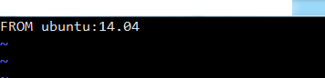
	- 그리고 다음과 같은 명령어를 수행해서 이미지를 생성한다. t옵션은 새롭게 생성될 이미지 이름을 정하는 것이다. 마지막 .은 Dockerfile의 위치이다.
`docker build -t fromtest:0.0 .`
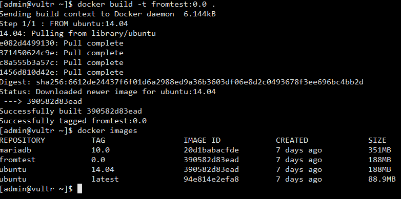
	- 수행하면 fromtest이미지와 우분투(fromtest이미지 기반)가 생성된다. fromtest이미지는 우분투 이미지와 동일하다. 왜냐하면 우분투 이미지를 기반으로 만들어졌고, 그 외에는 아무 작업을 하지 않았기 때문이다.

_ _ _

**RUN**
- 설명 : bash 쉘에서 입력하는 것과 동일하게 특정 명령어를 실행한다.
- 사용 예시 : 
	- 우선 Dockerfile을 아래와 같이 수정한다
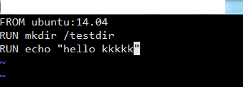
	- 그리고 아래와 같은 명령어를 수행해서 이미지를 생성한다.
`docker build -t runtest:0.0 .`
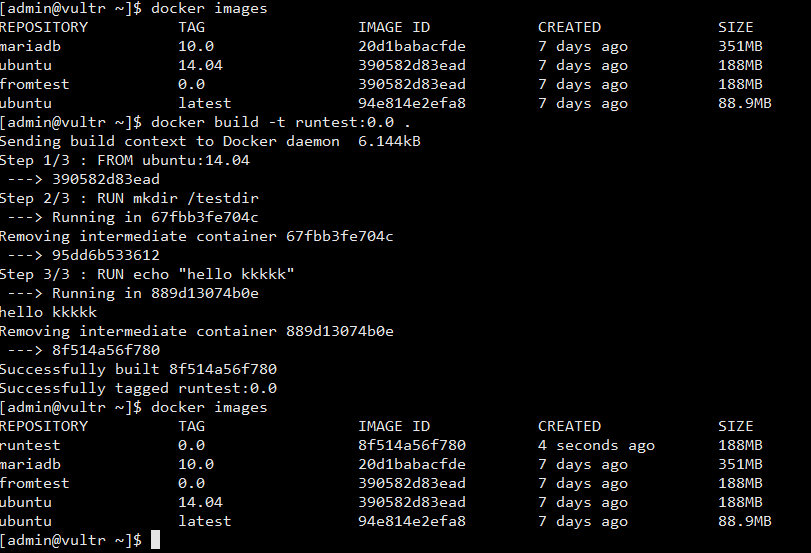
	- 그 다음 아래와 같은 명령어를 수행해서 컨테이너를 생성한다. 
` docker run -i -t --name runtest runtest:0.0`
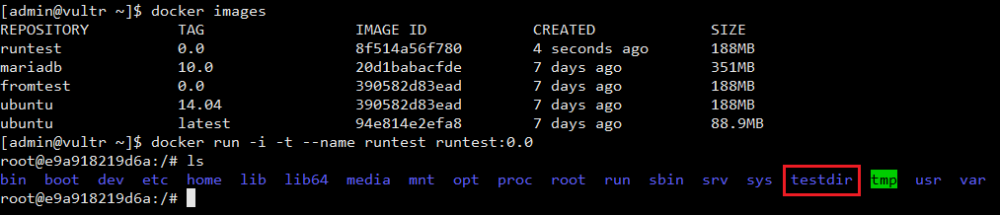
	- 컨테이너를 생성하면 Dockerfile에 명시된 `mkdir /testdir` 명령어가 실행되어 컨테이너 내부에 testdir이 생성된 것을 확인할 수 있다.

_ _ _

**ADD**
- 설명 : 이미지에 호스트에 존재하는 파일을 더한다(build 명령 중간에 호스트의 파일시스템으로부터 파일을 가져온다)
- 사용 예시 : 
	- 우선 호스트에 테스트 파일을 생성한다.
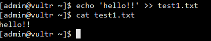
	- 그리고 Dockerfile을 아래와 같이 작성한다. ADD (호스트파일) (추가할 이미지 디렉토리)의 형식이다
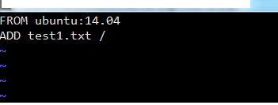
	- Dockerfile을 빌드한 뒤 그 이미지로 컨테이너를 실행시키면 test1.txt파일이 잘 들어가 있는 것을 확인할 수 있다.
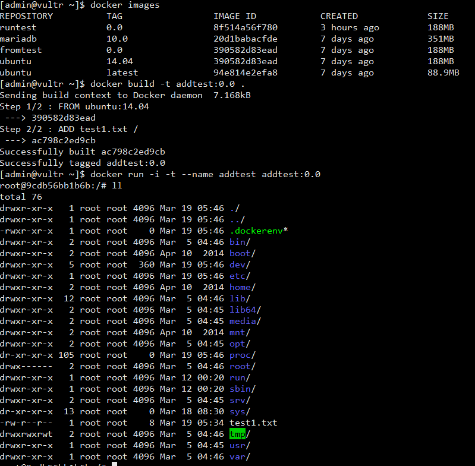

_ _ _

**ENTRYPOINT**
- 설명 : 컨테이너가 시작되었을 때 스크립트 혹은 명령을 실행합니다. 즉 docker run 명령으로 컨테이너를 생성하거나 docker start 명령으로 정지된 컨테이너가 시작할 때 실행됩니다. ENYRYPOINT는 Dockerfile에서 단 한번만 사용할 수 있습니다.
- 쉘(/bin/sh)로 명령 실행하기
	- 명령어 : `ENTRYPOINT <명령어>`
	- 사용 예 :  `ENTRYPOINT touch ./hello.txt`
	- 설명 : 쉘스크립트 구문을 사용할 수 있으며 FROM으로 설정한 이미지에 포함된 /bin/sh 실행파일을 사용하게 된다. /bin/sh 실행파일이 없으면 사용할 수 없습니다.
- 쉘 없이 바로 실행하기(/bin/sh를 사용하지 않음)
	- 명령어 : `ENTRYPOINT ["<실행 파일>", "<매개 변수1>", "<매개 변수2>"]`
	- 사용 예 : `ENTRYPOINT ["home/hello/hello.sh"]`, `ENTRYPOINT ["/home/hello/hello.sh", "--hello=1", "--world=2"]`
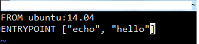
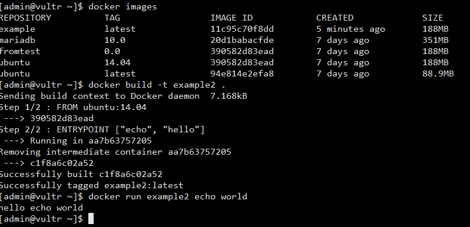

_ _ _

**CMD**
- 설명 : 컨테이너가 생성될 때 명령이 실행되는 것은 ENYRYPOINT와 동일. 단 docker run 명령에서 동작 방식이 다름. 만약 `docker run <이미지> <실행파일>` 의 명령어에서 실행파일을 설정하면 CMD 명령어는 무시된다.
- 예제 : CMD가 들어간 Dockerfile을 만들어서 build 한다. run 수행 시 "echo world"라는 인자값을 넣어주게 되면 CMD는 무시되고 "echo world"가 실행되게 된다.
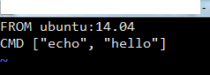
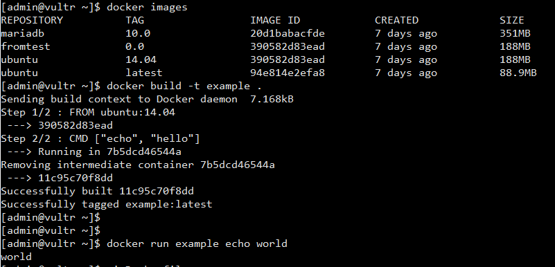

_ _ _

*출처 : 
- <http://blog.naver.com/PostView.nhn?blogId=alice_k106&logNo=220646382977&parentCategoryNo=7&categoryNo=&viewDate=&isShowPopularPosts=true&from=search> 
- <http://pyrasis.com/book/DockerForTheReallyImpatient/Chapter07/06> 참고