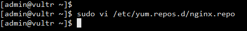
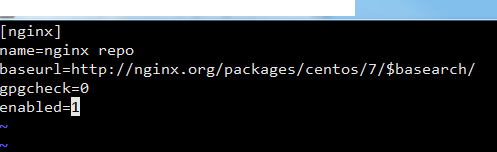
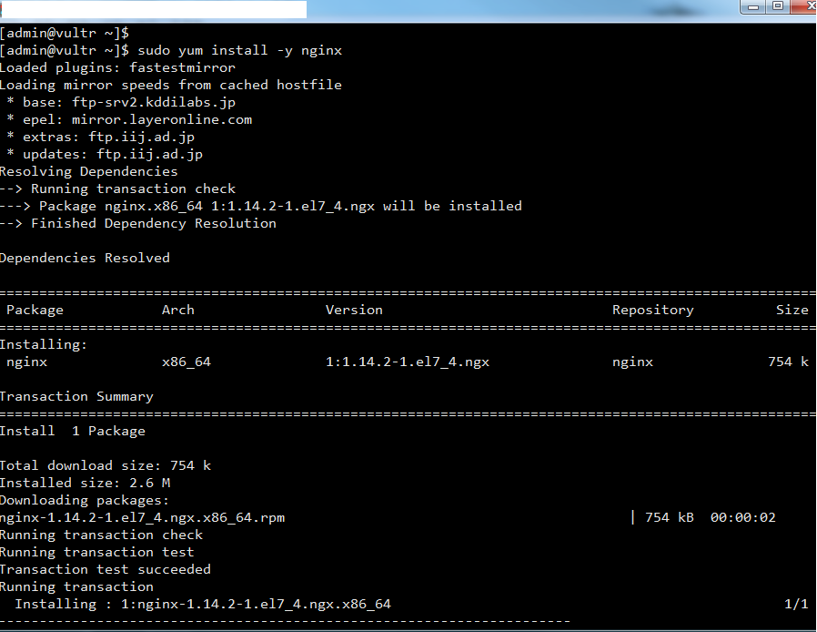

### [nginx란?]
트래픽이 많은 웹사이트의 확장성을 위해 설계한 비동기 이벤트 기반 구조의 웹서버 소프트웨어로 더 적은 자원으로 더 빠르게 서비스 가능하다. 이 프로그램은 가벼움과 높은 성능을 목표로 만들어 졌으며, Apache의 C10K problem(하나의 웹서버에 10000개의 클라이언트의 접속을 동시에 다룰 수 있는 기술적인 문제)을 해결하기 위해 만든 Event-driven 구조의 HTTP, Reverser Proxy, IMAP/POP Proxy Server를 제공하는 오픈소스 서버 프로그램이다. 

_ _ _

### [Apache와 nginx 비교]
**Apache**
- 쓰레드/프로세스 기반 구조로 요청 하나당 쓰레드 하나가 처리하는 구조
- 사용자가 많으면 많은 쓰레드 생성. 메모리 및 CPU 낭비가 심함
- "하나의 쓰레드=하나의 클라이언트" 라는 구조

**nginx**
- 비동기 Event-Driven 기반 구조
- 다수의 연결을 효과적으로 처리 가능
- 대부분의 코어 모듈이 Apache보다 적은 리소스로 더 빠르게 동작 가능
- 더 작은 쓰레드로 클라이언트의 요청들을 처리 가능

**쓰레드 기반 처리 VS Event-Driven 기반 처리**
- 쓰레드 기반 : 하나의 커넥션 당 하나의 쓰레드를 잡아먹음
- Event-Driven 기반 : 여러개의 커넥션을 몽땅 다 Event Handler를 통해 비동기 방식으로 처리해 먼저 처리되는 것부터 로직이 진행되게끔 함

_ _ _

### [CentOS7에 nginx 설치하기]

**1. nginx 저장소 추가**
nginx 저장소를 추가한 후 연다
명령어 : `sudo vi /etc/yum.repos.d/nginx.repo`

nginx 공식사이트에 적힌 저장소 내용을 붙여넣기한다. baseurl 부분의 centos은 자신의 OS명이고, 7부분은 OS의 버전이다.

**2. 설치**
저장소가 추가되었으면 설치를 진행한다
명령어 : `sudo yum install -y nginx`

**3. 포트 개방**
방화벽에서 웹서버 포트를 개방한다
명령어 : 
- `sudo firewall-cmd --permanent --zon=public --add-service=http`
- `sudo firewall-cmd --permanent --zon=public --add-service=https`
- `sudo firewall-cmd --reload`

**4. nginx 실행**
nginx를 실행시키고, 부팅 시 자동으로 시작되게 변경한다
- nginx 시작 : `sudo systemctl start nginx`
- nginx 자동 시작 등록 : `sudo systemctl enable nginx`

_ _ _

### [nginx 명령어 및 설정파일]

**1. nginx 관련 명령어**
- 서버 시작 : `sudo systemctl start nginx`
- 서버 자동 시작 등록 : `sudo systemctl enable nginx`
- 서버 상태 확인 : `sudo systemctl status nginx`
- 서버 정지 : `sudo systemctl stop nginx`
- 서버 재시작 : `sudo systemctl restart nginx`
- 설정 리로드 : `sudo systemctl reload nginx`

**2. nginx 설정파일**
- /etc/nginx/ : nginx 설정파일 디렉토리
- /etc/nginx/nginx.conf : 메인 설정파일(접속자 수, 동작 프로세스 수 등 퍼포먼스에 대한 설정)
- /etc/nginx/conf.d/ : nginx.conf에서 불러들일 수 있는 파일을 저장
- /etc/nginx/fastcgi.conf : FastCGI 환경설정 파일
- /etc/nginx/sites-available/ : 비활성화된 사이트들의 설정 파일들이 위치한다
- /etc/nginx/sites-enabled/ : 활성화된 사이트들의 설정파일들이 위치한다

_ _ _

*출처 : 
- <http://blog.tjsrms.me/centos-7-nginx-%EC%84%A4%EC%B9%98%ED%95%98%EA%B8%B0/>
- <https://m.blog.naver.com/jhc9639/220967352282> 
- <https://whatisthenext.tistory.com/123> 참고