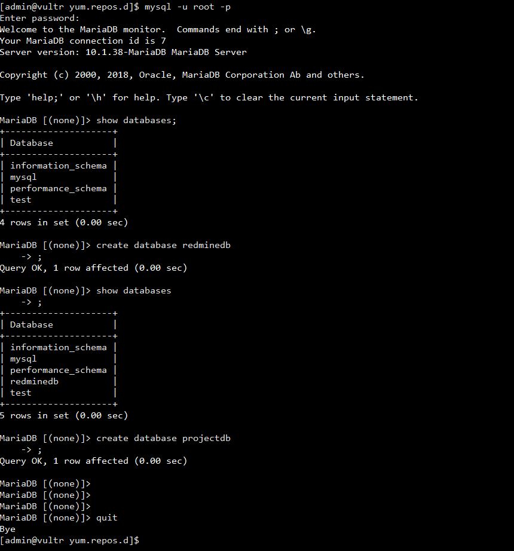
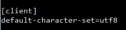

CentOS7에서 MariaDB를 설치하고 프로젝트에 필요한 다양한 환경설정(데이터베이스생성, 외부접속 허용, 계정생성, 권한생성 등 등을 수행해보자

_ _ _

### [1. MariaDB repo 설정]
- repo 설정을 하지 않고 그냥 yum install로 mariadb를 설치하게 되면 설치가 진행되지 않는다. 따라서 repo 설정을 진행해야 한다. /etc/yum.repos.d/ 밑에 MariaDB.repo라는 파일을 만든 후 아래와 같이 정보를 입력한다.
- 명령어 : `sudo vi /etc/yum.repos.d/MariaDB.repo`

_ _ _

### [2. 설치]
- 명령어 : `sudo yum install MariaDB-server`

_ _ _

### [3. 확인]
- 명령어 : `rpm -qa | grep MariaDB`

_ _ _

### [4. DB시작 및 패스워드 변경]
- 명령어
	- `sudo systemctl start mariadb`
	- `sudo /usr/bin/mysqladmin -u root password '2815'`

_ _ _

### [5. 접속 확인]
- 명령어 : `mysql -u root -p`

_ _ _

### [6. 부팅 시 자동시작 확인]
- 명령어 : `sudo systemctl is-enabled mariadb`

_ _ _

### [7. root 계정 외부 접속 허용]
- 마리아DB는 기본적으로 외부접속이 허용되지 않는다. 따라서 특정 계정에게 외부접속 허용 권한을 부여해야 한다.
- 명령어 :
	- 마리아DB 접속 : `mysql -u root -p`
	- database를 mysql로 전환 : `use mysql;`
	- root계정 or 특정 계정에 외부접근 권한 부여 : `grant all privileges on (DB이름).(테이블이름) to '(계정명)'@'(접속위치)' identified by '(계정비밀번호)';`
	- 등록된 권한 확인 : `select host, user, password from user;`
	- refresh : `flush privileges;`

_ _ _

### [8. 프로젝트용 database 생성]
- 명령어 :
	- database 리스트 확인 : `show databases;`
	- database 생성(기본 UTF8 설정 추가) : `create database (데이터베이스명) default character set utf8 collate utf8_general_ci;`

_ _ _

### [9. 프로젝트용 사용자 추가]
- 명령어 : 
	- 사용자 생성 : `create user '(유저명)';`
	- 사용자 외부 접속 권한 생성 : `grant all privileges on (데이터베이스명).(테이블명) to '(유저명)'@'%' identified by '(비밀번호)';`
	- 사용자 내부 접속 권한 생성 : `grant all privileges on (데이터베이스명).(테이블명) to '(유저명)'@'localhost' identified by '(비밀번호)';`
	- refresh : `flush privileges;`

_ _ _

### [10. 권한 부여 확인]
- 명령어 : `show grants for '(유저명)'@'(host)';`

_ _ _

### [11. 계정삭제 & 권한삭제 ]
- 명령어 :
	- 계정삭제 : `drop user '(유저명)'@'(host)';`
	- 권한삭제 : `revoke all on (데이터베이스명).(테이블명) from '(유저명)'@'(host)';`

### [MariaDB utf-8 인코딩 변경]
- /etc/my.cnf.d/client.cnf

- /etc/my.cnf.d/mysql-clients.cnf

- /etc/my.cnf.d/server.cnf

- DB 재시작 : `sudo systemctl restart mariadb`

_ _ _

*출처 : 
- <https://zetawiki.com/wiki/CentOS7_MariaDB_%EC%84%A4%EC%B9%98> 
- <https://wlsufld.tistory.com/40>  
- <https://slobell.com/blogs/38> 참고