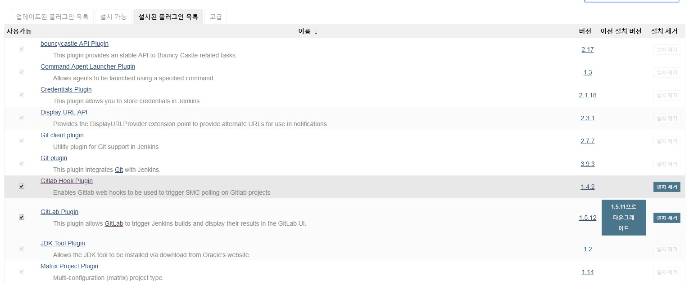
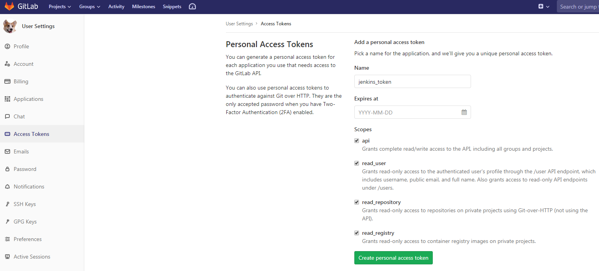
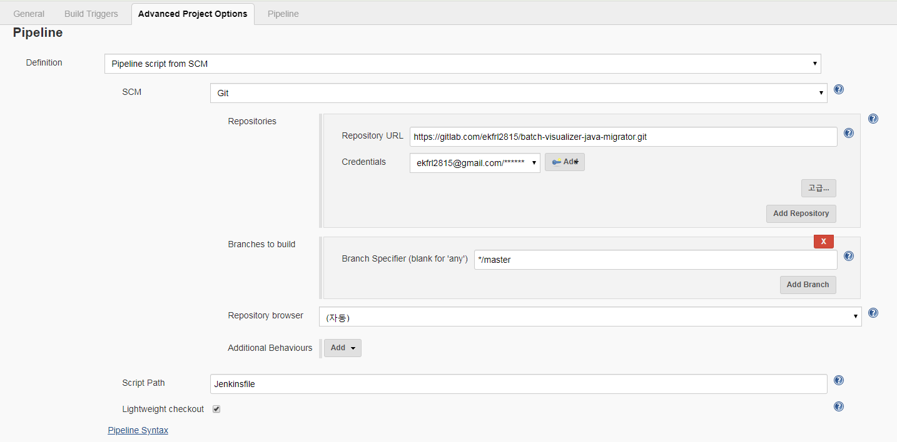
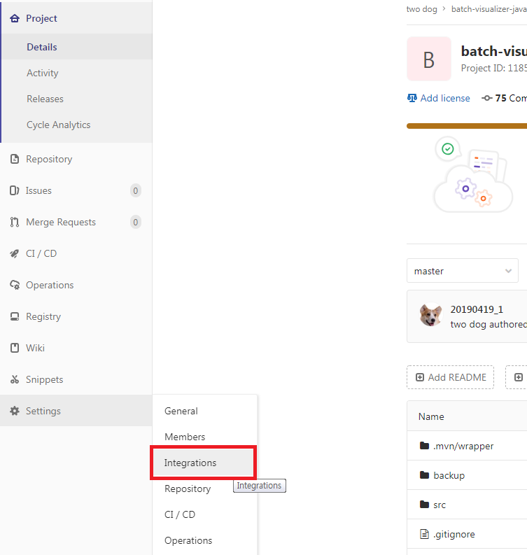

### [1. 개요]
Docker 컨테이너로 jenkins 실행 후 gitlab에서 관리하는 spring boot 소스를 수정 후 push 시 Maven build하여 jar파일로 만들고 Docker Container로 배포까지 수행해 보자.

설치부터 배포까지의 실행 순서는 아래와 같다

**<1단계 - Jenkins를 통한 수동 배포>**
1. 배포서버에 Docker 설치 & Gitlab Repository 생성 및 로컬 디렉토리와 연결(clone)
2. 배포서버에 Docker Container로 Jenkins 구동
3. Jenkins 화면에서(URL접속) Jenkins 설치 및 환경설정(플러그인 설치, 환경설정, Jenkins와 gitlab 연동 등)
4. gitlab 과 연결된 로컬 디렉토리에 Spring boot 소스 생성
5. 로컬 디렉토리에 Dockerfile과 Jenkisfile 생성
6. 로컬 디렉토리에서 소스 커밋 후 gitlab으로 push
7. Jenkins 화면에서 Open Blue Ocean 실행 후 RUN 수행으로 빌드/배포

**<2단계 - Webhook을 활용한 자동 배포>**
1. Jenkins 화면에서 Build Trigger 셋팅
2. gitlab에서 Webhook 셋팅
3. git-bash에서 소스 커밋 후 push 시 자동 빌드/배포


**<빌드/배포 프로세스>**


그럼 아래와 같이 상세하게 작업을 수행해 보자


_ _ _

### [2. 사전작업]
- docker 설치
- Gitlab Repository 생성
- Gitlab Repository와 Local 디렉토리와 연결(clone)


_ _ _

### [3. Docker컨테이너에 Jenkins 설치 및 실행]

1. 도커 컨테이너에 Jenkins 설치 후 구동 : 
 - `docker run -d -u root -p 8081:8080 --name=docker-jenkins-container -v /home/admin/docker/jenkins-data:/var/jenkins_home -v /var/run/docker.sock:/var/run/docker.sock -v "$HOME":/home jenkinsci/blueocean`
 - 또는 해당 명령어를 docker-compose.yml 파일로 작성 후 `docker-compose up -d --build` 명령어로 구동 가능하다
 - docker-compose.yml


2. Jenkins 포트 방화벽 오픈 : 
 - `sudo iptables -I INPUT 1 -p tcp --dport 8081 -j ACCEPT `
 - `sudo iptables -I OUTPUT 1 -p tcp --dport 8081 -j ACCEPT `
3. 도커 컨테이너 접속 : 
 - `docker exec -it docker-jenkins /bin/bash`
4. jenkins 웹(<http://(젠킨스 서버 ip주소):(젠킨스 port)>) 접속 후 admin password 명령어 확인
5. admin password 명령어를 접속한 도커 컨테이너에 입력하여 admin password 확인 후 도커 웹에 입력 : 
 - `cat /var/jenkins_home/secrets/initialAdminPassword`
6. jenkins 웹에 접속. jenkins 설치(install suggested plugin)


_ _ _

### [4. Jenkins 플러그인 설치 및 환경설정]

1. jenkins 설치 후 jenkins관리 -> 플러그인 관리에서 gitlab 관련 플러그인 설치

2. jenkins관리 -> 시스템 설정에서 gitlab 관련 설정 추가.(Credentials는 Gitlab에서 발급받은 API token을 입력하면 된다.)


3. Jenkins Location 입력


_ _ _

### [5. Jenkins와 Gitlab Repository 연결]

1. 새로운item -> pipeline 선택

2. jenkins pipeline 설정 입력. (Repository URL은 gitlab repository url 입력. Credentials는 ADD한 후 gitlab id와 password 추가. script path는 **Jenkinsfile**)



_ _ _

### [6. Gitlab과 연결된 Local 디렉토리에 Spring boot 소스 생성 후 해당 디렉토리에 Dockerfile과 Jenkinsfile 생성]

1. Dockerfile 과 Jenkins파일 생성


2. Spring boot의 jar파일을 Docker Container로 만드는 Dockerfile 작성


```
FROM openjdk:8-jdk-alpine
VOLUME /tmp
ADD ./target/batch-visualizer-java-migrator-0.0.1-SNAPSHOT.jar app.jar
ENV JAVA_OPTS=""
ENTRYPOINT ["java","-jar","/app.jar"]
```

3. Jenkins 빌드/배포 Pipeline을 정의한 Jenkinsfile 작성


```
pipeline {
    agent none
    options { skipDefaultCheckout(true) }
    stages {
        stage('Build and Test') {
            agent {
                docker {
                    image 'maven:3-alpine'
                    args '-v /root/.m2:/root/.m2'
                }
            }
            options { skipDefaultCheckout(false) }
            steps {
                sh 'mvn -B -DskipTests clean package'
            }
        }
        stage('Docker build') {
            agent any
            steps {
                sh 'docker build -t java-migrator-image:latest .'
            }
        }
        stage('Docker run') {
            agent any
            steps {
                sh 'docker ps -f name=java-migrator-container -q | xargs --no-run-if-empty docker container stop'
                sh 'docker container ls -a -fname=java-migrator-container -q | xargs -r docker container rm'
                sh 'docker rmi $(docker images -f "dangling=true" -q)'
                sh 'docker run -d --name java-migrator-container -p 8080:8080 java-migrator-image:latest'
            }
        }
    }
}

```
- 간략 설명
	- Pipeline 문법에는 크게 두가지가 있다. 처음에는 Scipted 방식이었고 후에 Declarative 방식이 추가되었다. 위에 작성한 방식은 Declarative 방식이다.
	- pipeline : 젠킨스 파이프라인 플러그인을 호출하기 위한 필수 외부 블록
	- agent : 파이프라인을 실행하고 싶은 위치 정의. agent any는 파이프라인이나 스테이지를 실행하기 위해 사용 가능한 어느 agent도 사용할 수 있음을 정의
	- stages : stage의 모음
	- stage : 젠킨스 파이프라인 stage. 해당 stage 명으로 jenkins 화면에 표시된다
	- steps : 실제 작업이 수행되는 블록
	- skipDefaultCheckout(true) : agent가 none 이 아닌 경우 gitlab의 소스를 jenkins 디렉토리로 내려받게 되는데, skipDefaultCheckout이 true인 경우 내려받는 프로세스를 skip한다. false인 경우는 gitlab의 소스를 체크한 후 jenkins 디렉토리로 내려받게 된다.
	- agent docker : docker image에 명시된 image를 활용하여 steps를 수행한다.
	- sh 'docker ps -f name=java-migrator-container -q | xargs --no-run-if-empty docker container stop' : 현재 동작중인 컨테이너(java-migrator-container) stop 시킴
	- sh 'docker container ls -a -fname=java-migrator-container -q | xargs -r docker container rm' : 현재 동작중인 컨테이너(java-migrator-container) 삭제
	- sh 'docker rmi $(docker images -f "dangling=true" -q)' : docker image build 시 기존에 존재하던 이미지는 <none> 이미지가 되기 때문에 <none> 이미지를 일괄 삭제해줌
	

_ _ _

### [7. gitlab 저장소에 소스 push 후 배포 수행 ]
1. 로컬 소스 커밋 후 gitlab으로 push


2. Jenkins Open Blue Ocean 실행 후 RUN


3. 배포 수행 확인


_ _ _


### 여기까지 수행했으면 Jenkins 수동 배포는 완료되었다. 이제 gitlab 저장소에 소스 push 시 자동으로 배포되는 프로세스를 만들어보자.


_ _ _

### [8. Jenkins Build Triggers 설정 ]
1. Jenkins 관리 -> 플러그인 관리 -> 설치된 플러그인 목록에서 **Gitlab Hook Plugin**과 **Gitlab Plugin** 설치 확인. 미 설치 시 설치 필요.

2. Jenkins에서 빌드/배포 job 선택 -> 구성 -> Build Triggers 에서 **Build when a change is pushed to Gitlab webhook....** 체크박스 체크

3. Build Triggers의 고급 버튼 클릭 후 **Secret token** Generate. Allowed branches에서 master branch 선택(master branch에 push 시에만 자동 빌드)


_ _ _

### [9. Gitlab에서 Webhook 설정 ]

1. 프로젝트 선택 -> Settings -> Integrations 선택


2. Webhook 설정 후 Add webhook(URL은 Jenkins에서 Build Triggers 설정 시 보였던 Gitlab Webhook URL 입력. Secret Token은 Build Triggers 설정 시 생성했던 Secret Toekn 입력 )


3. 방금 추가된 Webhook을 목록에서 확인 후 Test 수행


4. HTTP 200 이 리턴되면 정상 작동하는 것임


_ _ _

### [10. 소스 커밋 후 PUSH &  Jenkins 자동 빌드/배포 ]

1. 로컬 소스 수정 후 커밋 & Gitlab 으로 PUSH 수행

2. Jenkins 에서 해당 소스 자동 빌드/배포 수행됨

_ _ _


*출처 : 
- <https://jenkins.io/doc/tutorials/build-a-java-app-with-maven/#setup-wizard> 
- <https://blog.voidmainvoid.net/104>
- <https://stackoverflow.com/questions/47842241/how-do-i-stop-a-running-container-in-jenkinsfile> 
- <https://devops.stackexchange.com/questions/1683/how-to-check-out-github-repo-after-specifying-skipdefaultcheckout-in-jenkins-dec> 
- <https://m.blog.naver.com/PostView.nhn?blogId=punxoi&logNo=220304905675&proxyReferer=https%3A%2F%2Fwww.google.com%2F>
참고