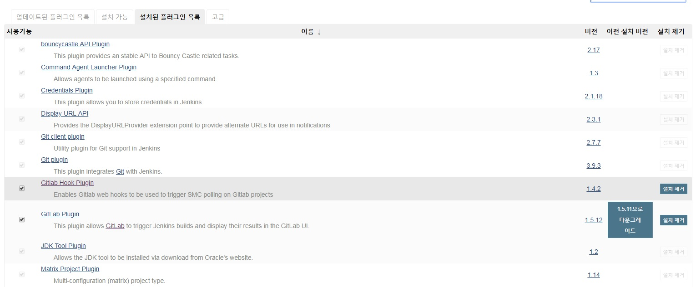
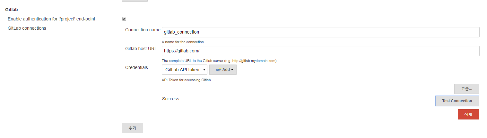
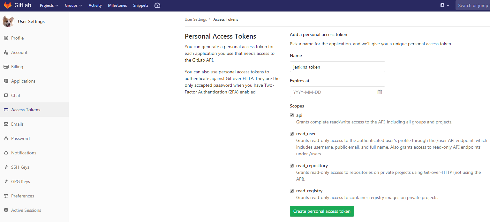
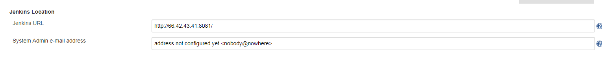
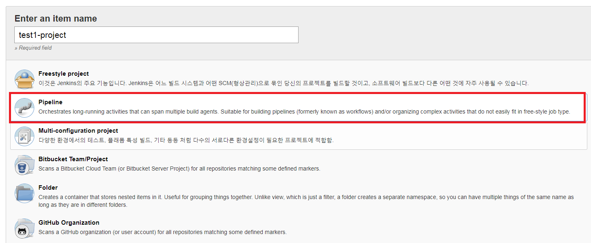
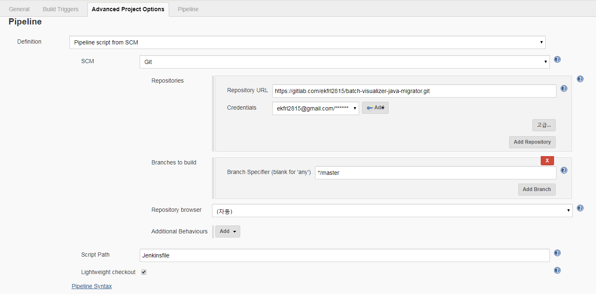

### [1. 개요]
Docker 컨테이너로 jenkins 실행 후 gitlab에서 관리하는 spring boot 소스를 Maven build하여 jar파일로 만들고 배포까지 수행해 보자.

_ _ _

### [2. 사전작업]
- docker 설치
- Gitlab Repository 생성
- Gitlab Repository와 Local 디렉토리와 연결(clone)

_ _ _

### [3. Docker컨테이너에 Jenkins 설치 및 실행]

1. 도커 컨테이너에 Jenkins 설치 후 구동 : `docker run -d -u root -p 8081:8080 --name=docker-jenkins -v jenkins-data:/var/jenkins_home -v /var/run/docker.sock:/var/run/docker.sock -v "$HOME":/home jenkinsci/blueocean`
2. Jenkins 포트 방화벽 오픈 : 
	- `sudo iptables -I INPUT 1 -p tcp --dport 8081 -j ACCEPT `
	- `sudo iptables -I OUTPUT 1 -p tcp --dport 8081 -j ACCEPT `
3. 도커 컨테이너 접속 : ` docker exec -it docker-jenkins bash`
4. jenkins 웹(<http://(젠킨스 서버 ip주소):(젠킨스 port)>) 접속 후 admin password 명령어 확인
5. admin password 명령어를 접속한 도커 컨테이너에 입력하여 admin password 확인 후 도커 웹에 입력 : `cat /var/jenkins_home/secrets/initialAdminPassword`
6. jenkins 웹에 접속. jenkins 설치(install suggested plugin)

_ _ _

### [4. Jenkins 플러그인 설치 및 환경설정]

1. jenkins 설치 후 jenkins관리 -> 플러그인 관리에서 gitlab 관련 플러그인 설치

2. jenkins관리 -> 시스템 설정에서 gitlab 관련 설정 추가.(Credentials는 Gitlab에서 발급받은 API token을 입력하면 된다.)

3. Jenkins Location 입력

_ _ _

### [5. Jenkins와 Gitlab Repository 연결]

1. 새로운item -> pipeline 선택

2. jenkins pipeline 설정 입력. (Repository URL은 gitlab repository url 입력. Credentials는 ADD한 후 gitlab id와 password 추가. script path는 **Jenkinsfile**)

_ _ _

### [6. Gitlab과 연결된 Local 디렉토리에 Spring boot 소스 생성]

_ _ _

### [7. Spring boot 소스 생성 후 해당 디렉토리에 Dockerfile과 Jenkinsfile 생성]

_ _ _

*출처 : 
- <https://jenkins.io/doc/tutorials/build-a-java-app-with-maven/#setup-wizard> 
- <https://blog.voidmainvoid.net/104>
- <https://stackoverflow.com/questions/47842241/how-do-i-stop-a-running-container-in-jenkinsfile> 
- <https://devops.stackexchange.com/questions/1683/how-to-check-out-github-repo-after-specifying-skipdefaultcheckout-in-jenkins-dec> 참고