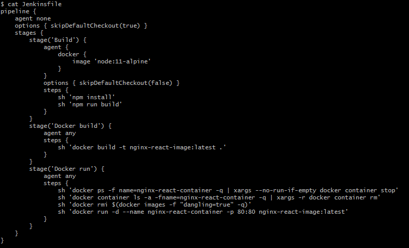

### [1. 개요]
Docker 컨테이너로 jenkins 실행 후 gitlab에서 관리하는 React 소스를 수정 후 push 시 npm install 후 npm run build 하여 ./build 디렉토리에 결과물을 만들어서 Docker Container로 배포까지 수행해 보자.

수행방법은 [Docker컨테이너로 jenkins 실행 후 gitlab으로 spring boot 소스 push 시 Docker Container로 자동 빌드/배포](https://twofootdog.github.io/Docker-Docker%EC%BB%A8%ED%85%8C%EC%9D%B4%EB%84%88%EB%A1%9C-jenkins-%EC%8B%A4%ED%96%89-%ED%9B%84-%EC%86%8C%EC%8A%A4-push-%EC%8B%9C-%EC%9E%90%EB%8F%99-%EB%B9%8C%EB%93%9C%EB%B0%B0%ED%8F%AC%ED%95%98%EA%B8%B0(Springboot)/) 와 동일하나 Dockerfile과 Jenkinsfile 작성법이 조금 다르다. 그러므로 Dockerfile 과 Jenkinsfile 작성법만 참고하고 그 외에는 위 링크를 참고하자.


_ _ _

### [2. Dockerfile 작성법]
1. 프로젝트 디렉토리에 Dockerfile을 작성한다. nginx image 기반으로 Docker image를 만들기 때문에 FROM 에 nginx를 넣어줬고, react 프로젝트 build 시 ./build 디렉토리에 build결과가 생성되고, nginx의 root 디렉토리가 /user/share/nginx/html이기 때문에 ./build에서 /user/share/nginx/html로 COPY를 수행한다.


```
FROM nginx:latest


COPY ./build /usr/share/nginx/html
```


_ _ _

### [3. Jenkinsfile 작성법]
1. 프로젝트 디렉토리에서 Jenkinsfile을 작성한다. **"build"** stage에서 node 기반으로 작업을 수행하며, npm install로 node_modules를 다운받고, npm run build로 build를 수행한다. 수행 후 **"Docker build"** stage에서 Dockerfile을 기반으로 docker build를 수행한다. **"Docker run"** stage에서는 기존에 존재하는 동일 이름의 docker container를 삭제하고 새로운 docker container를 수행한다.



```
pipeline {
    agent none
    options { skipDefaultCheckout(true) }
    stages {
        stage('Build') {
            agent {
                docker {
                    image 'node:11-alpine'
                }
            }
            options { skipDefaultCheckout(false) }
            steps {
                sh 'npm install'
                sh 'npm run build'
            }
        }
        stage('Docker build') {
            agent any
            steps {
                sh 'docker build -t nginx-react-image:latest .'
            }
        }
        stage('Docker run') {
            agent any
            steps {
                sh 'docker ps -f name=nginx-react-container -q | xargs --no-run-if-empty docker container stop'
                sh 'docker container ls -a -fname=nginx-react-container -q | xargs -r docker container rm'
                sh 'docker rmi $(docker images -f "dangling=true" -q)'
                sh 'docker run -d --name nginx-react-container -p 80:80 nginx-react-image:latest'
            }
        }
    }
}
```


_ _ _


*출처 : 
- <https://oofbird.net/35> 
참고