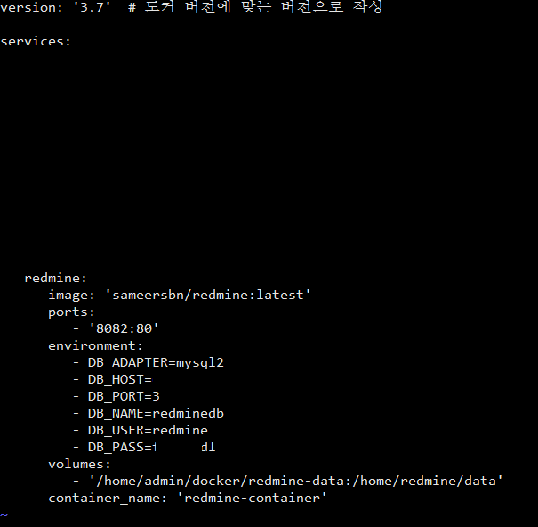

### [1. 개요]
Redmine을 도커 컨테이너 위에 실행시키고 싶다는 생각이 들었다. 그래서 이런저런 레퍼런스를 찾아보았는데, 대부분의 레퍼런스가 docker-compose.yml 안에 Redmine과 DB(Mysql, PostgreSQL)를 컨테이너로 생성하여 연동하는 방식을 사용했다. 하지만 나는 Redmine은 Docker 컨테이너로 올리고, redmine DB는 기존에 서버에 설치된 MariaDB를 사용하고 싶었다. 

맨 처음으로 사용한 redmine 도커 이미지는 **"redmine"** 이었다. 하지만 해당 이미지로는 database.yml 파일이 죽어도 수정이 되지 않았다(물론 내가 실력이 딸려서 그런 것일 수도 있다). 그 다음으로 시도한 도커 이미지는 **"bitnami/redmine"**였으나 해당 이미지로도 접속하는 database 수정이 되지 않아서(자꾸 이상한 DB 참조하다 timeout으로 docker 컨테이너가 죽어버림) 포기했다.

세번째로 시도한 redmine 도커 이미지는 **"sameersbn/redmine"**였다. 해당 도커 이미지로 docker-compose.yml을 만들어서 새로운 이미지 생성 후 컨테이너로 올렸더니 redmine이 서버의 MariaDB와 정상 연동되면서 동작하였다. 그럼 이제 어떤 식으로 연동을 진행했는지 상세히 적어보도록 하겠다.


_ _ _


### [2. redmine에서 사용할 DB 계정을 MariaDB에서 외부 접근 허용]
MariaDB는 기본적으로 내부/외부 접속이 허용되지 않는다. 따라서 특정 계정에게 내부/외부 접속 허용 권한을 부여해야 한다.
- 마리아DB 접속 : `mysql -u root -p`
- database를 mysql로 전환 : `use mysql;`
- redmine 계정에 외부접근 권한 부여 : `grant all privileges on (redmine DB이름).(테이블이름) to '(redmine 계정명)'@'(접속위치)' identified by '(계정비밀번호)';` (예 : `grant all privileges on redminedb.* to 'redmine'@'%' identified by '123456'`)
- redmine 계정에 내부접근 권한 부여 : `grant all privileges on (redmine DB이름).(테이블이름) to '(redmine 계정명)'@'(접속위치)' identified by '(계정비밀번호)';` (예 : `grant all privileges on redminedb.* to 'redmine'@'localhost' identified by '123456'`)
- 등록된 권한 확인 : `select host, user, password from user;`
- refresh : `flush privileges;`


_ _ _


### [3. docker-compose.yml 파일 작성]


```
version: '3.7'  # 도커 버전에 맞는 버전으로 작성

services:
   redmine:
      image: 'sameersbn/redmine:latest'
      ports:
         - '8082:80'
      environment:
         - DB_ADAPTER=mysql2
         - DB_HOST=(DB ip 주소)
         - DB_PORT=(DB포트 번호)
         - DB_NAME=(DATABASE 명)
         - DB_USER=(DB 유저 명)
         - DB_PASS=(DB 비밀번호)
      volumes:
         - '/home/admin/docker/redmine-data:/home/redmine/data'
      container_name: 'redmine-container'
```
- 간략 설명 : images는 sameersbn/redmine:latest를 사용했고, ports는 docker 내부의 redmine 기본포트가 80이기 때문에 80포트를 8082에 매핑시켜줬다(때문에 서버 외부에서 접근할 때는 8082 포트로 접근하면 된다). environment에 DB 접속 정보를 작성했고, volumes에는 redmine 파일 스토리지를 local 디렉토리와 매핑시켰다. container_name은 "redmine-container"로 작성했다.


_ _ _


### [4. docker-compose.yml 파일 실행]
- `docker-compose up -d --build` 명령어로 docker build 및 run 수행
- `docker ps -a` 명령어로 redmine-container 동작 확인


_ _ _


### [5. centos 포트 방화벽 오픈]
redmine 포트로 지정한 8082 포트는 기본적으로 열려있지 않은 포트이기 때문에 방화벽 오픈이 필요하다.
- `sudo iptables -I INPUT 1 -p tcp --dport 8082 -j ACCEPT`
- `sudo iptables -I OUTPUT 1 -p tcp --dport 8082 -j ACCEPT`


_ _ _


### [6. redmine 웹페이지 접속]
**"http://(서버ip):8082"** 로 redmine 웹페이지에 접속한다.


_ _ _


*출처 : 
- <https://hub.docker.com/r/sameersbn/redmine> 
- <https://github.com/sameersbn/docker-redmine> 
참고