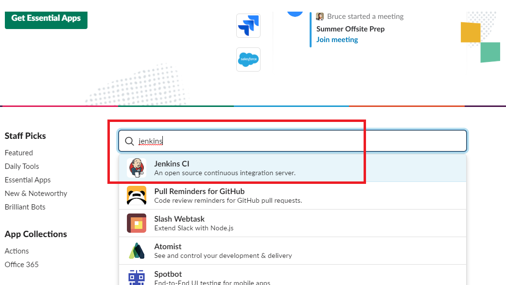
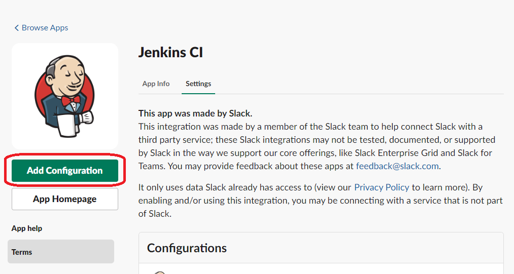
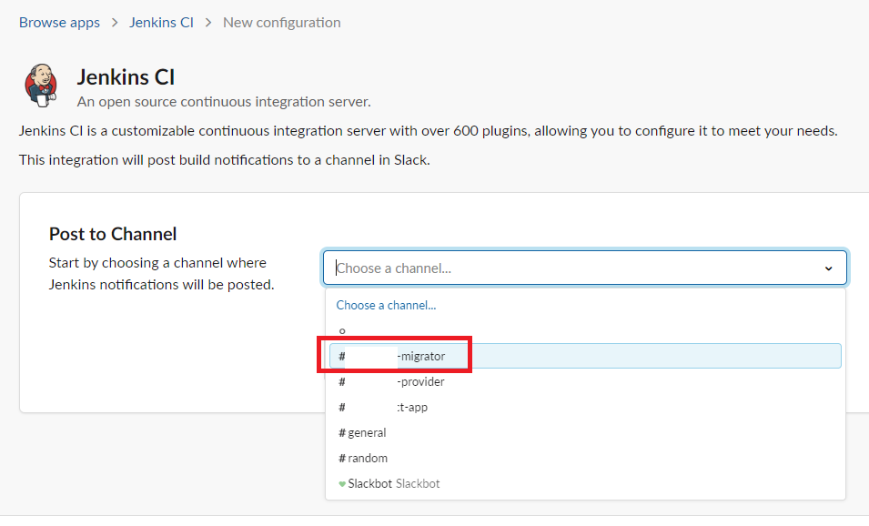
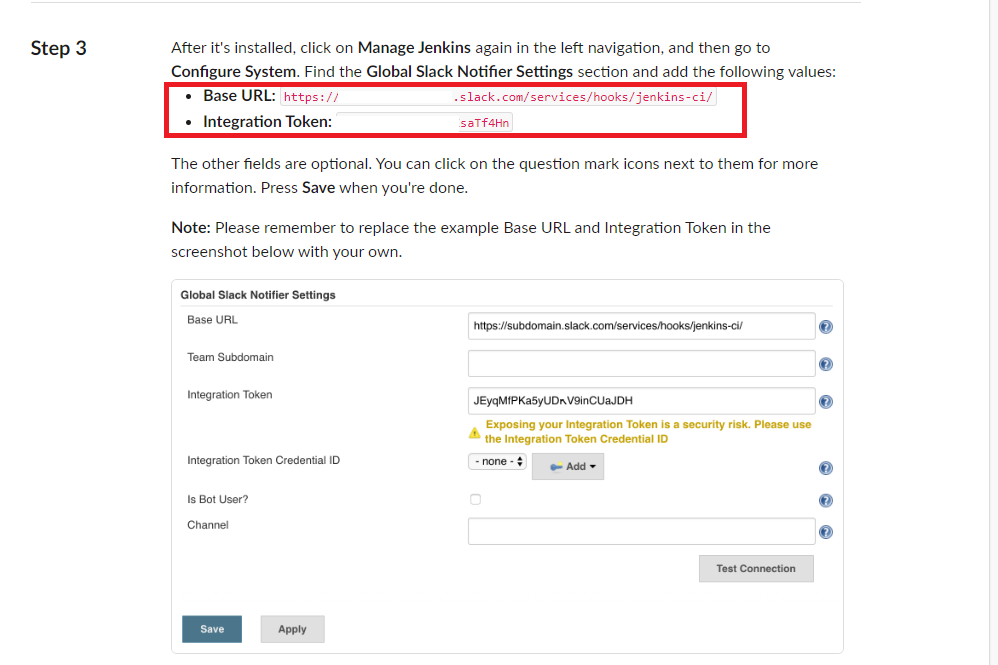
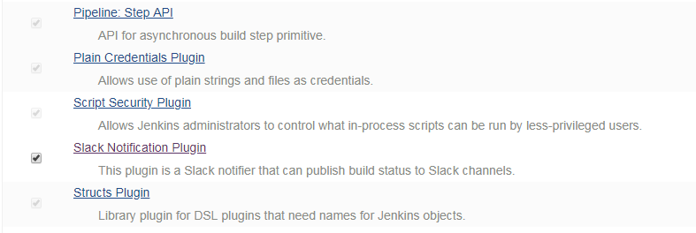
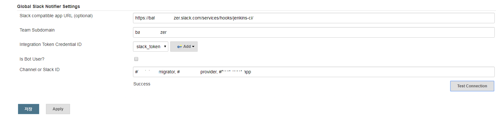
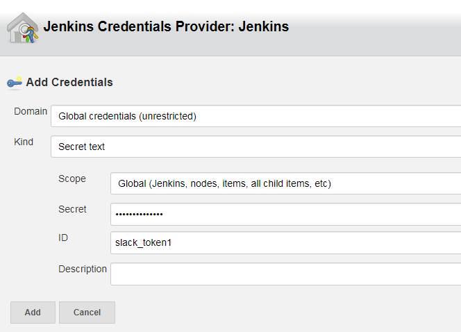
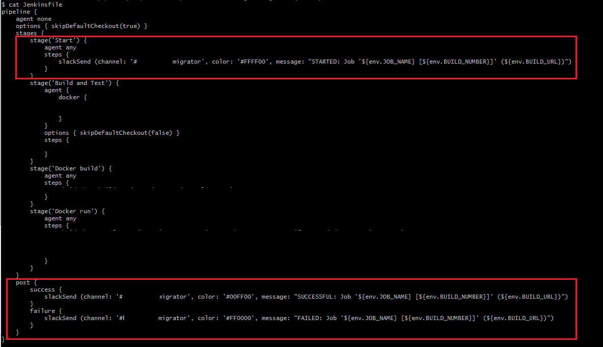
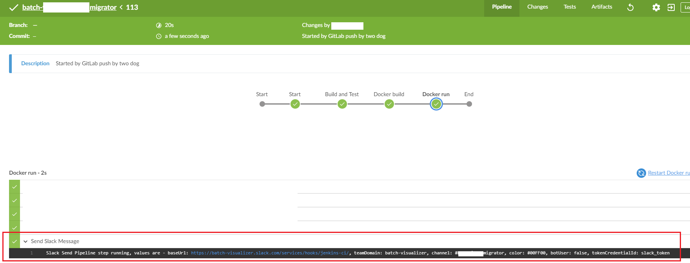

### [1. 개요]
Jenkins Pipeline 수행 시 Slack으로 알림을 받는 설정을 진행해 보도록 하자. 각 gitlab repository 별로 jenkins pipeline을 만들었고, 해당 pipeline 별로 slack 채널을 연동시켜, pipeline 에서 jenkinsfile 수행 시 slack 채널별로 알람이 나가게 설정할 것이다.


_ _ _


### [2. Slack Team 생성 및 Channel 생성]
Slack 가입 후 메시지를 받을 Slack Workspace를 생성한다. Workspace 생성 후에는 알림을 받을 Channel을 생성한다. 


_ _ _


### [3. Slack Token 생성]
1. Jenkins 연동 시 사용될 Token을 생성한다. 우선 Workspace 생성 시 제공받은 URL/apps <https://(Slack Workspace 명).slack.com/apps> 로 접속하여 **"Jenkins CI"**를 검색한다.



2. 좌측 상단의 녹색 Install 버튼을 클릭하여 Jenkins CI 설치 수행(이미 설치되어 있는 경우 ADD Configuration 클릭)



3. 알람을 보낼 채널 선택. (필자는 여러개의 채널을 만든 후 각 채널별로 gitlab repository를 매핑하여 각 repository가 빌드/배포 시 매핑된 채널로 알람이 가게 셋팅할 것이다. 이 글에선 첫번째 채널 선택)



4. Step3의 Base URL과 Integration Token 확인



_ _ _


### [4. Jenkins 셋팅]
1. Jenkins관리 -> 플러그인 관리에서 **"Slack Notification Plugin"** 설치 확인. 미 설치 시 설치



2. Jenkins관리 -> 시스템 설정에서 **"Global Slack Notifier Settings"** 에 설정 추가
- Slack compatible app URL : Slack Token 생성 시(3번 작업) 받은 Base URL
- Team Subdomain : Slack workspace 명
- Integration Token Credential ID에는 ADD 후 Secret text 선택. Secret에 Slack Token 생성 시 받은 Slack Token 입력. ID는 임의로 입력
- Channel or Slack ID : #(채널명) 입력. 여러개의 채널로 전송 시에는 ","로 구분하여 여러개의 채널 입력




_ _ _


### [5. Jenkinsfile 수정]
기존 프로젝트의 Jenkinsfile 를 수정한다. Start Stage와 Post를 추가하였고, slackSend를 사용하여 알람을 보내는데, channel 부분에 채널명을 기입하여 Jenkinsfile 수행 시 해당 채널로만 알람이 가도록 설정한다. Jenkins pipeline별로 Jenkinsfile이 다르고 Jenkinsfile별로 Slack 채널이 다르기 때문에, pipeline별로 다른 채널로 알람이 간다.

```
pipeline {
    agent none
    options { skipDefaultCheckout(true) }
    stages {
        stage('Start') {
            agent any
            steps {
                slackSend (channel: '#migrator', color: '#FFFF00', message: "STARTED: Job '${env.JOB_NAME} [${env.BUILD_NUMBER}]' (${env.BUILD_URL})")
            }
        }
        stage('Build and Test') {
            agent {
                docker {
					...
                }
            }
            options { skipDefaultCheckout(false) }
            steps {
                ...
            }
        }
        stage('Docker build') {
            agent any
            steps {
                ...
            }
        }
        stage('Docker run') {
            agent any
            steps {
				...
            }
        }
    }
    post {
        success {
            slackSend (channel: '#migrator', color: '#00FF00', message: "SUCCESSFUL: Job '${env.JOB_NAME} [${env.BUILD_NUMBER}]' (${env.BUILD_URL})")
        }
        failure {
            slackSend (channel: '#migrator', color: '#FF0000', message: "FAILED: Job '${env.JOB_NAME} [${env.BUILD_NUMBER}]' (${env.BUILD_URL})")
        }
    }
}

```


_ _ _


### [6. Jenkins Pipeline 수행 후 Slack 알람 확인]



_ _ _


*출처 : 
- <https://medium.com/appgambit/integrating-jenkins-with-slack-notifications-4f14d1ce9c7a> 
- <https://dogbirdfoot.tistory.com/16>
- <https://jenkins.io/blog/2017/02/15/declarative-notifications/> 
참고